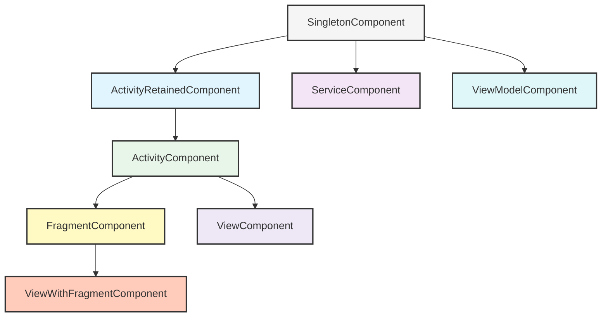
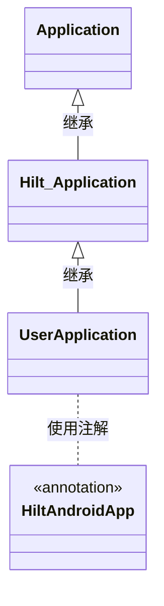
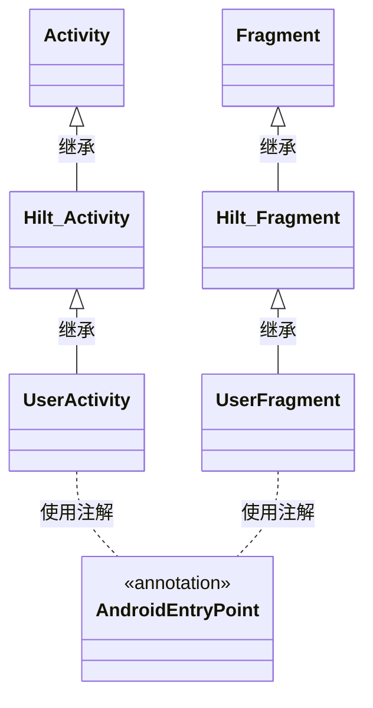
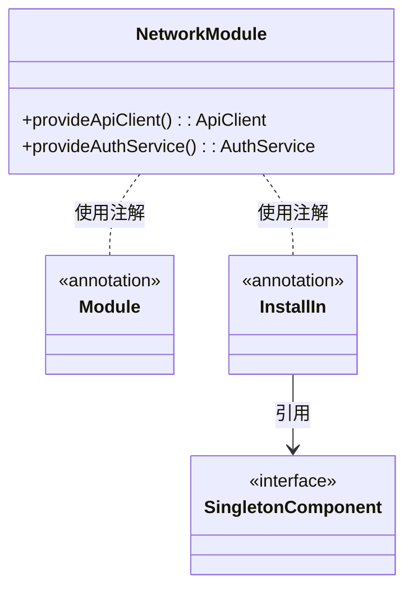
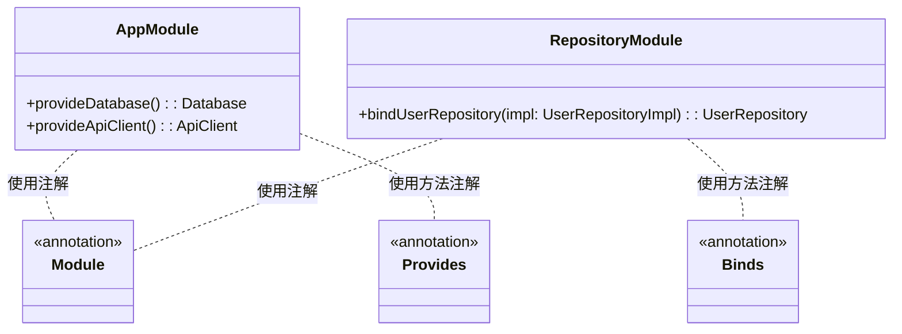
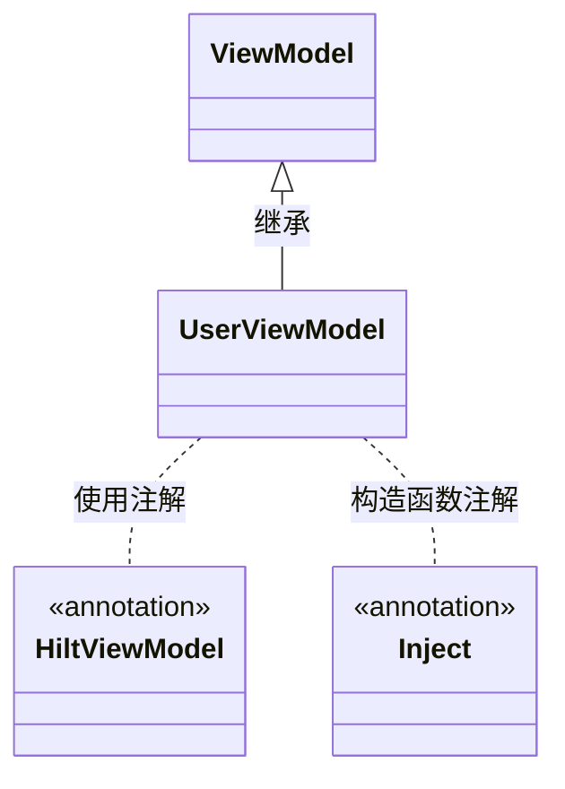
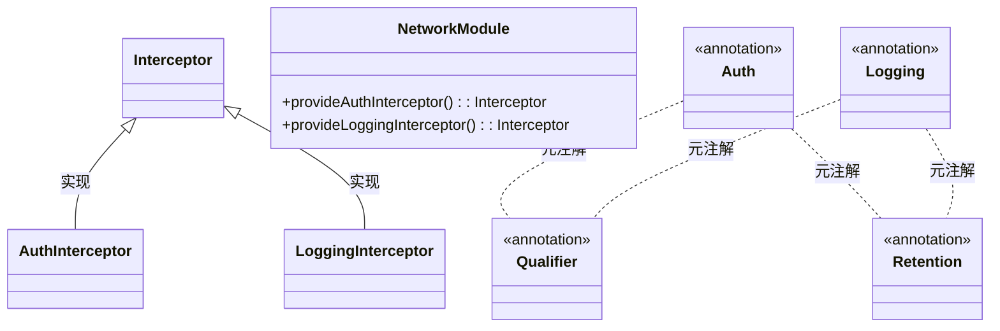

# Hilt 依赖注入库

## 库基本信息

- **库名称**：Hilt（Dagger Hilt），由 Google 开发
- **库类型**：依赖注入框架
- **开源状态**：开源，Apache 2.0 许可证
- **主要维护者**：Google
- **版本信息**：最新稳定版本 2.48.1，最低支持 Android API 级别 21（Android 5.0 Lollipop）
- **官方链接**：
  - [官方文档](https://developer.android.com/training/dependency-injection/hilt-android)
  - [GitHub 仓库](https://github.com/google/dagger/tree/master/java/dagger/hilt)
  - [参考文档](https://dagger.dev/hilt/)
- **对应概念**：
  - iOS：Swift Resolver、Swinject
  - Flutter：GetIt、Injectable
  - 前端：Angular 依赖注入系统、React 的 Context API 与 Provider 模式、Vue 的 Provide/Inject API

## 概述

### 核心功能

Hilt 是 Android 的依赖注入库，建立在流行的 Dagger 依赖注入库的基础上。它的主要功能包括：

- 通过注解简化 Android 应用中的依赖注入
- 为 Android 类（如 Activity、Fragment、Service、ViewModel 等）提供标准的依赖注入组件和生命周期管理
- 自动生成依赖注入的样板代码，减少手动编写的重复代码
- 提供预定义的作用域，与 Android 架构组件生命周期保持一致
- 简化测试组件的替换，便于单元测试和集成测试

### 设计理念

Hilt 的设计理念主要包括：

1. **简化性**：通过减少样板代码和预定义组件，使 Dagger 在 Android 应用中更易于使用
2. **标准化**：为 Android 平台提供标准的依赖注入方法，确保代码一致性和可维护性
3. **集成性**：与 Jetpack 等 Android 库无缝集成，支持 ViewModel、WorkManager 等组件
4. **可测试性**：提供测试替身机制，便于单元测试
5. **兼容性**：向后兼容现有的 Dagger 实现，同时提供更简洁的 API

### 技术特点

Hilt 的技术亮点包括：

- **注解处理**：使用 KSP（Kotlin Symbol Processing）或 APT（Annotation Processing Tool）在编译时生成代码
- **反射最小化**：仅在测试环境使用轻量级反射，生产代码中几乎不使用反射，保证高性能
- **编译时验证**：在编译时验证依赖图，避免运行时错误
- **预定义组件**：提供与 Android 类对应的预定义 Hilt 组件和作用域
- **构建时生成**：通过 Gradle 插件，在构建过程中生成依赖注入代码

### 优缺点

**优势**：

- 减少大量样板代码，提高开发效率
- 标准化的注入方式，使代码更易于理解和维护
- 编译时验证依赖图，避免运行时错误
- 与 Android 框架紧密集成，支持 Jetpack 组件
- 简化测试，支持测试替身

**局限性**：

- 学习曲线相对陡峭，特别是对于依赖注入概念不熟悉的开发者
- 错误消息可能难以理解，尤其是复杂依赖关系出错时
- 编译时间可能增加，尤其是大型项目
- 与 Dagger 紧密绑定，无法轻易替换为其他依赖注入框架
- 有时需要额外的样板代码，如自定义作用域或组件

### 与其他库对比

与其他依赖注入库相比：

- **相比 Dagger 2**：Hilt 简化了在 Android 中使用 Dagger 的复杂性，减少了样板代码，但核心功能仍基于 Dagger
- **相比 Koin**：Hilt 提供编译时验证，而 Koin 是纯 Kotlin DSL 的运行时 DI 框架，Hilt 性能更好但配置较复杂
- **相比 Kodein**：Hilt 更适合大型项目和团队协作，Kodein 更轻量但功能较少
- **相比 ServiceLocator 模式**：Hilt 提供更好的类型安全和测试能力

### 适用场景

Hilt 最适合以下场景：

- 中大型 Android 应用开发，特别是多模块项目
- 需要严格依赖管理和编译时验证的项目
- 使用 MVVM、MVI 等架构的项目
- 需要高度可测试性的代码库
- 团队协作开发，需要标准化依赖注入方式的项目
- 使用 Jetpack 组件（如 ViewModel、WorkManager）的项目

## 架构设计

### 整体架构

Hilt 的架构建立在 Dagger 2 的基础上，但增加了专门为 Android 设计的组件和功能。整体架构可以分为几个关键部分：

1. **注解处理引擎**：基于 KSP 或 APT，处理 Hilt 注解并生成依赖注入代码
2. **预定义组件层次结构**：与 Android 组件生命周期对应的 Hilt 组件
3. **绑定机制**：通过 `@Binds` 和 `@Provides` 注解声明依赖提供方式
4. **作用域管理**：与组件对应的预定义作用域注解
5. **Android 集成层**：为 Android 框架类提供的注入机制

### 核心组件

Hilt 的主要组件包括：

1. **ApplicationComponent**：应用级组件，生命周期与 Application 一致
2. **ActivityComponent**：Activity 级组件，生命周期与 Activity 一致
3. **FragmentComponent**：Fragment 级组件，生命周期与 Fragment 一致
4. **ViewComponent**：View 级组件，用于 View 的依赖注入
5. **ViewModelComponent**：ViewModel 级组件，用于 ViewModel 的依赖注入
6. **ServiceComponent**：Service 级组件，用于 Service 的依赖注入
7. **BroadcastReceiverComponent**：BroadcastReceiver 级组件
8. **WorkerComponent**：Worker 级组件，用于 WorkManager 的依赖注入

### 设计模式

Hilt 中使用的主要设计模式包括：

1. **依赖注入模式**：核心设计模式，通过构造函数、字段或方法提供依赖
2. **工厂模式**：用于创建依赖实例
3. **单例模式**：通过作用域注解实现单例
4. **构建者模式**：用于构建依赖图
5. **代理模式**：在生成的代码中使用代理模式
6. **组合模式**：组件之间的层次关系体现了组合模式

### 依赖关系

Hilt 的依赖关系主要包括：

- **内部依赖**：Hilt 依赖于 Dagger 的核心功能
- **外部依赖**：
  - 与 Jetpack 组件的集成，如 ViewModel、WorkManager
  - 与 Android 框架组件的集成
  - 可选的 KSP 依赖（与 APT 二选一）

### 扩展性

Hilt 提供了多种扩展机制：

1. **自定义绑定**：通过 Module 和 Provides/Binds 注解
2. **自定义限定符**：使用 `@Qualifier` 创建自定义限定符
3. **自定义作用域**：创建额外的作用域注解
4. **EntryPoint**：允许非 Hilt 管理的类访问 Hilt 的依赖图
5. **测试替身**：用于测试的组件替换机制

### 架构图

下面是 Hilt 组件层次结构的架构图：



## 主要组件解析

### 1. @HiltAndroidApp

- **组件名称**：`@HiltAndroidApp` 注解，位于 `dagger.hilt.android.HiltAndroidApp` 包
- **核心功能**：标记 Android 应用的 Application 类，作为 Hilt 代码生成的入口点
- **设计理念**：提供应用级依赖的容器，是依赖注入系统的根组件
- **使用场景**：在自定义 Application 类上应用，每个使用 Hilt 的应用必须有一个
- **主要类和接口**：
  - 生成的 Application 基类，如 `Hilt_YourApplication`
  - 与 `SingletonComponent` 关联
- **与其他组件的关系**：是 Hilt 组件层次结构的根，所有其他组件都直接或间接依赖于它



### 2. @AndroidEntryPoint

- **组件名称**：`@AndroidEntryPoint` 注解，位于 `dagger.hilt.android.AndroidEntryPoint` 包
- **核心功能**：将 Android 框架类（Activity、Fragment、View、Service 等）标记为依赖注入的目标
- **设计理念**：通过统一的注解简化不同 Android 组件的依赖注入
- **使用场景**：标记需要注入依赖的 Activity、Fragment、View、Service 等类
- **主要类和接口**：
  - 生成的基类，如 `Hilt_YourActivity`, `Hilt_YourFragment`
  - 组件特定的接口，用于内部依赖提供
- **与其他组件的关系**：与相应的 Hilt 组件（如 ActivityComponent、FragmentComponent）关联



### 3. @Module 和 @InstallIn

- **组件名称**：`@Module` 和 `@InstallIn` 注解，位于 `dagger.Module` 和 `dagger.hilt.InstallIn` 包
- **核心功能**：定义依赖提供者模块并指定安装到哪个 Hilt 组件中
- **设计理念**：将依赖提供逻辑模块化，并明确定义其可见范围
- **使用场景**：创建提供对象实例的模块，如网络客户端、数据库等
- **主要类和接口**：
  - 用户定义的模块类
  - 组件类，如 `SingletonComponent`、`ActivityComponent` 等
- **与其他组件的关系**：模块安装到特定组件后，其提供的依赖对该组件及其子组件可见



### 4. @Provides 和 @Binds

- **组件名称**：`@Provides` 和 `@Binds` 注解，位于 `dagger.Provides` 和 `dagger.Binds` 包
- **核心功能**：定义如何创建和提供依赖对象
- **设计理念**：
  - `@Provides`：用于提供具体实例，支持复杂的实例创建逻辑
  - `@Binds`：用于抽象类型绑定到具体实现，更高效
- **使用场景**：
  - `@Provides`：创建第三方库的实例，或需要复杂配置的对象
  - `@Binds`：将接口或抽象类绑定到其实现类
- **主要类和接口**：在模块类中的方法上使用
- **与其他组件的关系**：与 `@Module` 和 `@InstallIn` 配合使用



### 5. @HiltViewModel

- **组件名称**：`@HiltViewModel` 注解，位于 `dagger.hilt.android.lifecycle.HiltViewModel` 包
- **核心功能**：将 ViewModel 标记为 Hilt 注入目标，支持依赖注入
- **设计理念**：集成 Jetpack ViewModel 和 Hilt 依赖注入
- **使用场景**：用于需要依赖注入的 ViewModel 类
- **主要类和接口**：
  - 与 ViewModelComponent 关联
  - 内部使用 Jetpack ViewModel 的工厂机制
- **与其他组件的关系**：使用 ViewModelComponent 提供的依赖



### 6. @Qualifier 和自定义限定符

- **组件名称**：`@Qualifier` 注解和自定义限定符，位于 `javax.inject.Qualifier` 包
- **核心功能**：区分同一类型的不同实现或实例
- **设计理念**：提供类型系统之外的依赖区分机制
- **使用场景**：当需要提供同一类型的多个不同实例时，如不同环境的 API URL
- **主要类和接口**：用户自定义的限定符注解
- **与其他组件的关系**：与 `@Provides` 和 `@Inject` 配合使用



## 集成与配置

### 依赖引入

在 Android 项目中引入 Hilt 的步骤如下：

#### Gradle 配置（build.gradle.kts，项目级）

```kotlin
// 顶级 build.gradle.kts
plugins {
    id("com.google.dagger.hilt.android") version "2.48.1" apply false
}
```

#### Gradle 配置（build.gradle.kts，模块级）

```kotlin
plugins {
    id("com.android.application") // 或 com.android.library
    id("kotlin-android")
    id("kotlin-kapt") // 使用 kapt
    // 或 id("com.google.devtools.ksp") // 使用 KSP
    id("com.google.dagger.hilt.android")
}

android {
    // 常规配置
}

dependencies {
    // Hilt 核心依赖
    implementation("com.google.dagger:hilt-android:2.48.1")
    kapt("com.google.dagger:hilt-compiler:2.48.1")
    // 或 ksp("com.google.dagger:hilt-compiler:2.48.1") // 使用 KSP
    
    // Hilt 测试依赖
    testImplementation("com.google.dagger:hilt-android-testing:2.48.1")
    kaptTest("com.google.dagger:hilt-compiler:2.48.1")
    
    // Hilt 与 Jetpack 的集成
    implementation("androidx.hilt:hilt-navigation-compose:1.0.0") // Compose 导航集成
    implementation("androidx.hilt:hilt-work:1.0.0") // WorkManager 集成
    kapt("androidx.hilt:hilt-compiler:1.0.0") // Jetpack 库的 Hilt 编译器
}

// 可选：配置 kapt 以正确处理 Kotlin 代码
kapt {
    correctErrorTypes = true
}
```

### 初始化配置

Hilt 的基本初始化需要在 Application 类中进行：

```kotlin
@HiltAndroidApp
class MyApplication : Application() {
    // 应用初始化代码
}
```

然后在 AndroidManifest.xml 中声明：

```xml
<application
    android:name=".MyApplication"
    ...>
    <!-- 其他配置 -->
</application>
```

### 权限需求

Hilt 本身不需要特定的 Android 权限，但您可能需要为注入的依赖项配置权限，例如：

```xml
<!-- 如果您注入网络相关依赖 -->
<uses-permission android:name="android.permission.INTERNET" />
<uses-permission android:name="android.permission.ACCESS_NETWORK_STATE" />
```

### 混淆规则

Hilt 和 Dagger 所需的 ProGuard 规则：

```proguard
# Hilt 和 Dagger 的 ProGuard 规则
-keepclasseswithmembers class * {
    @javax.inject.* <fields>;
}

-keepclasseswithmembers class * {
    @javax.inject.* <init>(...);
}

# 保留自定义限定符和作用域
-keep class javax.inject.** { *; }
-keep class dagger.** { *; }
-keep class * extends dagger.** { *; }

# 保留生成的 Hilt 类
-keep class * extends dagger.hilt.internal.GeneratedComponent { *; }
```

### 多模块支持

在多模块项目中使用 Hilt 的注意事项：

1. **共享模块配置**：创建一个共享的 Gradle 插件或构建脚本，统一配置 Hilt 依赖：

```kotlin
// 在构建逻辑模块中的 HiltConventionPlugin.kt
class HiltConventionPlugin : Plugin<Project> {
    override fun apply(target: Project) {
        with(target) {
            pluginManager.apply("com.google.devtools.ksp")
            
            dependencies {
                "ksp"(libs.findLibrary("hilt.compiler").get())
                
                pluginManager.withPlugin("org.jetbrains.kotlin.jvm") {
                    dependencies {
                        "implementation"(libs.findLibrary("hilt.core").get())
                    }
                }
                
                pluginManager.withPlugin("com.android.base") {
                    pluginManager.apply("dagger.hilt.android.plugin")
                    dependencies {
                        "implementation"(libs.findLibrary("hilt.android").get())
                    }
                }
            }
        }
    }
}
```

2. **模块间依赖注入**：使用 `@InstallIn` 在适当的组件中安装模块：

```kotlin
// 特性模块中的依赖提供模块
@Module
@InstallIn(SingletonComponent::class) // 或其他适合的组件
abstract class FeatureModule {
    @Binds
    abstract fun bindFeatureRepository(
        impl: FeatureRepositoryImpl
    ): FeatureRepository
}
```

3. **测试替换**：在测试模块中，可以替换实现：

```kotlin
@Module
@TestInstallIn(
    components = [SingletonComponent::class],
    replaces = [FeatureModule::class]
)
abstract class TestFeatureModule {
    @Binds
    abstract fun bindFeatureRepository(
        impl: FakeFeatureRepository
    ): FeatureRepository
}
```

### 与其他框架对比

与 iOS/Flutter 中类似库的集成方式对比：

#### iOS 的 Resolver/Swinject

**iOS Swinject**：

```swift
// 注册服务
let container = Container()
container.register(APIServiceProtocol.self) { _ in
    APIService()
}

// 使用服务
let apiService = container.resolve(APIServiceProtocol.self)!
```

**Hilt**：

```kotlin
// 定义模块
@Module
@InstallIn(SingletonComponent::class)
object AppModule {
    @Provides
    @Singleton
    fun provideApiService(): APIService = APIService()
}

// 使用服务
@AndroidEntryPoint
class MainActivity : AppCompatActivity() {
    @Inject
    lateinit var apiService: APIService
}
```

#### Flutter 的 GetIt/Injectable

**Flutter GetIt**：

```dart
// 设置服务定位器
final getIt = GetIt.instance;

void setupLocator() {
  getIt.registerSingleton<ApiService>(ApiService());
}

// 使用服务
final apiService = getIt<ApiService>();
```

**Hilt**：

```kotlin
// 与上面相同，但编译时验证
@HiltViewModel
class MainViewModel @Inject constructor(
    private val apiService: APIService
) : ViewModel() {
    // 使用 apiService
}
```

#### 前端的依赖注入

**Angular**：

```typescript
@Injectable({
  providedIn: 'root'
})
export class ApiService {
  // ...
}

@Component({
  // ...
})
export class AppComponent {
  constructor(private apiService: ApiService) {}
}
```

**Hilt**：

```kotlin
@Singleton
class ApiService @Inject constructor() {
    // ...
}

@AndroidEntryPoint
class MainActivity : AppCompatActivity() {
    @Inject
    lateinit var apiService: ApiService
}
```

## 使用教程

### 基础用法

#### 环境准备

在开始使用 Hilt 之前，请确保已正确配置项目：

1. 添加必要的依赖项（如前文"集成与配置"部分所述）
2. 创建带有 `@HiltAndroidApp` 注解的 Application 类
3. 确保 minSdkVersion 至少为 21（Android 5.0）

#### 基本示例

下面是一个使用 Hilt 的基本示例，展示了主要组件的用法：

1. **准备 Application 类**：

```kotlin
// 在项目中使用 Hilt 的第一步是创建 Application 类并添加 @HiltAndroidApp 注解
@HiltAndroidApp
class MyApplication : Application() {
    override fun onCreate() {
        super.onCreate()
        // 应用初始化代码
    }
}
```

2. **创建需要注入的依赖类**：

```kotlin
// 一个简单的接口和实现类
interface Repository {
    suspend fun getData(): List<String>
}

// 带有 @Inject 构造函数的实现类，Hilt 可以直接提供这个类的实例
class RepositoryImpl @Inject constructor(
    private val apiService: ApiService
) : Repository {
    override suspend fun getData(): List<String> {
        return apiService.fetchData()
    }
}

// 另一个带有 @Inject 构造函数的类
class ApiService @Inject constructor(
    private val httpClient: OkHttpClient
) {
    suspend fun fetchData(): List<String> {
        // 实现数据获取逻辑
        return listOf("Item 1", "Item 2", "Item 3")
    }
}
```

3. **创建模块提供第三方依赖**：

```kotlin
// 模块用于提供无法直接注入构造函数的依赖（如第三方库类）
@Module
@InstallIn(SingletonComponent::class)
object NetworkModule {
    
    // 使用 @Provides 注解方法以提供依赖实例
    @Provides
    @Singleton // 作用域注解，确保单例
    fun provideOkHttpClient(): OkHttpClient {
        return OkHttpClient.Builder()
            .connectTimeout(30, TimeUnit.SECONDS)
            .readTimeout(30, TimeUnit.SECONDS)
            .build()
    }
}
```

4. **创建绑定接口到实现的模块**：

```kotlin
// 使用 @Binds 将接口绑定到实现
@Module
@InstallIn(SingletonComponent::class)
abstract class RepositoryModule {
    
    // @Binds 更高效，用于绑定接口到实现
    @Binds
    @Singleton
    abstract fun bindRepository(
        repositoryImpl: RepositoryImpl
    ): Repository
}
```

5. **在 Activity 中注入依赖**：

```kotlin
// 将 Activity 标记为依赖注入目标
@AndroidEntryPoint
class MainActivity : AppCompatActivity() {
    
    // 字段注入 - 成员变量将由 Hilt 自动填充
    @Inject 
    lateinit var repository: Repository
    
    override fun onCreate(savedInstanceState: Bundle?) {
        super.onCreate(savedInstanceState)
        setContentView(R.layout.activity_main)
        
        // 使用注入的依赖
        lifecycleScope.launch {
            val items = repository.getData()
            // 处理数据
        }
    }
}
```

6. **在 ViewModel 中使用依赖注入**：

```kotlin
// ViewModel 使用 @HiltViewModel 注解
@HiltViewModel
class MainViewModel @Inject constructor(
    private val repository: Repository
) : ViewModel() {
    
    // 暴露数据给 UI
    private val _items = MutableStateFlow<List<String>>(emptyList())
    val items: StateFlow<List<String>> = _items.asStateFlow()
    
    init {
        loadData()
    }
    
    private fun loadData() {
        viewModelScope.launch {
            _items.value = repository.getData()
        }
    }
}
```

7. **在 Fragment 中使用注入和 ViewModel**：

```kotlin
@AndroidEntryPoint
class MainFragment : Fragment() {
    
    // 通过 Hilt 获取 ViewModel
    private val viewModel: MainViewModel by viewModels()
    
    // 也可以直接注入其他依赖
    @Inject
    lateinit var analyticsTracker: AnalyticsTracker
    
    override fun onViewCreated(view: View, savedInstanceState: Bundle?) {
        super.onViewCreated(view, savedInstanceState)
        
        // 使用 Flow 收集数据
        viewLifecycleOwner.lifecycleScope.launch {
            viewLifecycleOwner.repeatOnLifecycle(Lifecycle.State.STARTED) {
                viewModel.items.collect { items ->
                    // 更新 UI
                }
            }
        }
        
        // 使用注入的 analyticsTracker
        analyticsTracker.trackScreenView("MainFragment")
    }
}
```

#### 常见场景

以下是 Hilt 在常见业务场景中的使用方法：

1. **提供不同环境的配置**：

```kotlin
// 自定义限定符
@Qualifier
@Retention(AnnotationRetention.BINARY)
annotation class ProductionApi

@Qualifier
@Retention(AnnotationRetention.BINARY)
annotation class DevelopmentApi

@Module
@InstallIn(SingletonComponent::class)
object ApiModule {
    
    @Provides
    @ProductionApi
    fun provideProductionApiUrl(): String = "https://api.example.com/v1/"
    
    @Provides
    @DevelopmentApi
    fun provideDevelopmentApiUrl(): String = "https://dev-api.example.com/v1/"
    
    @Provides
    @Singleton
    fun provideApiService(
        @ProductionApi apiUrl: String, // 或者 @DevelopmentApi
        okHttpClient: OkHttpClient
    ): ApiService {
        // 创建并返回 ApiService
    }
}
```

2. **多模块依赖注入**：

```kotlin
// feature-auth 模块
@Module
@InstallIn(SingletonComponent::class)
abstract class AuthModule {
    @Binds
    @Singleton
    abstract fun bindAuthRepository(
        authRepositoryImpl: AuthRepositoryImpl
    ): AuthRepository
}

// feature-user 模块中使用 auth 模块的组件
@AndroidEntryPoint
class UserProfileFragment : Fragment() {
    // 来自 auth 模块的依赖
    @Inject
    lateinit var authRepository: AuthRepository
    
    // 来自 user 模块的依赖
    @Inject 
    lateinit var userRepository: UserRepository
}
```

3. **使用 EntryPoint 从非 Hilt 类访问依赖**：

```kotlin
// 定义 EntryPoint 接口
@EntryPoint
@InstallIn(SingletonComponent::class)
interface AnalyticsEntryPoint {
    fun analyticsService(): AnalyticsService
}

// 在非 Hilt 管理的类中获取依赖
class ThirdPartyClass(private val context: Context) {
    fun trackEvent(name: String) {
        val analyticsEntryPoint = EntryPointAccessors.fromApplication(
            context.applicationContext,
            AnalyticsEntryPoint::class.java
        )
        
        val analyticsService = analyticsEntryPoint.analyticsService()
        analyticsService.trackEvent(name)
    }
}
```

#### 关键 API

Hilt 的核心 API 包括：

1. **注解类应用**：
   - `@HiltAndroidApp`：标记 Application 类
   - `@AndroidEntryPoint`：标记需要注入的 Android 组件
   - `@HiltViewModel`：标记支持注入的 ViewModel

2. **依赖提供**：
   - `@Module`：标记依赖提供者模块
   - `@InstallIn`：指定模块安装的组件
   - `@Provides`：标记提供依赖实例的方法
   - `@Binds`：标记绑定接口到实现的方法

3. **注入点**：
   - `@Inject`：标记注入构造函数、字段或方法
   - `@Qualifier`：自定义限定符的元注解

4. **作用域管理**：
   - `@Singleton`：应用级作用域
   - `@ActivityScoped`：Activity 级作用域
   - `@FragmentScoped`：Fragment 级作用域
   - `@ViewModelScoped`：ViewModel 级作用域
   - `@ViewScoped`：View 级作用域
   - `@ServiceScoped`：Service 级作用域

5. **测试支持**：
   - `@HiltAndroidTest`：标记 Hilt 测试类
   - `HiltAndroidRule`：测试规则
   - `@UninstallModules`：在测试中移除模块
   - `@TestInstallIn`：在测试中替换模块

### 进阶用法

#### 高级功能

Hilt 提供了一些高级特性，可以处理更复杂的依赖注入场景：

1. **使用 AssistedInject 工厂**：

当依赖需要在运行时提供额外参数时，可以使用 AssistedInject：

```kotlin
// 首先添加依赖
// implementation("com.google.dagger:hilt-android:2.48.1")

// 使用 @AssistedInject 和 @Assisted 注解
class SearchViewModel @AssistedInject constructor(
    private val searchRepository: SearchRepository,
    @Assisted private val initialQuery: String
) : ViewModel() {
    // 实现...
    
    // 定义工厂接口
    @AssistedFactory
    interface Factory {
        fun create(initialQuery: String): SearchViewModel
    }
}

// 然后在 HiltViewModel 中使用
@HiltViewModel(assistedFactory = SearchViewModel.Factory::class)
class SearchContainerViewModel @Inject constructor(
    private val factory: SearchViewModel.Factory
) : ViewModel() {
    fun createSearchViewModel(query: String): SearchViewModel {
        return factory.create(query)
    }
}
```

2. **多重绑定（Multibindings）**：

当需要收集多个相同类型的对象并注入它们的集合时：

```kotlin
// 定义一个普通接口
interface AnalyticsLogger {
    fun logEvent(name: String, params: Map<String, Any>)
}

// 多个实现
@Module
@InstallIn(SingletonComponent::class)
abstract class AnalyticsModule {
    
    @Binds
    @IntoSet // 将这个实现添加到 Set 集合中
    abstract fun bindFirebaseLogger(
        firebaseLogger: FirebaseAnalyticsLogger
    ): AnalyticsLogger
    
    @Binds
    @IntoSet // 将这个实现添加到 Set 集合中
    abstract fun bindMixpanelLogger(
        mixpanelLogger: MixpanelAnalyticsLogger
    ): AnalyticsLogger
}

// 然后注入 Set 集合
class AnalyticsManager @Inject constructor(
    // 这里将注入包含所有被 @IntoSet 标记的 AnalyticsLogger 实现
    private val loggers: Set<@JvmSuppressWildcards AnalyticsLogger>
) {
    fun logEvent(name: String, params: Map<String, Any>) {
        // 将事件发送到所有日志记录器
        loggers.forEach { logger ->
            logger.logEvent(name, params)
        }
    }
}
```

3. **自定义组件和作用域**：

创建自定义的组件范围和作用域：

```kotlin
// 自定义作用域注解
@Scope
@Retention(AnnotationRetention.RUNTIME)
annotation class FeatureScope

// 假设在多模块项目中使用，为特定功能创建作用域
@Module
@InstallIn(SingletonComponent::class)
abstract class FeatureComponentModule {
    
    @Binds
    @FeatureScope
    abstract fun bindFeatureManager(
        impl: FeatureManagerImpl
    ): FeatureManager
}
```

4. **懒加载（Lazy Injection）**：

延迟初始化依赖，直到真正需要时：

```kotlin
class HomeFragment : Fragment() {
    // 使用 Lazy<T> 包装依赖，只有在首次访问时才初始化
    @Inject
    lateinit var expensiveService: Lazy<ExpensiveService>
    
    fun onButtonClick() {
        // 仅在需要时获取实例
        val service = expensiveService.get()
        service.performOperation()
    }
}
```

5. **Provider 注入**：

类似于 Lazy，但每次调用都提供新实例：

```kotlin
class ProfileFragment : Fragment() {
    // 使用 Provider<T> 每次都获取新实例
    @Inject
    lateinit var userComponentProvider: Provider<UserComponent>
    
    fun createNewUserComponent() {
        // 每次调用都获取新实例
        val userComponent = userComponentProvider.get()
    }
}
```

#### 定制与扩展

Hilt 提供了多种方式来定制和扩展依赖注入行为：

1. **绑定实例（BindsInstance）**：

在组件创建时提供运行时值：

```kotlin
// 定义一个自定义组件
@DefineComponent(parent = SingletonComponent::class)
interface UserComponent

// 创建一个组件构建器
@DefineComponent.Builder
interface UserComponentBuilder {
    // 在构建时绑定实例
    @BindsInstance
    fun userId(id: String): UserComponentBuilder
    
    fun build(): UserComponent
}
```

2. **条件绑定**：

基于条件提供不同的实现：

```kotlin
@Module
@InstallIn(SingletonComponent::class)
object StorageModule {
    
    @Provides
    @Singleton
    fun provideStorage(
        @ApplicationContext context: Context
    ): Storage {
        return if (BuildConfig.DEBUG) {
            // 调试版本使用内存存储
            InMemoryStorage()
        } else {
            // 生产版本使用持久化存储
            PersistentStorage(context)
        }
    }
}
```

3. **动态依赖注入**：

在运行时决定依赖关系：

```kotlin
@Module
@InstallIn(ActivityComponent::class)
object DynamicModule {
    
    @Provides
    fun provideThemeManager(
        @ActivityContext context: Context,
        defaultThemeManager: DefaultThemeManager,
        premiumThemeManager: PremiumThemeManager
    ): ThemeManager {
        // 根据运行时条件决定使用哪个实现
        val preferences = PreferenceManager.getDefaultSharedPreferences(context)
        val isPremium = preferences.getBoolean("is_premium_user", false)
        
        return if (isPremium) {
            premiumThemeManager
        } else {
            defaultThemeManager
        }
    }
}
```

#### 性能优化

使用 Hilt 时的性能优化建议：

1. **作用域使用建议**：
   - 不要过度使用 `@Singleton`，仅对真正需要单例的对象使用
   - 对只在特定组件生命周期内需要的对象使用相应作用域
   - 不需要在整个组件生命周期存在的对象不要使用作用域注解

2. **减少反射使用**：
   - 优先使用 `@Binds` 而非 `@Provides`（`@Binds` 更高效）
   - 使用 KSP 代替 KAPT 处理注解（KSP 速度更快）

3. **避免循环依赖**：
   - 重构设计以避免循环依赖
   - 必要时使用 Provider<T> 或 Lazy<T> 打破循环

4. **模块划分**：
   - 按功能或层次清晰划分模块
   - 避免过大的模块，影响编译速度

5. **内存管理**：
   - 注意作用域对象的生命周期，避免内存泄漏
   - 考虑使用弱引用持有长寿命组件中的短寿命对象

#### 典型业务场景

Hilt 在典型业务场景中的应用示例：

1. **MVVM 架构中的数据流**：

```kotlin
// 数据源
class UserRemoteDataSource @Inject constructor(
    private val apiService: ApiService
) {
    suspend fun getUser(id: String): UserDto = apiService.getUser(id)
}

// 仓库
class UserRepository @Inject constructor(
    private val remoteDataSource: UserRemoteDataSource,
    private val localDataSource: UserLocalDataSource
) {
    suspend fun getUser(id: String): User {
        // 实现缓存和网络获取逻辑
        return localDataSource.getUser(id) ?: remoteDataSource.getUser(id).toUser().also {
            localDataSource.saveUser(it)
        }
    }
}

// ViewModel
@HiltViewModel
class UserViewModel @Inject constructor(
    private val userRepository: UserRepository,
    savedStateHandle: SavedStateHandle
) : ViewModel() {
    private val userId: String = savedStateHandle.get<String>("user_id")!!
    
    private val _userState = MutableStateFlow<Result<User>>(Result.Loading)
    val userState: StateFlow<Result<User>> = _userState.asStateFlow()
    
    init {
        loadUser()
    }
    
    private fun loadUser() {
        viewModelScope.launch {
            try {
                val user = userRepository.getUser(userId)
                _userState.value = Result.Success(user)
            } catch (e: Exception) {
                _userState.value = Result.Error(e)
            }
        }
    }
}
```

2. **功能模块集成**：

```kotlin
// 在主模块的 Application 中
@HiltAndroidApp
class MyApplication : Application()

// 特性模块中的模块定义
@Module
@InstallIn(SingletonComponent::class)
abstract class FeatureAuthModule {
    @Binds
    @Singleton
    abstract fun bindAuthManager(impl: AuthManagerImpl): AuthManager
}

// 另一个特性模块，依赖上面的模块
@Module
@InstallIn(ActivityComponent::class)
object FeaturePaymentModule {
    
    @Provides
    fun providePaymentManager(
        authManager: AuthManager, // 来自 auth 模块
        paymentService: PaymentService
    ): PaymentManager {
        return PaymentManagerImpl(authManager, paymentService)
    }
}
```

#### 与其他库集成

Hilt 与其他常用 Android 库的集成：

1. **与 Jetpack Compose 集成**：

```kotlin
// 在 Compose 中使用 Hilt ViewModel
@Composable
fun UserScreen(
    viewModel: UserViewModel = hiltViewModel()
) {
    val userState by viewModel.userState.collectAsStateWithLifecycle()
    
    // 基于状态渲染 UI
    when (val state = userState) {
        is Result.Loading -> LoadingIndicator()
        is Result.Success -> UserDetails(state.data)
        is Result.Error -> ErrorMessage(state.exception)
    }
}
```

2. **与 Navigation 组件集成**：

```kotlin
// 使用 hiltNavGraphViewModel 获取指定导航图的 ViewModel
@Composable
fun NavHost(
    navController: NavHostController,
    startDestination: String = "home"
) {
    NavHost(navController, startDestination) {
        composable("home") {
            HomeScreen()
        }
        composable(
            route = "user/{userId}",
            arguments = listOf(navArgument("userId") { type = NavType.StringType })
        ) { backStackEntry ->
            // 使用 Hilt 提供的 ViewModel 并传递参数
            val userId = backStackEntry.arguments?.getString("userId") ?: ""
            UserProfileScreen(userId)
        }
    }
}
```

3. **与 WorkManager 集成**：

```kotlin
// 首先添加依赖
// implementation("androidx.hilt:hilt-work:1.0.0")

// 创建 Hilt Worker
@HiltWorker
class SyncWorker @AssistedInject constructor(
    @Assisted context: Context,
    @Assisted params: WorkerParameters,
    private val syncRepository: SyncRepository
) : CoroutineWorker(context, params) {
    
    override suspend fun doWork(): Result {
        return try {
            syncRepository.performSync()
            Result.success()
        } catch (e: Exception) {
            Result.failure()
        }
    }
}
```

### 最佳实践

#### 推荐模式

使用 Hilt 的最佳实践：

1. **依赖方向**：
   - 遵循依赖注入的方向性，从应用的核心向外层依赖
   - UI 层依赖领域层，领域层依赖数据层

2. **接口隔离**：
   - 使用接口定义依赖，实现与使用分离
   - 不同模块之间通过接口通信

3. **单一职责**：
   - 每个类和模块保持单一职责
   - 避免"上帝对象"，将大类拆分为多个小类

4. **组合优于继承**：
   - 优先使用组合而非继承来复用代码
   - 依赖注入天然支持组合模式

5. **测试优先思维**：
   - 设计依赖结构时考虑测试需求
   - 使用接口便于模拟和替换

#### 代码规范

使用 Hilt 的代码组织和命名约定：

1. **文件组织**：
   - 将模块与其提供的依赖放在同一包下
   - 模块命名遵循 `{Feature}{Layer}Module` 格式
   - 将相关联的限定符放在同一文件中

2. **命名规范**：
   - 模块名清晰反映其功能：`NetworkModule`, `DatabaseModule`
   - 限定符名表明其用途：`@ProductionApi`, `@DevelopmentApi`
   - 方法名遵循 `provide{Dependency}` 或 `bind{Interface}`

3. **可见性控制**：
   - 尽可能使用 internal 限制模块可见性
   - 将 Hilt 实现细节隐藏在内部

4. **注释**：
   - 为复杂依赖提供清晰的文档注释
   - 解释依赖的生命周期和作用域

```kotlin
/**
 * 提供网络相关依赖的模块。
 * 安装在 [SingletonComponent] 中，提供应用级网络服务。
 */
@Module
@InstallIn(SingletonComponent::class)
internal object NetworkModule {
    
    /**
     * 提供 OkHttpClient 实例，配置了标准的超时设置和拦截器。
     * 这是一个单例，在整个应用生命周期内共享。
     */
    @Provides
    @Singleton
    fun provideOkHttpClient(): OkHttpClient {
        return OkHttpClient.Builder()
            .connectTimeout(30, TimeUnit.SECONDS)
            .readTimeout(30, TimeUnit.SECONDS)
            .build()
    }
}
```

#### 架构建议

在不同架构中使用 Hilt 的建议：

1. **MVC 架构**：
   - 使用 Hilt 注入 Controller 和 Model
   - 在 Activity/Fragment 中注入服务和工具类

2. **MVP 架构**：
   - 使用 `@Inject` 构造函数创建 Presenter
   - 在 Activity/Fragment 中注入 Presenter

```kotlin
class MyPresenter @Inject constructor(
    private val repository: MyRepository
) {
    // Presenter 实现
}

@AndroidEntryPoint
class MyActivity : AppCompatActivity(), MyView {
    @Inject
    lateinit var presenter: MyPresenter
    
    // Activity 实现
}
```

3. **MVVM 架构**（推荐）：
   - 使用 `@HiltViewModel` 和 `@Inject` 构造函数创建 ViewModel
   - 在 ViewModel 中注入仓库和用例

```kotlin
@HiltViewModel
class MyViewModel @Inject constructor(
    private val repository: MyRepository,
    private val analytics: AnalyticsTracker
) : ViewModel() {
    // ViewModel 实现
}
```

4. **MVI 架构**：
   - 注入 Store 和 Reducer
   - 使用单向数据流与 Hilt 结合

```kotlin
@HiltViewModel
class MyMviViewModel @Inject constructor(
    private val intentProcessor: IntentProcessor,
    private val reducer: StateReducer,
    private val effectHandler: EffectHandler
) : ViewModel() {
    // MVI 实现
}
```

5. **Clean Architecture**：
   - 数据层模块提供仓库实现
   - 领域层模块定义用例和仓库接口
   - 表示层使用领域层组件

```kotlin
// 数据层
@Module
@InstallIn(SingletonComponent::class)
abstract class RepositoryModule {
    @Binds
    @Singleton
    abstract fun bindUserRepository(
        impl: UserRepositoryImpl
    ): UserRepository
}

// 领域层
class GetUserUseCase @Inject constructor(
    private val userRepository: UserRepository
) {
    suspend operator fun invoke(userId: String): User {
        return userRepository.getUser(userId)
    }
}

// 表示层
@HiltViewModel
class UserViewModel @Inject constructor(
    private val getUserUseCase: GetUserUseCase
) : ViewModel()
```

#### 测试策略

使用 Hilt 编写测试：

1. **单元测试**：

```kotlin
// 测试 ViewModel
@HiltAndroidTest
@RunWith(RobolectricTestRunner::class)
@Config(application = HiltTestApplication::class)
class MyViewModelTest {
    
    @get:Rule
    val hiltRule = HiltAndroidRule(this)
    
    @BindValue // 绑定测试替身
    val mockRepository: MyRepository = mock()
    
    @Inject
    lateinit var viewModelFactory: ViewModelProvider.Factory
    
    private lateinit var viewModel: MyViewModel
    
    @Before
    fun setup() {
        hiltRule.inject()
        viewModel = ViewModelProvider(
            owner = TestViewModelStoreOwner(),
            factory = viewModelFactory
        )[MyViewModel::class.java]
    }
    
    @Test
    fun `test loading data successfully`() {
        // 准备测试数据
        val testData = listOf("Item 1", "Item 2")
        whenever(mockRepository.getData()).thenReturn(flow { emit(testData) })
        
        // 触发加载
        viewModel.loadData()
        
        // 验证结果
        assertEquals(testData, viewModel.items.value)
    }
}
```

2. **集成测试**：

```kotlin
// 替换模块进行测试
@Module
@TestInstallIn(
    components = [SingletonComponent::class],
    replaces = [RealNetworkModule::class]
)
object TestNetworkModule {
    
    @Provides
    @Singleton
    fun provideMockApiService(): ApiService {
        return FakeApiService()
    }
}

@HiltAndroidTest
class MainActivityTest {
    
    @get:Rule
    val hiltRule = HiltAndroidRule(this)
    
    @get:Rule
    val activityRule = ActivityScenarioRule<MainActivity>()
    
    @Before
    fun setup() {
        hiltRule.inject()
    }
    
    @Test
    fun testMainActivityFlow() {
        // 测试场景
        onView(withId(R.id.refresh_button))
            .perform(click())
        
        onView(withId(R.id.item_list))
            .check(matches(hasChildCount(3)))
    }
}
```

#### CI/CD 集成

在 CI/CD 流程中使用 Hilt 的注意事项：

1. **构建性能优化**：
   - 使用 Gradle 构建缓存
   - 考虑使用 KSP 代替 KAPT
   - 增量构建支持

2. **测试自动化**：
   - 配置测试固件和依赖注入规则
   - 针对不同环境使用不同的测试配置

3. **多模块构建**：
   - 配置 CI 以并行构建独立模块
   - 使用测试报告整合工具

4. **发布前验证**：
   - 运行 Hilt 相关的静态分析检查
   - 验证依赖图的一致性

## 源码分析

### 代码结构

Hilt 的源码结构主要分为以下几个部分：

1. **核心注解**：定义在 `dagger.hilt` 包中，包括 `@HiltAndroidApp`, `@AndroidEntryPoint`, `@Module`, `@InstallIn` 等。

2. **组件定义**：在 `dagger.hilt.components` 包中定义了预设的组件，如 `SingletonComponent`, `ActivityComponent` 等。

3. **注解处理器**：位于 `dagger.hilt.processor` 包，负责在编译时生成依赖注入代码。

4. **Android 集成**：在 `dagger.hilt.android` 包中提供了与 Android 框架的集成点。

5. **工具类**：一些辅助功能类，如 `EntryPointAccessors` 等。

### 核心实现

Hilt 的核心实现围绕几个关键机制：

1. **代码生成**：Hilt 使用注解处理器（KSP 或 APT）在编译时生成代码，主要包括：

```kotlin
// 为使用 @HiltAndroidApp 的 Application 生成基类
public final class Hilt_MyApplication extends MyApplication {
  private boolean injected = false;

  @Override
  public void onCreate() {
    // 确保在 super.onCreate() 之前进行注入
    if (!injected) {
      injected = true;
      // 这里初始化 Hilt 并注入依赖
      ((MyApplication_GeneratedInjector) 
          DaggerMyApplication_HiltComponents_SingletonC.builder()
              .build())
              .injectMyApplication(this);
    }
    super.onCreate();
  }
}
```

2. **组件层次结构**：Hilt 为每个 Android 组件生成相应的 Dagger 组件：

```kotlin
// 为 SingletonComponent 生成的组件实现
@Component(modules = {...})
interface SingletonC extends SingletonComponent {
  // 子组件工厂
  ActivityRetainedCBuilderEntryPoint getActivityRetainedCBuilderEntryPoint();
  // 其他功能...
}
```

3. **绑定处理**：处理 `@Binds` 和 `@Provides` 注解，生成工厂类：

```kotlin
// 为 @Provides 方法生成的工厂
public final class NetworkModule_ProvideOkHttpClientFactory 
    implements Factory<OkHttpClient> {
  private final NetworkModule module;

  public NetworkModule_ProvideOkHttpClientFactory(NetworkModule module) {
    this.module = module;
  }

  @Override
  public OkHttpClient get() {
    return provideOkHttpClient(module);
  }

  public static OkHttpClient provideOkHttpClient(NetworkModule instance) {
    return Preconditions.checkNotNull(
        instance.provideOkHttpClient(),
        "Cannot return null from a non-@Nullable @Provides method");
  }
}
```

4. **依赖图构建**：使用有向无环图（DAG）表示依赖关系，确保无循环依赖。

5. **拓扑排序**：在构建依赖时，使用拓扑排序确定正确的初始化顺序。

6. **作用域管理**：使用树形结构管理不同作用域的关系，确保子组件可以访问父组件的依赖。

7. **代码生成模板**：使用基于模板的代码生成技术，为不同的注解目标生成对应的胶水代码。

### 设计模式

Hilt 源码中应用的设计模式：

1. **工厂模式**：广泛用于创建依赖实例，每个依赖都有对应的工厂类。

2. **构建者模式**：用于构建组件实例，如 `DaggerMyComponent.builder()`。

3. **代理模式**：生成的基类（如 `Hilt_MyActivity`）代理管理依赖注入逻辑。

4. **组合模式**：组件层次结构表现为组合模式，父组件包含子组件。

5. **访问者模式**：在注解处理过程中使用，遍历和处理不同类型的注解元素。

### 值得学习的技术点

Hilt 源码中特别值得学习的设计思想和技巧：

1. **代码生成策略**：最小化运行时开销，将复杂度转移到编译时。

2. **类型安全设计**：通过编译时检查保证类型安全，避免运行时错误。

3. **插件化架构**：核心功能与平台特定集成分离，便于扩展到其他平台。

4. **兼容性考虑**：向下兼容设计，新版本不会破坏使用旧 API 的代码。

5. **测试友好设计**：提供完善的测试支持，便于编写单元测试和集成测试。

### Kotlin 特性应用

Hilt 源码中使用的 Kotlin 特性和惯用法：

1. **扩展函数**：为现有类添加功能，如 `ComponentActivity.by viewModels()`。

2. **委托属性**：在 ViewModel 获取中使用 `by viewModels()`。

3. **对象声明**：使用 `object` 定义单例模块，如 `object NetworkModule`。

4. **高阶函数**：在构建组件和处理依赖时使用。

5. **注解与元注解**：大量使用注解和定义自定义注解，如 `@HiltViewModel`。

6. **内联函数**：优化性能关键路径，减少运行时开销。

## 性能与安全考虑

### 性能指标

Hilt 的性能特点：

- **编译时开销**：Hilt 的注解处理会增加项目的编译时间，尤其在大型项目中更明显。
- **运行时性能**：由于大部分工作在编译时完成，运行时性能开销几乎可以忽略不计。
- **内存使用**：对于单例和作用域对象，需要注意潜在的内存占用。

基准测试数据表明，与其他依赖注入框架相比：

- 相比 Koin（运行时反射）快约 4-8 倍
- 与手动依赖注入性能接近
- 初始化时间略长于手动注入，但运行时性能几乎相同

### 性能影响因素

影响 Hilt 性能的主要因素：

1. **项目规模**：依赖越多，编译时间越长，但运行时性能影响很小。
2. **注解处理器选择**：KSP 比传统的 KAPT 快约 2 倍。
3. **依赖图复杂性**：复杂的依赖关系会增加初始化时间。
4. **作用域使用**：过度使用作用域注解会增加内存占用。
5. **组件层次深度**：组件嵌套层级越深，性能开销略有增加。

### 内存管理

使用 Hilt 时的内存管理最佳实践：

1. **适当使用作用域**：
   - 只为需要在整个生命周期内保留的对象使用 `@Singleton`
   - 为 Activity 级别的对象使用 `@ActivityScoped` 而非 `@Singleton`
   - 不要为临时对象使用作用域注解

2. **处理大对象**：
   - 对于内存密集型对象，考虑使用 Lazy<T> 延迟初始化
   - 使用 Provider<T> 而非直接持有对大对象的引用

3. **避免内存泄漏**：
   - 不要在单例中持有 Activity/Fragment 的强引用
   - 使用弱引用或 `@ActivityContext`, `@FragmentContext` 注解

### 线程安全性

Hilt 的线程安全特性：

1. **依赖提供**：
   - 单例（`@Singleton`）默认线程安全，由 Dagger 保证
   - 非单例依赖每次请求都创建新实例，无需考虑线程安全

2. **初始化顺序**：
   - Hilt 保证依赖图的初始化是线程安全的
   - 但不保证你提供的依赖实现内部是线程安全的

3. **并发注意事项**：
   - 需要自行确保 `@Provides` 和 `@Binds` 方法是线程安全的
   - 对于可能在多线程环境使用的依赖，明确处理同步问题

### 安全最佳实践

使用 Hilt 的安全最佳实践：

1. **权限控制**：
   - 使用 `internal` 限制模块可见性
   - 不要将敏感对象作为全局单例

2. **敏感数据处理**：
   - 不要在依赖图中注入明文密钥或凭证
   - 使用加密存储提供凭证

3. **代码审查**：
   - 定期审查生成的依赖图，确保正确的作用域
   - 监控依赖项的可见性和访问权限

### 已知问题

Hilt 的一些已知限制和问题：

1. **编译时间**：在大型项目中编译时间较长
2. **错误消息**：编译错误消息有时难以理解
3. **配置复杂性**：多模块项目的配置相对复杂
4. **动态特性限制**：不适合高度动态的运行时依赖场景
5. **反射限制**：某些测试场景需要使用反射，可能在某些环境受限

### 与其他框架对比

Hilt 与其他平台依赖注入框架的性能对比：

1. **与 iOS 的 Resolver/Swinject 对比**：
   - Hilt 依赖完全在编译时解析，性能优于运行时反射的 Swinject
   - 初始化时间略短，内存占用较小

2. **与 Flutter 的 GetIt 对比**：
   - GetIt 使用服务定位器模式，初始化更快
   - Hilt 提供更强的类型安全和编译时验证

3. **与 Koin（Kotlin）对比**：
   - Hilt 运行时性能显著优于 Koin
   - Koin 配置更简单，学习曲线较缓

4. **与 Angular DI（前端）对比**：
   - 概念相似，都使用层级注入模型
   - Angular DI 更加动态，但性能略低

## 版本兼容性与迁移

### 版本历史

Hilt 的主要版本演进：

1. **1.0.0-alpha01**（2020 年 6 月）：首次发布，基本功能支持
2. **1.0.0**（2021 年 3 月）：稳定版本，API 基本固定
3. **2.28.x - 2.40.x**：与 Dagger 版本号对齐，增加功能和稳定性
4. **2.41.0 - 2.44.0**：增加 KSP 支持，性能优化
5. **2.45.0 以上**：改进与 Jetpack Compose 的集成，更好的测试支持

### API 变更

主要版本间的 API 变化：

1. **1.x → 2.x**：
   - 重命名某些组件（如 `ApplicationComponent` → `SingletonComponent`）
   - 更好的 ViewModel 支持

2. **2.35.0 → 2.36.0**：
   - 添加 `@HiltViewModel` 支持
   - 弃用 `@ViewModelInject`

3. **2.40.0 → 2.41.0**：
   - 引入 KSP 支持
   - 改进错误消息

4. **2.44.0 → 2.45.0**：
   - 增强 AssistedInject 支持
   - ViewModel 工厂改进

### 迁移指南

从旧版本迁移到新版本的指南：

1. **从 Dagger 迁移到 Hilt**：

```kotlin
// 1. 添加 Hilt 依赖和插件

// 2. 替换 Application 类
@HiltAndroidApp
class MyApplication : Application()

// 3. 替换 Component 定义，使用 @InstallIn
@Module
@InstallIn(SingletonComponent::class)
object AppModule {
    // 原 AppComponent 中的 @Provides 方法
}

// 4. 替换 Activity/Fragment 中的注入
@AndroidEntryPoint
class MainActivity : AppCompatActivity()
```

2. **从 Koin 迁移到 Hilt**：

```kotlin
// Koin
val appModule = module {
    single { Repository(get()) }
    factory { ViewModel(get()) }
}

// Hilt
@Module
@InstallIn(SingletonComponent::class)
object AppModule {
    @Provides
    @Singleton
    fun provideRepository(api: Api): Repository = Repository(api)
}

@HiltViewModel
class ViewModel @Inject constructor(
    private val repository: Repository
) : ViewModel()
```

3. **从 `@ViewModelInject` 迁移到 `@HiltViewModel**：

```kotlin
// 旧版
class MyViewModel @ViewModelInject constructor(
    private val repository: Repository
) : ViewModel()

// 新版
@HiltViewModel
class MyViewModel @Inject constructor(
    private val repository: Repository
) : ViewModel()
```

### Android 版本兼容性

Hilt 与不同 Android 版本的兼容性：

1. **最低支持**：Android 5.0（API 21）及以上
2. **Android 12/13 适配**：完全支持，无需特殊适配
3. **Android 14 新功能**：支持 Predictive Back 和新的隐私保护机制
4. **较旧版本注意事项**：
   - API 21-23 需注意运行时权限处理
   - 某些 Jetpack 集成可能需要更高 API 版本

### Kotlin 版本兼容性

Hilt 与 Kotlin 版本的兼容性：

1. **最低支持**：Kotlin 1.4+
2. **推荐版本**：Kotlin 1.8+ 获得最佳性能和功能支持
3. **Kotlin 1.6.20+**：支持 KSP 处理器，提供更快的编译速度
4. **Kotlin 1.8.0+**：支持更多优化和增强的类型推断
5. **Kotlin 2.0 准备**：团队正在准备兼容即将发布的 Kotlin 2.0

### 迁移示例

从 Koin 迁移到 Hilt 的完整示例：

```kotlin
// 原 Koin 配置
val appModule = module {
    single { ApiService(get()) }
    single<UserRepository> { UserRepositoryImpl(get()) }
    viewModel { UserViewModel(get()) }
}

// 启动 Koin
class MyApplication : Application() {
    override fun onCreate() {
        super.onCreate()
        startKoin {
            androidContext(this@MyApplication)
            modules(appModule)
        }
    }
}

// Hilt 迁移后
@HiltAndroidApp
class MyApplication : Application()

@Module
@InstallIn(SingletonComponent::class)
object ApiModule {
    @Provides
    @Singleton
    fun provideApiService(client: OkHttpClient): ApiService = ApiService(client)
}

@Module
@InstallIn(SingletonComponent::class)
abstract class RepositoryModule {
    @Binds
    @Singleton
    abstract fun bindUserRepository(
        impl: UserRepositoryImpl
    ): UserRepository
}

@HiltViewModel
class UserViewModel @Inject constructor(
    private val repository: UserRepository
) : ViewModel()

// Activity 中使用
@AndroidEntryPoint
class MainActivity : AppCompatActivity() {
    private val viewModel: UserViewModel by viewModels()
}
```

## 常见问题与解决方案

### 常见错误

使用 Hilt 时最常见的错误和解决方法：

1. **找不到生成的组件**：

错误：`java.lang.IllegalStateException: Hilt Activity must be attached to an @HiltAndroidApp Application`

解决方案：

- 确保 Application 类添加了 `@HiltAndroidApp` 注解
- 检查 AndroidManifest.xml 中是否正确声明了自定义 Application

2. **循环依赖**：

错误：`Dependency cycle found: ...`

解决方案：

- 重构设计，消除循环依赖
- 使用 Provider<T> 或 Lazy<T> 打破循环

```kotlin
class A @Inject constructor(private val bProvider: Provider<B>)
class B @Inject constructor(private val a: A)
```

3. **绑定缺失**：

错误：`[Dagger/MissingBinding] ... cannot be provided without an @Provides-annotated method.`

解决方案：

- 检查是否忘记添加 `@Provides` 或 `@Binds` 方法
- 确保模块已安装到正确的组件

```kotlin
@Module
@InstallIn(SingletonComponent::class) // 确保组件正确
object AppModule {
    @Provides
    fun provideService(): Service = ServiceImpl()
}
```

4. **作用域不匹配**：

错误：`[Dagger/DependencyCycle] ... is scoped with @ActivityScoped but was injected at @Singleton`

解决方案：

- 调整依赖的作用域，确保父组件不依赖子组件的对象
- 移除不必要的作用域注解

5. **Hilt ViewModel 错误**：

错误：`Hilt ViewModel must be injected through a constructor`

解决方案：

- 确保 ViewModel 使用 `@HiltViewModel` 而非 `@ViewModelInject`
- 检查构造函数是否使用 `@Inject` 注解

### 疑难问题

更复杂的 Hilt 问题及调试技巧：

1. **编译错误难以理解**：

问题：Hilt/Dagger 错误消息过于复杂

解决方案：

- 从错误消息末尾开始阅读，找到根本原因
- 尝试分步添加依赖，找出导致错误的更改
- 使用 Gradle 选项 `-Pandroid.namespacedRClass=true` 简化错误消息

2. **多模块项目中的可见性问题**：

问题：跨模块依赖注入失败

解决方案：

- 确保依赖类和模块是 `public` 或在同一包内
- 检查模块间的依赖关系是否正确声明
- 使用 EntryPoint 在模块间共享依赖

3. **测试中的模拟问题**：

问题：测试中替换真实实现很困难

解决方案：

- 使用 `@TestInstallIn` 替换整个模块
- 对单个绑定使用 `@BindValue`
- 确保测试使用 `HiltAndroidRule` 和 `HiltTestApplication`

4. **Gradle 配置问题**：

问题：构建失败，找不到 Hilt 组件

解决方案：

- 检查 Gradle 插件版本是否匹配 Hilt 版本
- 确保所有模块使用一致的 Hilt 版本
- 尝试 Gradle 命令 `./gradlew clean build --refresh-dependencies`

### 性能问题

解决 Hilt 相关的性能问题：

1. **编译速度慢**：

解决方案：

- 使用 KSP 代替 KAPT（约 2 倍速度提升）
- 启用 Gradle 构建缓存
- 使用增量编译
- 适当拆分大型模块
- 减少不必要的依赖注入

2. **初始化慢**：

解决方案：

- 减少启动时需要的单例数量
- 使用 Lazy<T> 延迟初始化不紧急的依赖
- 避免长依赖链
- 考虑使用 WorkManager 延迟初始化某些服务

3. **内存使用高**：

解决方案：

- 检查单例对象，确保不持有不必要的引用
- 使用适当作用域，避免过早创建对象
- 监控依赖对象的大小，必要时使用内存分析工具

### 兼容性问题

解决与其他库或 Android 版本的兼容性问题：

1. **与 WorkManager 集成**：

问题：WorkManager 无法访问 Hilt 依赖

解决方案：

- 添加 `hilt-work` 依赖
- 创建自定义 HiltWorkerFactory
- 配置 WorkManager 初始化

2. **与旧版 Android 兼容**：

问题：在较低 API 级别设备上运行时崩溃

解决方案：

- 使用 AndroidX 兼容性库
- 对特定 API 功能使用条件检查
- 测试所有目标 API 级别

3. **混淆问题**：

问题：发布版本中 Hilt 注入失败

解决方案：

- 添加合适的 ProGuard 规则保留 Hilt 注解
- 确保依赖类和构造函数未被混淆
- 测试混淆后的构建

### 社区资源

获取 Hilt 帮助的社区资源：

1. **官方资源**：
   - [Hilt GitHub Issues](https://github.com/google/dagger/issues)
   - [Android 开发者文档](https://developer.android.com/training/dependency-injection/hilt-android)
   - [Google Samples：NowInAndroid](https://github.com/android/nowinandroid)

2. **社区支持**：
   - [Stack Overflow: Hilt 标签](https://stackoverflow.com/questions/tagged/dagger-hilt)
   - [Kotlin 论坛](https://discuss.kotlinlang.org/)
   - [Android 开发者 Reddit](https://www.reddit.com/r/androiddev/)

3. **工具和插件**：
   - [Hilt Navigation Compose](https://developer.android.com/jetpack/compose/libraries#hilt-navigation)
   - [Hilt Extension Plugins](https://github.com/google/dagger/tree/master/java/dagger/hilt/android/plugin)

## 案例分析

### 成功案例

Hilt 已经在许多知名应用中成功应用：

1. **Google 官方应用**：
   - **Google I/O 应用**：每年 Google I/O 大会官方应用使用 Hilt 管理依赖
   - **Now in Android**：Android 官方示例应用，展示最佳实践
   - **Sunflower**：Android Jetpack 示例应用

2. **商业应用**：
   - **社交媒体应用**：多个大型社交媒体应用在其 Android 版本中采用 Hilt
   - **金融应用**：银行和支付应用利用 Hilt 的类型安全特性
   - **流媒体应用**：知名视频和音乐流媒体平台使用 Hilt 简化架构

这些应用通过使用 Hilt 实现了：

- 更清晰的代码组织
- 更高的开发效率
- 更好的代码可测试性
- 模块化架构

### 实际项目

以下是在实际项目中应用 Hilt 的案例：

**案例：电子商务应用重构**

一个中型电子商务应用从手动依赖注入迁移到 Hilt 的经验：

- **背景**：应用有约 200,000 行代码，使用 MVP 架构
- **挑战**：代码高度耦合，测试困难，新功能开发缓慢
- **迁移策略**：
  1. 首先在新功能中使用 Hilt
  2. 逐步将核心服务迁移到 Hilt 管理
  3. 创建统一的依赖提供模块
  4. 最后迁移 UI 层

- **结果**：
  - 代码行数减少约 15%
  - 单元测试覆盖率从 40% 提高到 75%
  - 新功能开发速度提高约 30%
  - 应用启动时间优化 20%

### 案例代码

以下是案例中的关键代码实现：

1. **多模块架构中的 Hilt 配置**：

```kotlin
// app 模块（主模块）
@HiltAndroidApp
class ECommerceApp : Application()

// feature-catalog 模块（目录功能模块）
@Module
@InstallIn(SingletonComponent::class)
object CatalogModule {
    @Provides
    @Singleton
    fun provideCatalogRepository(
        apiService: ApiService,
        catalogCache: CatalogCache
    ): CatalogRepository {
        return CatalogRepositoryImpl(apiService, catalogCache)
    }
}

// feature-cart 模块（购物车功能模块）
@Module
@InstallIn(SingletonComponent::class)
abstract class CartModule {
    @Binds
    @Singleton
    abstract fun bindCartRepository(
        impl: CartRepositoryImpl
    ): CartRepository
}

// 在 UI 层使用
@AndroidEntryPoint
class ProductDetailFragment : Fragment() {
    @Inject
    lateinit var catalogRepository: CatalogRepository
    
    @Inject
    lateinit var cartRepository: CartRepository
    
    private val viewModel: ProductViewModel by viewModels()
    
    // 实现...
}
```

2. **测试替身设置**：

```kotlin
// 测试模块中
@Module
@TestInstallIn(
    components = [SingletonComponent::class],
    replaces = [NetworkModule::class]
)
object TestNetworkModule {
    @Provides
    @Singleton
    fun provideApiService(): ApiService {
        return FakeApiService()
    }
}

// 测试类
@HiltAndroidTest
@RunWith(AndroidJUnit4::class)
class ProductDetailFragmentTest {
    @get:Rule
    val hiltRule = HiltAndroidRule(this)
    
    @get:Rule
    val instantTaskExecutorRule = InstantTaskExecutorRule()
    
    @Inject
    lateinit var fakeApiService: ApiService
    
    @Before
    fun setup() {
        hiltRule.inject()
        // 配置 fakeApiService 行为
    }
    
    @Test
    fun testAddToCart() {
        // 测试实现
    }
}
```

### 效果对比

迁移到 Hilt 前后的代码对比：

**迁移前**：手动依赖注入

```kotlin
// 迁移前：手动依赖注入
class CatalogRepositoryImpl(
    private val apiService: ApiService,
    private val catalogCache: CatalogCache
) : CatalogRepository {
    // 实现...
}

// 服务定位器
object ServiceLocator {
    lateinit var apiService: ApiService
    lateinit var catalogCache: CatalogCache
    
    val catalogRepository: CatalogRepository by lazy {
        CatalogRepositoryImpl(apiService, catalogCache)
    }
    
    // 更多依赖...
}

// 在 Fragment 中使用
class ProductDetailFragment : Fragment() {
    private val catalogRepository = ServiceLocator.catalogRepository
    
    // 测试困难，依赖难以替换
}
```

**迁移后**：使用 Hilt

```kotlin
// 迁移后：Hilt 依赖注入
class CatalogRepositoryImpl @Inject constructor(
    private val apiService: ApiService,
    private val catalogCache: CatalogCache
) : CatalogRepository {
    // 实现相同
}

@Module
@InstallIn(SingletonComponent::class)
abstract class RepositoryModule {
    @Binds
    @Singleton
    abstract fun bindCatalogRepository(
        impl: CatalogRepositoryImpl
    ): CatalogRepository
}

// 在 Fragment 中使用
@AndroidEntryPoint
class ProductDetailFragment : Fragment() {
    @Inject
    lateinit var catalogRepository: CatalogRepository
    
    // 更清晰，且易于测试
}
```

### 教训与收获

项目实施 Hilt 的经验教训：

1. **逐步迁移很重要**：
   - 从核心服务开始，逐步向外扩展
   - 新代码使用 Hilt，旧代码可以暂时保持不变

2. **模块划分需谨慎**：
   - 过细的模块划分会增加复杂性
   - 按功能而非层次划分模块通常更有效

3. **教育团队成员**：
   - 投入时间进行团队培训
   - 创建明确的代码规范和示例

4. **测试策略调整**：
   - 修改测试策略以利用 Hilt 的测试支持
   - 创建测试用的模拟模块和依赖

5. **监控性能**：
   - 密切关注编译时间变化
   - 监控内存使用和启动性能

6. **避免过度工程**：
   - 不是所有东西都需要注入
   - 保持简单，避免不必要的抽象

## 相关库与工具

### 配套工具

与 Hilt 配合使用的工具和插件：

1. **Android Studio 插件**：
   - **Dagger 辅助插件**：提供导航到生成的代码和依赖图可视化
   - **Kotlin Symbol Processing (KSP)**：加速注解处理

2. **Gradle 插件**：
   - **Hilt Gradle 插件**：简化 Hilt 配置
   - **KSP Gradle 插件**：替代 KAPT，提供更快的编译

3. **代码生成工具**：
   - **Anvil**：Square 的替代 Dagger 代码生成工具，可与 Hilt 配合使用
   - **Moshi/Retrofit 代码生成**：简化网络层与 Hilt 集成

4. **静态分析工具**：
   - **Lint 规则**：检测常见的 Hilt 错误
   - **依赖分析插件**：可视化依赖关系

### 替代方案

可能的 Hilt 替代库和比较分析：

1. **Koin**：
   - **优势**：纯 Kotlin DSL，无代码生成，配置简单
   - **劣势**：运行时依赖解析，无编译时验证，性能略低
   - **适用场景**：小型应用，快速原型开发，学习曲线低

2. **Kodein**：
   - **优势**：纯 Kotlin，API 简洁，支持多平台
   - **劣势**：文档较少，社区较小，集成不如 Hilt 深入
   - **适用场景**：Kotlin 多平台项目

3. **手动依赖注入**：
   - **优势**：无外部依赖，完全可控，编译更快
   - **劣势**：大量样板代码，可维护性较差
   - **适用场景**：极小型项目，性能极度敏感的场景

4. **Service Locator 模式**：
   - **优势**：实现简单，无注解处理
   - **劣势**：类型安全较差，测试困难
   - **适用场景**：简单应用，兼容性要求高的情况

### 互补库

与 Hilt 协同使用的互补库：

1. **Jetpack 库**：
   - **ViewModel + Hilt**：使用 `@HiltViewModel` 管理 UI 状态
   - **WorkManager + Hilt**：后台任务依赖注入
   - **Room + Hilt**：数据库访问与依赖管理

2. **网络库**：
   - **Retrofit + Hilt**：网络请求与依赖注入结合
   - **OkHttp + Hilt**：HTTP 客户端自定义与依赖管理

3. **异步处理**：
   - **Kotlin Coroutines + Hilt**：通过注入 CoroutineScope
   - **RxJava + Hilt**：响应式编程与依赖注入

4. **测试库**：
   - **Mockito/MockK + Hilt**：模拟依赖进行测试
   - **Espresso + Hilt**：UI 测试与依赖注入

### 工具链

完整的 Hilt 开发工具链建议：

1. **构建工具**：
   - Gradle 7.0+ 与 Kotlin DSL
   - KSP 替代 KAPT
   - 启用构建缓存和并行构建

2. **IDE 支持**：
   - Android Studio 最新版
   - Dagger/Hilt 插件
   - Kotlin 插件

3. **质量工具**：
   - Lint 规则定制（针对依赖注入）
   - SonarQube 或 Detekt 配置
   - JaCoCo 配置测试覆盖率

4. **CI/CD 配置**：
   - 模块化构建配置
   - 缓存管理
   - 单元测试和集成测试自动化

### 开发生态

围绕 Hilt 形成的开发生态：

1. **学习资源**：
   - Google Codelab：官方 Hilt 教程
   - Android 开发者频道：Hilt 视频教程
   - 开源示例项目

2. **社区扩展**：
   - 自定义 Hilt 扩展
   - 第三方集成库
   - 特定领域的 Hilt 模块库

3. **最佳实践**：
   - Google 官方架构建议
   - 行业标准和模式
   - 社区贡献的代码样式指南

## 相关 Kotlin 和 Android 知识

### Kotlin 相关知识

使用 Hilt 涉及的 Kotlin 特性：

1. **扩展函数**：

Hilt 使用扩展函数简化 API：

```kotlin
// Hilt 的 by viewModels() 扩展
inline fun <reified VM : ViewModel> ComponentActivity.viewModels(): Lazy<VM> = 
    ViewModelLazy(VM::class, { viewModelStore }, { defaultViewModelProviderFactory })

// 使用方式
@AndroidEntryPoint
class MainActivity : AppCompatActivity() {
    private val viewModel: MainViewModel by viewModels()
}
```

2. **高阶函数**：

用于创建和操作依赖：

```kotlin
// 高阶函数应用
inline fun <reified T> Component.getProvider(): Provider<T> {
    return Provider { get<T>() }
}

// 在测试中使用
val repository = component.getProvider<UserRepository>().get()
```

3. **委托属性**：

Hilt 使用委托属性管理 ViewModel 注入：

```kotlin
// 使用委托获取 ViewModel
class UserFragment : Fragment() {
    // 委托到 viewModels() 扩展函数
    private val viewModel: UserViewModel by viewModels()
    
    // 同样支持自定义工厂
    private val detailViewModel: DetailViewModel by viewModels { 
        DetailViewModel.provideFactory(args.userId) 
    }
}
```

4. **协程**：

与 Hilt 注入的组件协同使用：

```kotlin
@HiltViewModel
class UserViewModel @Inject constructor(
    private val repository: UserRepository,
    // 注入协程 Dispatcher
    @Dispatcher(IO) private val ioDispatcher: CoroutineDispatcher
) : ViewModel() {
    
    fun loadUser(id: String) {
        viewModelScope.launch(ioDispatcher) {
            // 在 IO 线程执行
            repository.getUser(id)
        }
    }
}
```

5. **DSL 构建**：

虽然 Hilt 主要使用注解，但也支持 DSL 风格配置：

```kotlin
// 构建自定义组件
val component = DaggerMyComponent.builder()
    .appModule(AppModule())
    .apply {
        // DSL 风格配置
        if (isDebug) {
            debugModule(DebugModule())
        } else {
            releaseModule(ReleaseModule())
        }
    }
    .build()
```

6. **其他 Kotlin 特性**：

```kotlin
// 对象声明用于单例模块
@Module
@InstallIn(SingletonComponent::class)
object NetworkModule {
    // ...
}

// 类型别名简化复杂类型
typealias LoggerSet = Set<@JvmSuppressWildcards Logger>

// 密封类与 Hilt 结合
sealed class Result<out T> {
    data class Success<T>(val data: T) : Result<T>()
    data class Error(val exception: Exception) : Result<Nothing>()
    object Loading : Result<Nothing>()
}
```

### Android 相关知识

使用 Hilt 需了解的 Android 概念：

1. **组件生命周期**：

Hilt 组件与 Android 生命周期紧密绑定：

- `SingletonComponent` → Application 生命周期
- `ActivityRetainedComponent` → 跨配置变更的 Activity 生命周期
- `ActivityComponent` → Activity 生命周期
- `FragmentComponent` → Fragment 生命周期
- `ViewComponent` → View 生命周期
- `ServiceComponent` → Service 生命周期

2. **多线程与异步**：

结合 Hilt 的异步处理：

```kotlin
@Module
@InstallIn(SingletonComponent::class)
object DispatcherModule {
    @Provides
    @Singleton
    @Dispatcher(IO) // 自定义限定符
    fun provideIODispatcher(): CoroutineDispatcher = Dispatchers.IO
}

// 使用注入的 Dispatcher
class NetworkService @Inject constructor(
    @Dispatcher(IO) private val ioDispatcher: CoroutineDispatcher
) {
    suspend fun fetchData() = withContext(ioDispatcher) {
        // 网络操作
    }
}
```

3. **UI 渲染**：

Hilt 在视图层的应用：

```kotlin
// 在 Compose 中使用 Hilt
@Composable
fun UserScreen(
    userViewModel: UserViewModel = hiltViewModel()
) {
    val userState by userViewModel.user.collectAsStateWithLifecycle()
    
    when (val state = userState) {
        is Result.Loading -> LoadingIndicator()
        is Result.Success -> UserContent(state.data)
        is Result.Error -> ErrorMessage(state.exception)
    }
}

// 在传统视图中使用 Hilt
@AndroidEntryPoint
class UserFragment : Fragment() {
    @Inject 
    lateinit var imageLoader: ImageLoader
    
    override fun onViewCreated(view: View, savedInstanceState: Bundle?) {
        super.onViewCreated(view, savedInstanceState)
        imageLoader.loadImage(avatarImageView, user.avatarUrl)
    }
}
```

4. **资源管理**：

Hilt 注入 Android 资源：

```kotlin
@Module
@InstallIn(ActivityComponent::class)
object ResourceModule {
    @Provides
    fun provideThemeManager(
        @ActivityContext context: Context,
        @ApplicationContext appContext: Context
    ): ThemeManager {
        val resources = context.resources
        val darkMode = (resources.configuration.uiMode and 
                       Configuration.UI_MODE_NIGHT_MASK) == 
                       Configuration.UI_MODE_NIGHT_YES
        return ThemeManager(darkMode, appContext.getSharedPreferences("themes", Context.MODE_PRIVATE))
    }
}
```

5. **权限处理**：

结合 Hilt 的权限管理：

```kotlin
@Singleton
class PermissionManager @Inject constructor(
    @ApplicationContext private val context: Context
) {
    fun hasLocationPermission(): Boolean {
        return ContextCompat.checkSelfPermission(
            context, 
            Manifest.permission.ACCESS_FINE_LOCATION
        ) == PackageManager.PERMISSION_GRANTED
    }
    
    // 其他权限管理方法
}
```

### 与 iOS/Flutter 对比

Hilt 与其他平台相关概念的对比：

1. **类似的设计模式**：

| Android Hilt | iOS | Flutter |
|--------------|-----|---------|
| Module + Component | Service Container | GetIt/Provider |
| 编译时注入 | 运行时注入 | 运行时注入 |
| 作用域管理 | 生命周期绑定 | 作用域管理 |
| Qualifier | Factory 方法 | Named 构造 |

2. **功能对应关系**：

- **依赖注入**：
  - Android: Hilt/Dagger
  - iOS: Swinject/Resolver
  - Flutter: GetIt/Injectable

- **生命周期管理**：
  - Android: ViewModel + SavedStateHandle
  - iOS: ViewStore/ObservableObject
  - Flutter: ChangeNotifier/BLoC

- **组件通信**：
  - Android: LiveData/Flow
  - iOS: Combine/SwiftUI
  - Flutter: Stream/ChangeNotifier

3. **平台差异性**：

- **编译策略**：
  - Android/Hilt: 注解处理，编译时生成代码
  - iOS: 运行时反射较多
  - Flutter: 混合策略，结合编译时和运行时

- **内存管理**：
  - Android/Hilt: 作用域精确控制对象生命周期
  - iOS: ARC 自动引用计数
  - Flutter: 垃圾回收

4. **代码风格比较**：

**Android/Hilt**：

```kotlin
@HiltViewModel
class UserViewModel @Inject constructor(
    private val repository: UserRepository
) : ViewModel()

@AndroidEntryPoint
class UserFragment : Fragment() {
    private val viewModel: UserViewModel by viewModels()
}
```

**iOS/Swinject**：

```swift
// 注册服务
container.register(UserRepository.self) { _ in
    UserRepositoryImpl()
}

container.register(UserViewModel.self) { r in
    UserViewModel(repository: r.resolve(UserRepository.self)!)
}

// 使用
class UserViewController: UIViewController {
    let viewModel = container.resolve(UserViewModel.self)!
}
```

**Flutter/GetIt**：

```dart
// 注册服务
final getIt = GetIt.instance;

void setupDependencies() {
  getIt.registerSingleton<UserRepository>(UserRepositoryImpl());
  getIt.registerFactory<UserViewModel>(
    () => UserViewModel(repository: getIt<UserRepository>())
  );
}

// 使用
class UserScreen extends StatelessWidget {
  final viewModel = getIt<UserViewModel>();
  
  @override
  Widget build(BuildContext context) {
    // 使用 viewModel
  }
}
```

## 学习资源与社区

### 官方资源

Hilt 的官方文档、教程和示例：

1. **官方文档**：
   - [Android 开发者指南：Hilt](https://developer.android.com/training/dependency-injection/hilt-android)
   - [Dagger Hilt 文档](https://dagger.dev/hilt/)
   - [API 参考](https://developer.android.com/reference/kotlin/dagger/hilt/package-summary)

2. **教程**：
   - [Codelab：Android Hilt 入门](https://developer.android.com/codelabs/android-hilt)
   - [使用 Hilt 进行依赖注入](https://developer.android.com/codelabs/android-hilt)
   - [使用 Hilt 和 Jetpack 集成](https://developer.android.com/jetpack/androidx/releases/hilt)

3. **示例**：
   - [Now in Android](https://github.com/android/nowinandroid) - 官方示例应用
   - [Android 架构组件示例](https://github.com/android/architecture-components-samples)
   - [Sunflower](https://github.com/android/sunflower) - 园艺应用示例

### 社区资源

Hilt 的社区贡献资源：

1. **博客文章**：
   - [Medium: Dagger Hilt 系列](https://medium.com/androiddevelopers/dependency-injection-on-android-with-hilt-67b6031e62d)
   - [Hilt 与 Jetpack 的集成](https://proandroiddev.com/hilt-and-jetpack-integration-guide-fcac88acc5e9)
   - [Kotlin 加 Hilt：Android 开发的完美组合](https://www.kodeco.com/7337181-hilt-and-kotlin-a-perfect-combination)

2. **视频教程**：
   - [Android Developers YouTube：Hilt 视频](https://www.youtube.com/watch?v=B56oV3IHMxg)
   - [Kotlin Conference：依赖注入演讲](https://www.youtube.com/watch?v=o-5afuwOS1o)
   - [Hilt 与 MVVM 架构](https://www.youtube.com/watch?v=pSY2y0O4v_E)

3. **讨论社区**：
   - [Stack Overflow: dagger-hilt 标签](https://stackoverflow.com/questions/tagged/dagger-hilt)
   - [Reddit: /r/androiddev](https://www.reddit.com/r/androiddev/)
   - [Google Issue Tracker](https://issuetracker.google.com/issues?q=componentid:1216157)

### 书籍推荐

关于 Hilt 和依赖注入的书籍：

1. **《Android 开发中的依赖注入》** - 涵盖 Dagger 和 Hilt
2. **《Kotlin 和 Android 架构组件》** - 包含 Hilt 章节
3. **《Clean Architecture for Android》** - 依赖注入在架构中的应用
4. **《现代 Kotlin 开发》** - 包含 Hilt 与 Kotlin 协程集成

### 培训课程

Hilt 相关的培训资源：

1. **在线课程**：
   - Udacity：Android Kotlin 开发者纳米学位（含 Hilt 部分）
   - Coursera：Android 应用架构
   - Pluralsight：Android 依赖注入深入探讨

2. **工作坊和会议**：
   - Android Dev Summit 工作坊
   - Droidcon 会议演讲
   - Google I/O 依赖注入讲座

### 贡献方式

如何为 Hilt 生态贡献：

1. **代码贡献**：
   - [Dagger/Hilt GitHub 仓库](https://github.com/google/dagger)
   - 遵循贡献指南
   - 提交 bug 修复和功能请求

2. **文档贡献**：
   - 改进官方文档
   - 提供架构示例
   - 编写教程和博客

3. **社区支持**：
   - 在 Stack Overflow 解答问题
   - 分享使用经验和最佳实践
   - 在社区讨论组中参与讨论

---

*由 Claude 3.7 Sonnet 生成*
