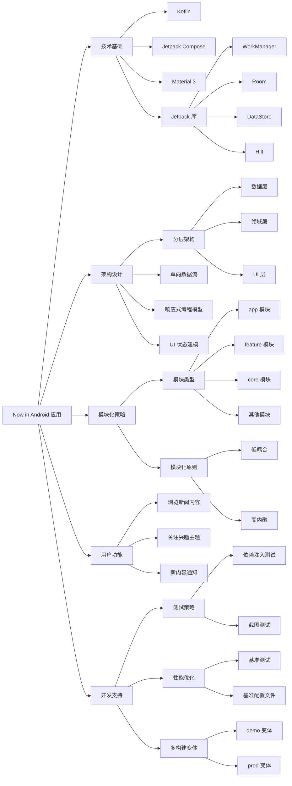

# 《Now in Android 应用》总结

## 文字摘要

### 核心概述

Now in Android 是一个由 Google 官方开发的示例应用，完全使用 Kotlin 和 Jetpack Compose 构建。该应用旨在展示 Android 开发的最佳实践，同时为开发者提供一个实用的参考，帮助他们了解 Android 开发领域的最新动态。

### 关键技术点

- **完全采用 Kotlin 和 Jetpack Compose**：应用完全使用 Kotlin 语言和 Jetpack Compose UI 框架构建
- **遵循官方架构指南**：实现了分层架构（数据层、领域层、UI 层）和单向数据流模式
- **完整的模块化结构**：采用模块化设计，分为 app、feature、core 等多种类型的模块
- **Material 3 设计**：遵循 Material 3 设计指南，支持动态颜色和暗色模式
- **自适应布局**：支持不同屏幕尺寸的自适应布局
- **测试策略**：使用依赖注入和真实测试替身（而非模拟库）实现测试
- **性能优化**：包含基准测试和基准配置文件生成
- **使用多种 Jetpack 组件**：如 WorkManager、Room、DataStore、Hilt 等

### 目标分析

该应用的主要目的是作为 Android 开发的参考实现，展示如何构建一个现代、符合最佳实践的 Android 应用。目标受众是 Android 开发者，特别是希望学习和实践 Jetpack Compose、模块化架构和官方架构指南的开发者。

### 技术价值

- 提供了一个全面的参考实现，展示了如何将各种现代 Android 开发技术和模式整合在一个真实应用中
- 详细的学习资源，包括架构学习之旅和模块化学习之旅文档
- 演示了如何平衡技术实践与实际项目需求，特别是在模块化策略方面
- 使用实际案例展示单向数据流和响应式编程模式的应用

### 扩展分析

#### 架构模式

应用遵循官方的 Android 架构指南，采用分层架构：

- **数据层**：实现为离线优先的数据源，包含仓库和数据源
- **领域层**：包含用例类，处理业务逻辑和数据转换
- **UI 层**：使用 Jetpack Compose 实现 UI，通过 ViewModel 管理 UI 状态

#### 模块化结构

应用采用精心设计的模块化结构：

- **app 模块**：应用级别组件和导航逻辑
- **feature 模块**：独立功能模块，如主题、推荐内容等
- **core 模块**：共享的核心功能，如网络、数据库、设计系统等

#### 状态管理

采用单向数据流模式，使用 Kotlin Flow 实现：

- 数据从低层（数据层）向高层（UI 层）流动
- 事件从高层向低层流动
- UI 状态通过密封层次结构建模

#### 最佳实践

应用展示了多种 Android 开发最佳实践：

- 依赖注入（使用 Hilt）
- 离线优先数据策略
- 响应式编程
- 自适应 UI 设计
- 全面的测试策略

## 思维导图

