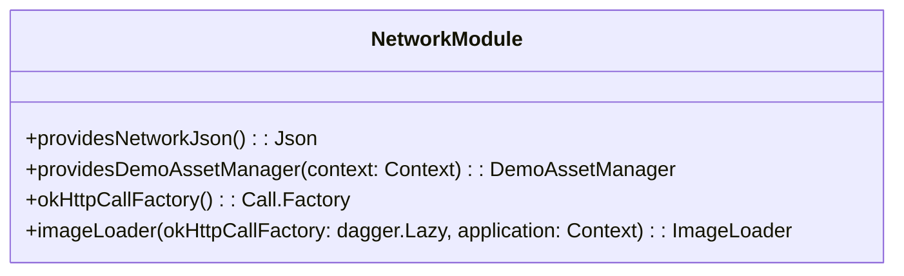
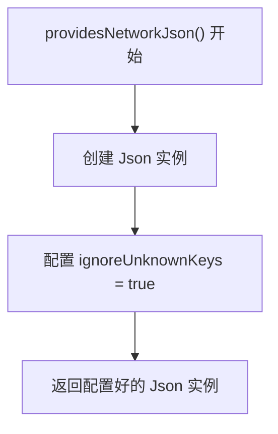
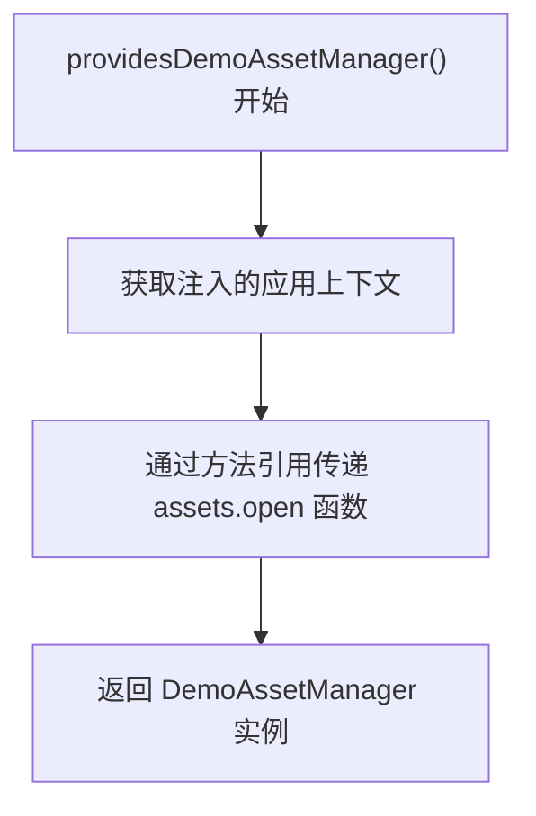
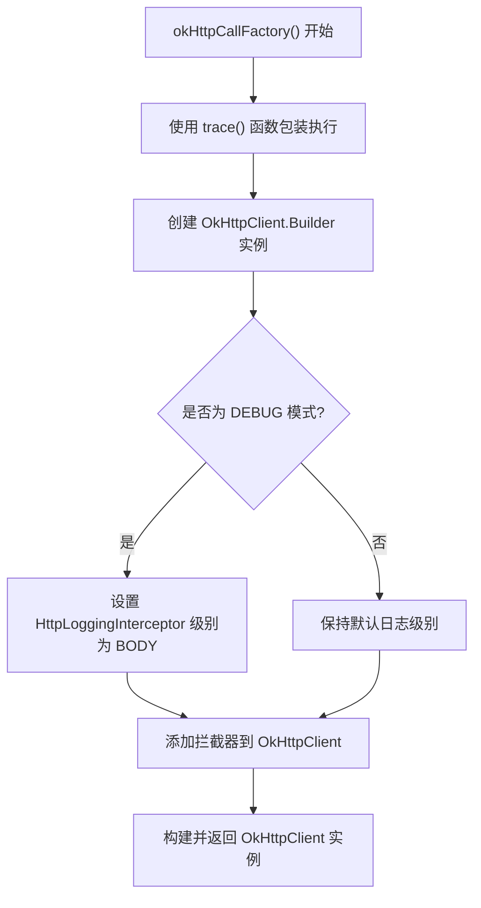
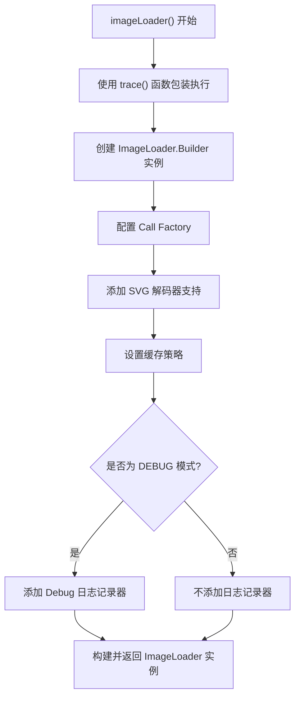

# NetworkModule.kt 文件分析报告

## 文件基本信息

- **文件名称**：NetworkModule.kt
- **文件路径**：core/network/src/main/kotlin/com/google/samples/apps/nowinandroid/core/network/di/NetworkModule.kt
- **主要功能**：提供网络相关依赖的依赖注入模块，包括 JSON 序列化器、HTTP 客户端和图片加载器
- **技术要点**：
  - Dagger Hilt 依赖注入
  - OkHttp 网络客户端
  - Coil 图片加载
  - Kotlin 序列化
  - 单例模式
- **Android 基础概念**：
  - 依赖注入（DI）：一种设计模式，用于实现控制反转，将类的依赖关系提供给它，而不是由类自己创建
  - 网络层抽象：通过接口和实现类分离网络请求逻辑，便于测试和维护
- **与已知技术栈对比**：
  - 类似于 iOS 中的 Swinject 或 Resolver 依赖注入框架
  - 相当于 Flutter 中的 GetIt 或 Provider 服务定位器
  - 类似于前端 React 中的 Context API 和依赖注入

## 语法元素分析

### 语法元素概览

- **包声明**：`com.google.samples.apps.nowinandroid.core.network.di`，遵循 Java 包命名约定
- **导入声明**：
  - Android 框架导入：`android.content.Context`, `androidx.tracing.trace`
  - 图片加载库：`coil.*`
  - 项目内部导入：`com.google.samples.apps.nowinandroid.core.network.*`
  - 依赖注入框架：`dagger.*`, `javax.inject.Singleton`
  - 网络库：`okhttp3.*`
  - 序列化库：`kotlinx.serialization.json.Json`

- **元素统计**：

| 元素类型 | 数量 | 备注 |
|---------|------|------|
| 类      | 0    | 不包含普通类 |
| 接口    | 0    | 不包含接口定义 |
| 对象    | 1    | 包含 `NetworkModule` 单例对象 |
| 函数    | 4    | 包含提供依赖的函数 |
| 扩展函数 | 0    | 不包含 Kotlin 扩展函数 |
| 属性    | 0    | 不包含顶层属性 |

### 类与接口分析

#### NetworkModule 对象分析

- **类/接口名称**：`NetworkModule`
- **类型**：Kotlin `object`（单例对象）
- **职责描述**：提供网络相关组件的依赖注入，集中管理应用的网络层配置
- **Kotlin 语法特点**：
  - 使用 `object` 声明单例，而非 Java 中的 `class` 加私有构造函数
  - 使用函数的表达式主体（`fun x() = y`）简化代码
  - 使用 Lambda 表达式和高阶函数配置网络组件
- **与其他语言对比**：
  - Swift：类似于带有静态方法的 struct 或 class，但 Kotlin 的 object 更接近真正的单例
  - Dart：类似于带有静态方法的 class，Flutter 中常见的 Provider
  - Java：相当于一个带有静态方法的工厂类，但更简洁
  - Objective-C：类似于一个只有类方法的类
  
- **方法分析**：

| 方法名 | 参数 | 返回类型 | 用途 |
|-------|------|---------|------|
| providesNetworkJson | 无 | Json | 提供用于网络数据序列化/反序列化的 Json 对象 |
| providesDemoAssetManager | context: Context | DemoAssetManager | 提供访问应用资源的接口实现 |
| okHttpCallFactory | 无 | Call.Factory | 提供用于网络请求的 OkHttp 客户端实例 |
| imageLoader | okHttpCallFactory: dagger.Lazy<Call.Factory>, application: Context | ImageLoader | 提供支持 SVG 格式的 Coil 图片加载器 |

- **类 UML 图**：

- **依赖关系**：
  - 依赖 `Context` 提供应用上下文
  - 依赖 `DemoAssetManager` 访问应用资源
  - 依赖 `Json` 处理序列化/反序列化
  - 依赖 `OkHttpClient` 处理网络请求
  - 依赖 `ImageLoader` 加载图片

- **与 Java 对比**：
  - Java 中需要使用 `class` 加 `private constructor` 和静态方法实现单例
  - Java 中需要显式声明返回类型，而 Kotlin 可以推断
  - Java 中配置类的链式调用写法更冗长

- **与 Swift 对比**：
  - Swift 中实现类似功能可以使用 `struct` 或 `class` 加静态方法
  - Swift 的依赖注入通常使用 Swinject 等第三方库

- **与 Dart/Flutter 对比**：
  - Flutter 中类似功能可使用 Provider 或 GetIt 框架
  - Dart 中的工厂模式通常使用 factory 构造函数

### 函数分析

#### providesNetworkJson 函数分析

- **函数名称**：`providesNetworkJson`
- **函数签名**：`fun providesNetworkJson(): Json`
- **函数职责**：创建并配置 JSON 序列化器实例，用于网络数据的序列化和反序列化
- **参数分析**：无参数
- **返回值分析**：返回配置好的 `Json` 实例，设置为忽略未知键，提高解析容错性
- **函数流程图**：

- **Kotlin 特有语法**：
  - 使用 DSL（领域特定语言）风格创建并配置 Json 对象
  - 使用表达式函数体简化函数定义
- **与其他语言的函数对比**：
  - Swift 中可使用 JSONDecoder 并设置相关属性
  - JavaScript 中使用 JSON.parse 但需要手动处理异常
  - Dart 中使用 jsonDecode 或 Flutter 中的 convert 库

#### providesDemoAssetManager 函数分析

- **函数名称**：`providesDemoAssetManager`
- **函数签名**：`fun providesDemoAssetManager(@ApplicationContext context: Context): DemoAssetManager`
- **函数职责**：创建 DemoAssetManager 实例，用于访问应用资源文件
- **参数分析**：
  - `context: Context`：应用上下文，带有 `@ApplicationContext` 限定符
- **返回值分析**：返回 DemoAssetManager 实例，封装了资源访问功能
- **函数流程图**：

- **Kotlin 特有语法**：
  - 使用方法引用 `context.assets::open` 传递函数
  - 使用函数式接口的实例化
- **与其他语言的函数对比**：
  - Swift 中可使用闭包或协议实现类似功能
  - Dart 中可使用回调函数或传递方法引用

#### okHttpCallFactory 函数分析

- **函数名称**：`okHttpCallFactory`
- **函数签名**：`fun okHttpCallFactory(): Call.Factory`
- **函数职责**：创建并配置 OkHttpClient 实例，处理 HTTP 请求
- **参数分析**：无参数
- **返回值分析**：返回 OkHttpClient 实例，作为 Call.Factory 接口实现
- **函数流程图**：

- **Kotlin 特有语法**：
  - 使用 `apply` 作用域函数配置对象
  - 使用条件表达式结合作用域函数
- **与其他语言的函数对比**：
  - Swift 中使用 URLSession 配置
  - Flutter 中使用 http 或 dio 库配置网络客户端

#### imageLoader 函数分析

- **函数名称**：`imageLoader`
- **函数签名**：`fun imageLoader(okHttpCallFactory: dagger.Lazy<Call.Factory>, @ApplicationContext application: Context): ImageLoader`
- **函数职责**：创建并配置 Coil 图片加载器，支持 SVG 格式和其他图片加载优化
- **参数分析**：
  - `okHttpCallFactory: dagger.Lazy<Call.Factory>`：延迟加载的 HTTP 客户端工厂
  - `application: Context`：应用上下文，带有 `@ApplicationContext` 限定符
- **返回值分析**：返回配置好的 ImageLoader 实例，用于高效加载图片，特别是 SVG 格式
- **函数流程图**：

- **边界条件**：
  - 通过 `dagger.Lazy` 延迟初始化 HTTP 客户端，避免循环依赖问题
- **Kotlin 特有语法**：
  - 使用 Lambda 表达式配置组件
  - 使用 DSL 风格的构建器模式
  - 使用 `apply` 作用域函数组织代码块
- **与其他语言的函数对比**：
  - Swift 中使用 Kingfisher 或 SDWebImage 库
  - Flutter 中使用 cached_network_image 库

### Kotlin 语法分析

**Kotlin 特性与语法**：

- **空安全特性**：
  - 函数参数类型没有使用可空类型，表明所有参数在调用时都必须非空
  - 与 Swift 的 Optional 类似，但语法上区别在于 Kotlin 使用 `?` 后缀标记可空类型
  - 与 Dart 的空安全类似，但 Dart 使用 `?` 标记可空类型，语法接近

- **函数式编程特性**：
  - 使用 Lambda 表达式：`.callFactory { okHttpCallFactory.get() }`
  - 高阶函数的使用：`trace("NiaImageLoader") { ... }`
  - 与 Swift 闭包语法类似：`{ okHttpCallFactory.get() }`
  - 与 JavaScript 箭头函数对比：`() => okHttpCallFactory.get()`

- **作用域函数**：
  - 使用 `apply` 函数配置对象并返回它本身
  - 相当于 Swift 中的方法链式调用结合 `with` 函数
  - 相当于 JavaScript 中的方法链式调用，但更简洁

- **函数方法引用**：
  - 使用 `context.assets::open` 语法传递方法引用
  - 与 Java 的方法引用 `Class::method` 类似
  - 与 Dart 的 `callback` 传递函数引用类似

- **单例对象**：
  - 使用 `object` 关键字创建单例
  - 与 Swift 的 `static let shared = ...` 单例模式相比更简洁
  - 与 Java 通过私有构造函数实现单例相比更安全

- **注解使用**：
  - 使用 `@Module`, `@InstallIn`, `@Provides`, `@Singleton` 等注解定义 DI 模块
  - 与 Java 注解用法类似，但语法更简洁
  - 与 Swift 的 property wrapper 或 Dart 的元数据注解概念类似

### API 使用分析

- **重要 API**：

| API 名称 | 用途 | 文档链接 | 类似 iOS/Flutter API |
|---------|------|---------|------------------|
| Dagger Hilt | 依赖注入框架 | [Hilt](https://dagger.dev/hilt/) | iOS: Swinject, Flutter: GetIt, Provider |
| OkHttp | HTTP 客户端 | [OkHttp](https://square.github.io/okhttp/) | iOS: Alamofire, Flutter: dio |
| Coil | 图片加载库 | [Coil](https://coil-kt.github.io/coil/) | iOS: Kingfisher, Flutter: cached_network_image |
| Kotlin Serialization | JSON 序列化 | [kotlinx.serialization](https://github.com/Kotlin/kotlinx.serialization) | iOS: Codable, Flutter: json_serializable |
| Android Tracing | 性能跟踪 | [Tracing](https://developer.android.com/reference/kotlin/androidx/tracing/package-summary) | iOS: os_signpost, Flutter: DevTools |

- **第三方库**：
  - OkHttp：处理 HTTP 请求的高性能客户端，相当于 iOS 的 Alamofire 或 Flutter 的 dio
  - Coil：专为 Kotlin 协程优化的图片加载库，类似于 iOS 的 Kingfisher 或 Flutter 的 cached_network_image
  - Dagger Hilt：简化 Dagger 依赖注入使用的库，类似 iOS 的 Swinject 或 Flutter 的 GetIt

- **Android 框架 API**：
  - Context：提供应用环境信息的接口，类似于 iOS 中的 UIApplication 或 Flutter 中的 BuildContext
  - Trace：性能监测 API，用于跟踪代码执行时间，类似于 iOS 中的 os_signpost

## 注意事项与最佳实践

- **优点**：
  - 使用单例模式管理网络组件，确保资源共享和一致性
  - 使用依赖注入实现关注点分离，便于测试和维护
  - 使用条件配置（如 DEBUG 模式下的日志）提高开发效率
  - 明确定义组件职责，每个函数功能单一

- **改进空间**：
  - 可考虑添加更多网络相关配置，如连接超时、重试策略等
  - 可以提取公共配置到常量或配置类中

- **风险点**：
  - 缺少网络错误处理策略
  - 图片加载设置 `respectCacheHeaders(false)` 可能导致缓存问题
  - 未实现网络状态监测和离线模式支持

- **初学者指南**：
  - 学习 Dagger Hilt 依赖注入框架基础
  - 了解 OkHttp 网络库的使用方法
  - 掌握 Kotlin 中单例模式和依赖注入的实现
  - 针对 iOS 开发者：理解 Android 中的依赖注入与 iOS 依赖管理的区别
  - 针对 Flutter 开发者：对比 Flutter 中的 Provider/GetIt 与 Android 依赖注入

- **替代方案**：
  - 可使用 Koin 作为更轻量的依赖注入框架替代 Dagger Hilt
  - 可使用 Retrofit 结合 OkHttp 实现更声明式的 API 调用
  - 可使用 Glide 替代 Coil 作为图片加载库

- **跨平台开发考虑**：
  - 将网络层抽象为接口，便于在跨平台开发中实现不同平台的具体实现
  - 使用 Kotlin Multiplatform 可将网络模型和逻辑共享给 iOS 端
  - 在 Flutter 中可使用平台通道调用原生网络实现，或使用纯 Dart 实现 