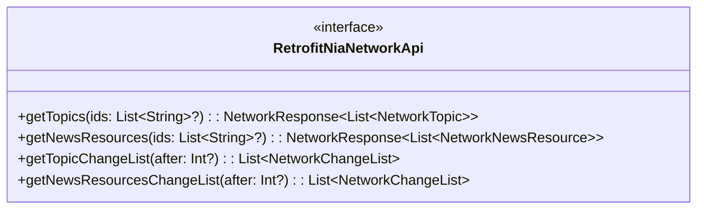
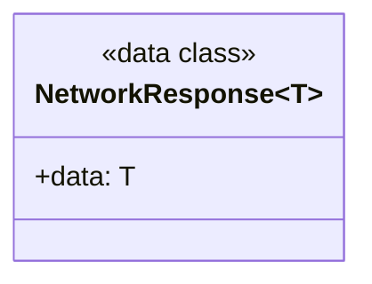
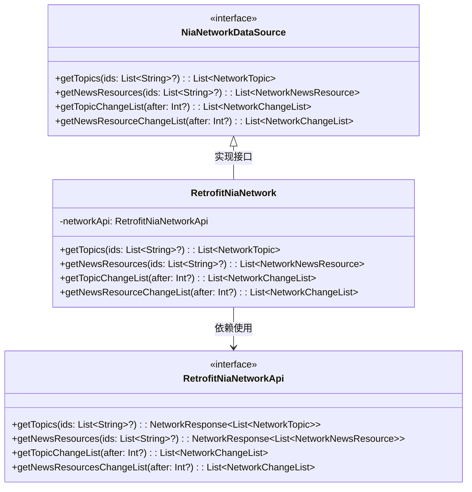
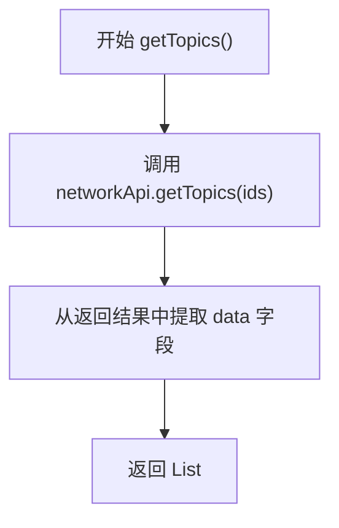

# RetrofitNiaNetwork.kt 文件分析报告

## 文件基本信息

- **文件名称**：RetrofitNiaNetwork.kt
- **文件路径**：core/network/src/main/kotlin/com/google/samples/apps/nowinandroid/core/network/retrofit/RetrofitNiaNetwork.kt
- **主要功能**：实现基于 Retrofit 的网络数据源，用于获取 NowInAndroid 应用所需的主题和新闻资源数据
- **技术要点**：Retrofit、Kotlin Serialization、依赖注入（Dagger Hilt）、Kotlin 协程、懒加载
- **Android 基础概念**：网络请求、RESTful API、数据序列化与反序列化、依赖注入
- **与已知技术栈对比**：
  - iOS：类似于 Alamofire + Codable
  - Flutter：类似于 Dio + json_serializable
  - 前端：类似于 Axios + TypeScript 接口

## 语法元素分析

### 语法元素概览

- **包声明**：`com.google.samples.apps.nowinandroid.core.network.retrofit`
- **导入声明**：包含 Android 追踪、网络库、序列化库和依赖注入相关导入
- **元素统计**：

| 元素类型 | 数量 | 备注 |
|---------|------|------|
| 类      | 2    | 包括实现类和网络响应数据类 |
| 接口    | 1    | Retrofit API 接口 |
| 对象    | 0    | 无单例对象或伴生对象 |
| 函数    | 4    | 接口实现函数 |
| 扩展函数 | 0    | 无扩展函数 |
| 属性    | 2    | 常量和私有属性 |

### 类与接口分析

#### `RetrofitNiaNetworkApi`（接口）

- **类型**：接口（Interface）
- **职责描述**：声明用于与后端 API 通信的网络请求方法
- **Kotlin 语法特点**：使用 suspend 函数表示异步操作，配合 Retrofit 注解
- **与其他语言对比**：
  - Swift：类似于使用 URLSession 定义的请求方法，但协程替代了 completion handler
  - Dart：类似于 Flutter 中定义的 API 服务类，但使用 suspend 函数而非 Future
  - Java：类似于传统 Retrofit 接口，但使用 Kotlin 的 suspend 函数而非 Call 或 RxJava

- **方法分析**：

| 方法名 | 参数 | 返回类型 | 用途 |
|-------|------|---------|------|
| getTopics | ids: List<String>? | NetworkResponse<List<NetworkTopic>> | 获取主题列表 |
| getNewsResources | ids: List<String>? | NetworkResponse<List<NetworkNewsResource>> | 获取新闻资源列表 |
| getTopicChangeList | after: Int? | List<NetworkChangeList> | 获取主题变更列表 |
| getNewsResourcesChangeList | after: Int? | List<NetworkChangeList> | 获取新闻资源变更列表 |

- **变更列表方法业务含义**：
  - `getTopicChangeList` 和 `getNewsResourcesChangeList` 方法用于实现增量数据同步。这些方法从服务器获取自上次同步以来的数据变更记录。
  - 参数 `after` 表示客户端当前已知的最新版本号。服务器会返回版本号大于此值的所有变更记录。
  - 这种机制类似于 Git 的拉取操作，只获取新的变更而非全量数据，减少网络传输和处理开销。
  - 当 `after` 为 null 时，服务器将返回所有变更记录（初始同步）。

- **UML 类图**：



#### `NetworkResponse`（数据类）

- **类型**：数据类（Data Class）
- **职责描述**：包装从后端 API 返回的数据
- **Kotlin 语法特点**：泛型数据类、Kotlinx.Serialization 序列化
- **与其他语言对比**：
  - Swift：类似于 Swift 中的泛型结构体
  - Dart：类似于 Flutter 中的泛型模型类
  - Java：类似于带有泛型的 POJO 类，但更简洁

- **属性分析**：

| 属性名 | 类型 | 可见性 | 用途 |
|-------|------|-------|------|
| data | T | public | 存储实际返回的数据 |

- **UML 类图**：



#### `RetrofitNiaNetwork`（类）

- **类型**：普通类
- **职责描述**：实现 `NiaNetworkDataSource` 接口，使用 Retrofit 执行网络请求
- **Kotlin 语法特点**：构造函数注入、懒加载、Lambda 表达式
- **与其他语言对比**：
  - Swift：类似于 iOS 中的网络管理器，但使用依赖注入而非单例
  - Dart：类似于 Flutter 中的 API 服务实现，但使用协程而非 Future
  - Java：类似于 Repository 实现，但使用 Kotlin 协程简化异步操作

- **属性分析**：

| 属性名 | 类型 | 可见性 | 用途 |
|-------|------|-------|------|
| networkApi | RetrofitNiaNetworkApi | private | 存储 Retrofit 创建的 API 接口实现 |

- **方法分析**：

| 方法名 | 参数 | 返回类型 | 用途 |
|-------|------|---------|------|
| getTopics | ids: List<String>? | List<NetworkTopic> | 获取主题列表并提取数据 |
| getNewsResources | ids: List<String>? | List<NetworkNewsResource> | 获取新闻资源列表并提取数据 |
| getTopicChangeList | after: Int? | List<NetworkChangeList> | 获取主题变更列表 |
| getNewsResourceChangeList | after: Int? | List<NetworkChangeList> | 获取新闻资源变更列表 |

- **类 UML 图**：



- **继承关系**：实现了 `NiaNetworkDataSource` 接口
- **依赖关系**：
  - 依赖 Retrofit 创建 API 实例
  - 依赖 OkHttp 作为 HTTP 客户端
  - 依赖 Kotlinx.Serialization 进行 JSON 序列化
- **与 Java 对比**：在 Java 中实现类似功能需要更多代码，不支持 suspend 函数和构造函数注入
- **与 Swift 对比**：类似 Swift 中的网络服务类，但使用协程代替闭包
- **与 Dart/Flutter 对比**：类似 Dart 中的 API 服务，但使用协程代替 Future 和 async/await

### 函数分析

#### `getTopics`（方法）

- **函数名称**：getTopics
- **函数签名**：`override suspend fun getTopics(ids: List<String>?): List<NetworkTopic>`
- **函数职责**：获取主题列表，可选择性地按 ID 过滤
- **参数分析**：
  - ids：可选的主题 ID 列表，用于过滤结果
- **返回值分析**：返回主题列表，从 API 响应中提取出 data 字段
- **函数流程图**：



- **调用关系**：调用了内部 `RetrofitNiaNetworkApi.getTopics()` 方法
- **边界条件**：
  - 当 ids 为 null 时，返回所有主题
  - 当网络请求失败时，会抛出异常
- **复杂度分析**：时间复杂度和空间复杂度取决于网络请求和返回数据的大小
- **Kotlin 特有语法**：使用 suspend 函数表示异步操作，使用单行表达式简化函数体
- **与其他语言的函数对比**：
  - Swift：类似于使用 async/await 的函数
  - Dart：类似于使用 async/await 的函数
  - JavaScript：类似于使用 async/await 的函数，但 Kotlin 协程提供了更多控制

### 全局变量与常量分析

#### `NIA_BASE_URL`（常量）

- **变量/常量名**：NIA_BASE_URL
- **类型**：String
- **作用域**：私有常量，仅在文件内可见
- **用途**：存储后端 API 的基础 URL
- **初始化**：从 BuildConfig 获取 BACKEND_URL
- **使用方式**：用于初始化 Retrofit 实例
- **与其他语言对比**：
  - Swift：类似于在文件顶部定义的私有常量
  - Dart：类似于类内部定义的静态常量
  - JavaScript：类似于模块内的常量

#### `BuildConfig` 基础知识

`BuildConfig` 是 Android 构建系统自动生成的类，包含应用构建时的配置信息：

- **作用**：在编译时将构建配置信息注入到代码中，如版本号、调试标志和自定义属性
- **常见字段**：
  - `DEBUG`：布尔值，表示是否为调试构建
  - `APPLICATION_ID`：应用的包名
  - `VERSION_CODE` 和 `VERSION_NAME`：应用版本信息
  - 自定义字段：如此处的 `BACKEND_URL`

- **敏感信息处理**：
  - 项目使用 `secrets-gradle-plugin` 插件管理敏感配置
  - 配置文件：

    ```properties
    # secrets.defaults.properties（默认配置，可提交到版本控制）
    BACKEND_URL="http://example.com"
    ```

  - Gradle 配置：

    ```kotlin
    // build.gradle.kts
    secrets {
        defaultPropertiesFileName = "secrets.defaults.properties"
    }
    ```

  - 工作原理：
    1. 插件会查找 `secrets.properties`（本地配置，不提交到版本控制）
    2. 如果找不到，则使用 `secrets.defaults.properties` 中的默认值
    3. 配置值会在构建时注入到 `BuildConfig` 类中
    4. 代码通过 `BuildConfig.BACKEND_URL` 安全地访问这些值

- **优势**：
  - 避免硬编码配置值
  - 支持不同构建变体使用不同的配置
  - 提高代码安全性，敏感信息不直接写入代码
  - 通过默认配置文件支持 CI/CD 构建
  - 本地开发可以使用不同的配置而不影响其他开发者

- **最佳实践**：
  - 将 `secrets.properties` 添加到 `.gitignore`
  - 提供 `secrets.defaults.properties` 作为模板和默认值
  - 在文档中说明如何配置本地开发环境
  - 在 CI/CD 环境中通过环境变量覆盖这些值

### Kotlin 语法分析

#### **空安全特性**

- 参数中使用 `?` 表示可空类型，如 `ids: List<String>?`
- 与 Swift 对比：类似于 Swift 中的可选类型（Optional）
- 与 Dart 对比：类似于 Dart 中的可空类型声明

#### **函数式编程特性**

- 使用 Lambda 表达式配置 Retrofit Builder
- 使用单行表达式函数体简化实现
- 与 Swift 闭包对比：类似于 Swift 中的尾随闭包
- 与 JavaScript 箭头函数对比：语法不同但概念类似

#### **协程与异步**

- 使用 `suspend` 关键字标记异步函数
- 使用 `trace` 函数包装协程代码以进行性能追踪
- 与 Swift 的 async/await 对比：概念类似但语法不同
- 与 JavaScript Promise/async/await 对比：概念类似但协程提供更多控制
- 与 Dart Future/async/await 对比：概念类似但协程更轻量级

#### **Dagger Lazy 加载与 callFactory**

- **`dagger.Lazy<Call.Factory>`**：
  - **功能**：Dagger 提供的懒加载容器，它延迟初始化对象，直到首次调用 `get()` 方法
  - **作用**：避免在注入时就创建可能开销较大的对象，如 OkHttp 实例
  - **原理**：在依赖注入时只注入一个代理对象，实际对象在首次访问时才创建
  - **优势**：减少应用启动时间，降低内存占用，特别是对于可能不会立即使用的重量级对象

- **`.callFactory { okhttpCallFactory.get().newCall(it) }`**：
  - **功能**：为 Retrofit 提供一个创建 HTTP 请求的工厂方法
  - **作用**：通过 Lambda 表达式延迟获取 OkHttp 客户端实例，避免在主线程初始化
  - **工作方式**：
    - `callFactory` 方法接收一个函数类型参数，该函数负责创建 HTTP 请求
    - 当 Retrofit 需要发起请求时，才调用这个函数
    - 函数内部通过 `okhttpCallFactory.get()` 懒加载获取 OkHttp 客户端
    - 然后使用客户端的 `newCall(it)` 方法创建具体的请求
  - **代码解析**：

    ```kotlin
    .callFactory { request -> // 参数 request 是 Retrofit 创建的 HTTP 请求
        okhttpCallFactory.get() // 懒加载获取 OkHttp 客户端
            .newCall(request) // 使用客户端创建请求
    }
    ```

  - **性能优势**：避免在应用启动阶段初始化 OkHttp，减少启动时间

### API 使用分析

#### **重要 API**

| API 名称 | 用途 | 文档链接 | 类似 iOS/Flutter API |
|---------|------|---------|------------------|
| Retrofit | HTTP 客户端 | [Retrofit](https://square.github.io/retrofit/) | Alamofire (iOS) / Dio (Flutter) |
| kotlinx.serialization | JSON 序列化 | [Kotlinx.Serialization](https://github.com/Kotlin/kotlinx.serialization) | Codable (iOS) / json_serializable (Flutter) |
| OkHttp | HTTP 客户端 | [OkHttp](https://square.github.io/okhttp/) | URLSession (iOS) / http package (Flutter) |
| Dagger/Hilt | 依赖注入 | [Hilt](https://dagger.dev/hilt/) | Swinject (iOS) / get_it (Flutter) |

#### **第三方库**

- Retrofit：简化 HTTP 请求的库
  - 与 iOS 生态系统对比：类似于 Alamofire 或 Moya
  - 与 Flutter 生态系统对比：类似于 Dio 或 Chopper
- Kotlinx.Serialization：Kotlin 官方序列化库
  - 与 iOS 生态系统对比：类似于 Codable 或 SwiftyJSON
  - 与 Flutter 生态系统对比：类似于 json_serializable 或 built_value

#### **Android 框架 API**

- `androidx.tracing.trace`：用于性能追踪
  - 与 iOS 框架对比：类似于 Instruments 中的 signpost
  - 与 Flutter 框架对比：类似于 Flutter DevTools 的性能标记

### 注意事项与最佳实践

#### **优点**

1. 使用依赖注入提高代码模块化和可测试性
2. 使用 Lazy 加载避免在主线程初始化 OkHttp
3. 接口分离原则（ISP）通过接口定义网络操作
4. 使用 Kotlin 协程简化异步代码

#### **改进空间**

1. 可添加网络错误处理机制和重试逻辑
2. 可实现缓存策略以减少网络请求
3. 可添加请求和响应的日志记录
4. 可实现请求取消和超时处理

#### **风险点**

1. 没有明显的错误处理机制
2. 未实现网络状态检查
3. 缺少请求速率限制和负载管理

#### **初学者指南**

- 对 Android 初学者：
  - 学习 Retrofit 基本用法和配置
  - 理解 Kotlin 协程在网络请求中的应用
  - 学习依赖注入基础概念

- 对有 iOS 背景的开发者：
  - 将 Retrofit 与 Alamofire 概念对比学习
  - 将 Kotlin 协程与 Swift 中的异步操作对比
  
- 对有前端背景的开发者：
  - 将 Retrofit 与 Axios/Fetch API 对比学习
  - 将 Kotlin 协程与 JavaScript Promise/async/await 对比

#### **替代方案**

1. 使用 Ktor Client 替代 Retrofit
2. 使用 Moshi 替代 Kotlinx.Serialization
3. 使用 Flow API 返回流式数据而非单次响应

#### **跨平台开发考虑**

1. 在跨平台开发中，可以使用类似的架构设计模式
2. Flutter 可使用 Repository 模式和 Dio 实现类似功能
3. React Native 可实现类似的网络层抽象
4. Kotlin Multiplatform 可共享网络数据模型和序列化逻辑
