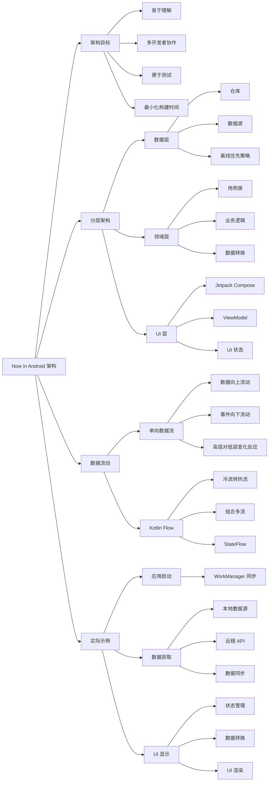

# 《架构学习之旅》总结

## 文字摘要

### 核心概述

Now in Android 应用架构是官方 Android 架构指南的实际应用，它采用了分层设计，包括数据层、领域层和 UI 层，实现了单向数据流的响应式编程模型。这种架构设计旨在创建可扩展、易于理解和测试的应用，同时支持多开发者协作。

### 关键技术点

- **三层架构**：应用分为数据层（数据管理）、领域层（业务逻辑）和 UI 层（界面展示）
- **单向数据流**：数据从低层向高层流动，事件从高层向低层传递
- **响应式编程模型**：使用 Kotlin Flow 实现数据流和状态管理
- **离线优先策略**：数据层采用本地存储作为真实来源，确保应用在离线状态下也能正常工作
- **Repository 模式**：仓库作为唯一访问应用数据的公共 API
- **用例（UseCase）设计**：封装业务逻辑的类，简化 ViewModel 逻辑
- **UI 状态建模**：使用密封层次结构建模 UI 状态，确保 UI 元素处理所有可能状态
- **ViewModel 转换**：将数据流转换为 UI 状态，使用 StateFlow 共享状态

### 应用案例：显示新闻流程

应用架构通过"为你推荐"屏幕上的新闻展示功能进行了详细说明：

1. 应用启动时，WorkManager 队列化同步任务
2. ViewModel 获取新闻资源流并设置加载状态
3. 用户数据从 DataStore 获取，新闻数据通过网络请求获取
4. 远程数据保存到本地 Room 数据库
5. 数据变化触发流更新，经过转换后提供给 UI
6. UI 接收到数据后更新状态并渲染内容

### 技术价值

- **数据一致性**：通过单一真实来源原则确保数据一致性
- **关注点分离**：清晰的责任划分使代码更易于维护和扩展
- **数据流可追踪性**：单向数据流使数据流动和状态变化更可预测和可追踪
- **测试友好**：架构各层可独立测试，降低测试复杂性
- **离线能力**：即使在无网络环境下，应用仍能提供核心功能

### 扩展分析

#### 数据层详解

数据层实现为应用数据和业务逻辑的离线优先源，是所有数据的真实来源：

- **仓库设计**：每个仓库有自己的模型，提供读写数据的方法
- **数据源管理**：仓库依赖多个数据源（如 Room 数据库、DataStore、网络 API）
- **数据同步策略**：仓库负责协调本地存储与远程源之间的数据，使用指数退避策略处理同步错误
- **数据暴露方式**：数据作为流（Flow）公开，确保客户端能对数据变化做出反应

#### 领域层详解

领域层包含用例类，封装业务逻辑，简化 ViewModel 逻辑：

- **用例设计**：单一可调用方法类（`operator fun invoke`）
- **数据转换**：组合和转换来自仓库的数据
- **跨仓库协作**：如 `GetUserNewsResourcesUseCase` 组合多个仓库数据

#### UI 层详解

UI 层使用 Jetpack Compose 构建，通过 ViewModel 管理状态：

- **状态建模**：使用密封层次结构建模 UI 状态（如 `Loading` 和 `Success`）
- **状态转换**：ViewModel 将数据流转换为 UI 状态
- **用户交互处理**：UI 元素将用户操作作为事件传递给 ViewModel

## 思维导图

