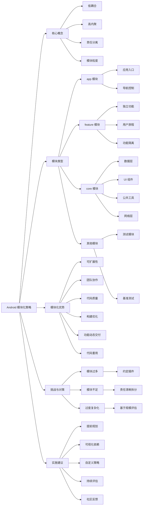

# 《模块化学习之旅》总结

## 文字摘要

### 核心概述

Now in Android 应用的模块化策略是将单体代码库拆分为松散耦合、自包含的模块集合，实现关注点分离、提高代码可维护性和扩展性。这种模块化方法平衡了技术优势与实际项目需求，为大型 Android 应用的模块化架构提供了参考实现。

### 关键技术点

- **模块化定义**：将单体代码库拆分为松散耦合、自包含的功能模块
- **核心原则**：低耦合（模块之间最小依赖）和高内聚（模块内部功能紧密相关）
- **模块类型划分**：app 模块、feature 模块、core 模块和其他辅助模块
- **依赖方向控制**：严格控制模块间依赖关系（feature 模块不依赖其他 feature 模块）
- **构建优化**：使用约定插件（convention plugins）提取可重用构建配置
- **模块粒度平衡**：避免模块过多或过少，找到合适的模块划分粒度
- **责任边界清晰**：每个模块有明确定义的责任和领域边界

### 模块结构与职责

Now in Android 应用采用了以下模块结构：

1. **app 模块**：作为应用的入口点，包含应用级别组件（如 MainActivity、NiaApp）和导航逻辑，依赖所有 feature 模块和必要的 core 模块

2. **feature 模块**：每个模块负责应用中的一个特定功能或用户旅程，如：
   - `feature:topic`：处理主题信息展示
   - `feature:foryou`：处理用户新闻订阅和首次运行引导

3. **core 模块**：为应用提供共享的基础功能，如：
   - `core:data`：数据管理和仓库
   - `core:designsystem`：设计系统和 UI 组件
   - `core:ui`：复合 UI 组件
   - `core:network`：网络请求处理
   - `core:database`：本地数据存储
   - `core:datastore`：用户偏好存储
   - `core:model`：共享数据模型
   - `core:common`：通用工具类
   - `core:testing`：测试支持

4. **其他辅助模块**：如 `sync`、`benchmark`、`test` 和 `app-nia-catalog` 等

### 技术价值

- **代码可扩展性**：模块化设计使代码库更易于扩展，新功能可以作为新模块添加
- **团队协作增强**：明确的模块边界减少团队成员间的冲突，支持平行开发
- **代码质量提升**：封装的模块更易于测试、维护和理解
- **构建性能优化**：支持 Gradle 并行和增量构建，减少构建时间
- **动态交付支持**：为 Google Play 功能动态交付提供基础架构支持
- **代码重用**：模块可跨应用和平台重用，提高开发效率

### 扩展分析

#### 模块化的挑战和对策

模块化过程中存在的挑战和 Now in Android 应用采取的对策：

1. **模块过多问题**：
   - 挑战：过多模块增加构建配置复杂性，延长 Gradle 同步时间
   - 对策：使用 `build-logic` 中的约定插件提取可重用构建配置

2. **模块不足问题**：
   - 挑战：模块太少会导致单体应用问题重现
   - 对策：根据责任分明的原则拆分模块，避免创建臃肿模块

3. **过度复杂化风险**：
   - 挑战：小型项目可能不需要复杂的模块化
   - 对策：基于代码库规模和复杂性评估模块化程度

#### 模块化决策思路

Now in Android 团队的模块化决策过程：

1. 考虑项目路线图、未来功能和拓展需求
2. 在过度模块化和展示最佳实践之间寻找平衡
3. 与社区讨论并根据反馈调整方案
4. 关注模块粒度和调整灵活性

#### 模块化实践建议

基于 Now in Android 经验的实践建议：

1. 事先规划和可视化模块依赖关系图
2. 根据团队和项目具体情况调整模块化策略
3. 随着项目增长，考虑增加模块粒度（如拆分数据层）
4. 持续评估和调整模块边界

## 思维导图

