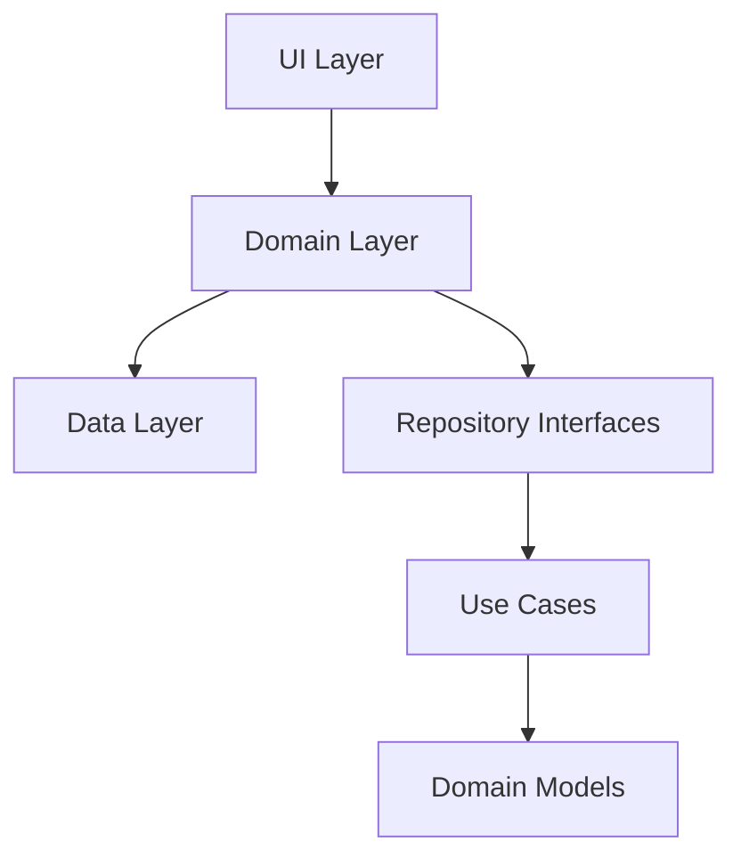
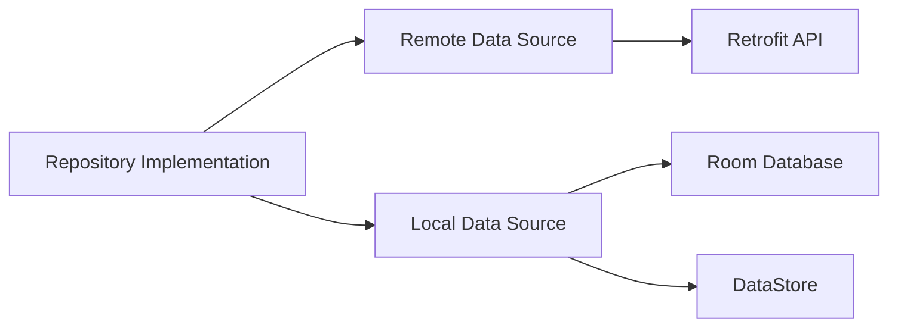

# Now in Android 项目分析报告

## 项目概述

Now in Android 是一个完全使用 Kotlin 和 Jetpack Compose 构建的 Android 示例应用。该应用旨在展示 Android 开发的最佳实践，并帮助开发者通过提供定期新闻更新来了解 Android 开发世界的最新动态。

### 主要功能

- 展示来自 Now in Android 系列的内容
- 浏览最新视频、文章和其他内容的链接
- 关注感兴趣的主题
- 当有新内容发布时接收通知
- 支持自适应布局，适配不同屏幕尺寸
- 支持动态主题和暗色模式

## 技术栈分析

### 核心技术

| 技术/框架 | 版本/说明 | 对比 iOS/Flutter |
|----------|----------|-----------------|
| Kotlin | JDK 17+ | 类比 Swift，都是现代静态类型语言 |
| Jetpack Compose | Material 3 | 类比 SwiftUI/Flutter，都是声明式 UI 框架 |
| Kotlin 协程 & Flow | 异步编程 | 类比 Swift 的 async/await 和 Combine，或 Flutter 的 Future/Stream |
| Hilt | 依赖注入 | 类比 iOS 的 Resolver/Swinject，Flutter 的 GetIt/Provider |
| Room | 本地数据库 | 类比 iOS 的 CoreData，Flutter 的 sqflite |
| DataStore | 键值存储 | 类比 iOS 的 UserDefaults，Flutter 的 SharedPreferences |
| WorkManager | 后台任务 | 类比 iOS 的 BackgroundTasks，Flutter 的 WorkManager |

### 构建系统

- Gradle 构建系统（使用 Kotlin DSL）
- 版本目录（libs.versions.toml）管理依赖
- 支持多个构建变体：
  - `demo`：使用本地静态数据
  - `prod`：连接实际后端服务器
  - `debug`/`release`：调试和发布版本
- 基准配置文件优化
- Compose 编译器指标收集

### 项目架构

#### 模块化结构

```plaintext
项目根目录/
├── app/                              # 应用主模块
├── feature/                          # 功能模块
│   ├── foryou/                      # "为你推荐"功能
│   ├── interests/                    # 兴趣管理功能
│   ├── bookmarks/                    # 书签功能
│   ├── topic/                       # 主题功能
│   ├── search/                      # 搜索功能
│   └── settings/                    # 设置功能
├── core/                            # 核心模块
│   ├── analytics/                   # 分析功能
│   ├── common/                      # 通用工具和扩展
│   ├── data/                        # 数据层实现
│   ├── database/                    # 本地数据库
│   ├── datastore/                   # 键值存储
│   ├── designsystem/                # 设计系统组件
│   ├── domain/                      # 业务领域模型
│   ├── model/                       # 数据模型
│   ├── network/                     # 网络通信
│   ├── notifications/               # 通知功能
│   └── ui/                         # UI 通用组件
├── sync/                           # 数据同步模块
└── benchmarks/                     # 性能基准测试
```

#### 分层架构分析

##### 1. 界面层（UI Layer）

项目采用 Jetpack Compose 实现现代化的声明式 UI，主要特点：

- **Compose UI 架构**
  - 使用 Material 3 设计系统
  - 支持自适应布局和不同屏幕尺寸
  - 实现动态主题和暗色模式
  - 使用 Compose Navigation 进行导航管理

- **状态管理**
  - 使用 `ViewModel` 管理 UI 状态
  - 采用单向数据流（UDF）模式
  - 利用 Kotlin Flow 进行状态更新
  - 使用 `remember` 和 `rememberSaveable` 进行状态保存

- **UI 组件复用**
  - 通过 `core:designsystem` 模块提供统一的设计系统
  - 使用 Compose 预览功能进行 UI 开发
  - 支持组件级别的主题定制

##### 2. 业务层（Domain Layer）

采用清晰的领域驱动设计（DDD）思想：



主要特点：

- **领域模型**
  - 使用 Kotlin 数据类定义业务实体
  - 通过密封类（sealed class）表示状态和事件
  - 领域模型与数据模型分离

- **用例实现**
  - 每个业务功能封装为独立用例
  - 使用协程处理异步操作
  - 通过 Flow 实现响应式数据流

- **依赖注入**
  - 使用 Hilt 进行依赖管理
  - 模块间通过接口解耦
  - 便于测试的依赖替换机制

##### 3. 数据层（Data Layer）

采用 Repository 模式管理数据访问：



主要特点：

- **数据源管理**
  - 支持本地和远程数据源
  - 实现离线优先策略
  - 使用 Room 进行本地持久化
  - 通过 DataStore 存储用户偏好

- **数据同步**
  - 使用 WorkManager 管理后台同步
  - 实现增量同步策略
  - 处理冲突解决

- **数据映射**
  - DTO 与领域模型的转换
  - 使用扩展函数实现映射逻辑
  - 保持各层数据模型的独立性

### 测试策略

项目采用全面的测试策略：

1. **单元测试**
   - 使用 JUnit 进行单元测试
   - 不使用 Mock 库，而是采用测试替身
   - 通过 Hilt 进行测试依赖注入

2. **UI 测试**
   - 使用 Roborazzi 进行截图测试
   - 支持不同屏幕尺寸的 UI 测试
   - 使用 Compose 测试 API

3. **集成测试**
   - 使用真实的本地数据存储
   - 测试组件间的交互
   - 验证数据流的完整性

### 性能优化

项目实施多项性能优化措施：

1. **编译优化**
   - 使用 Gradle 构建缓存
   - 启用配置缓存
   - 优化 Compose 编译器配置

2. **运行时优化**
   - 使用基准配置文件
   - 实现 Compose 组件记忆化
   - 优化启动性能

3. **资源优化**
   - 模块化减少 APK 大小
   - 使用矢量图标
   - 实现资源按需加载

### 开发工具和环境

- Android Studio 最新稳定版
- JDK 17 或更高版本
- Gradle 8.x
- 支持的 Android API 级别：
  - 最低版本：Android 5.0（API 21）
  - 目标版本：Android 14（API 34）

### 项目构建与运行

主要的构建命令：

```bash
# 构建 Demo 调试版本
./gradlew assembleDemoDebug

# 运行单元测试
./gradlew testDemoDebug

# 运行 UI 测试
./gradlew connectedDemoDebugAndroidTest

# 生成基准配置文件
./gradlew :app:generateDemoDebugBaselineProfile
```

### Kotlin 语法特性应用

项目充分利用了 Kotlin 的现代语言特性：

1. **协程和 Flow**

   ```kotlin
   // 示例：使用协程和 Flow 处理数据流
   fun getNewsStream(): Flow<List<NewsItem>> = flow {
       while(true) {
           val news = newsRepository.getLatestNews()
           emit(news)
           delay(refreshInterval)
       }
   }
   ```

2. **扩展函数**

   ```kotlin
   // 示例：为 Compose 组件添加扩展函数
   fun Modifier.adaptiveLayout(
       compact: Modifier.() -> Modifier,
       medium: Modifier.() -> Modifier,
       expanded: Modifier.() -> Modifier
   ): Modifier = ...
   ```

3. **密封类和数据类**

   ```kotlin
   // 示例：使用密封类表示 UI 状态
   sealed interface UiState<out T> {
       data object Loading : UiState<Nothing>
       data class Success<T>(val data: T) : UiState<T>
       data class Error(val message: String) : UiState<Nothing>
   }
   ```

### 最佳实践建议

1. **架构设计**
   - 遵循清晰的分层架构
   - 保持模块间的低耦合
   - 使用依赖注入管理组件

2. **UI 开发**
   - 优先使用 Compose 预览功能
   - 实现响应式界面设计
   - 注意性能优化

3. **测试策略**
   - 编写全面的单元测试
   - 使用截图测试验证 UI
   - 实现端到端测试

4. **性能优化**
   - 监控启动性能
   - 优化构建配置
   - 实施懒加载策略
