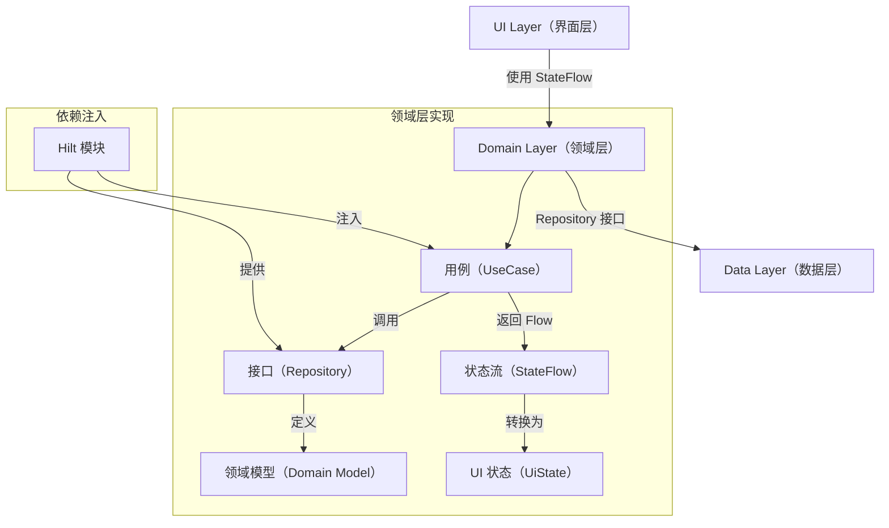
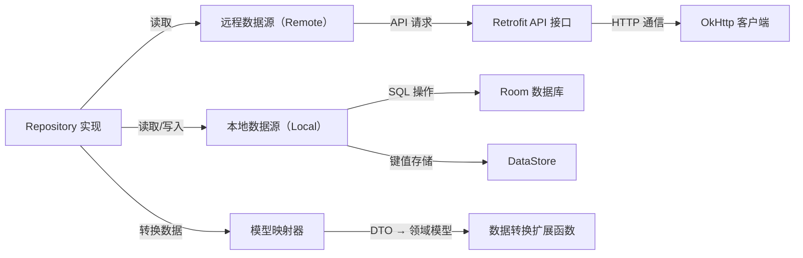

# Now in Android 项目分析报告

## 项目概述

Now in Android 是一个完全使用 Kotlin 和 Jetpack Compose 构建的 Android 示例应用。该应用旨在展示 Android 开发的最佳实践，并帮助开发者通过提供定期新闻更新来了解 Android 开发世界的最新动态。项目采用模块化架构，实现了清晰的关注点分离，是学习现代 Android 开发的理想参考。

### 主要功能

- 展示来自 Now in Android 系列的内容
- 浏览最新视频、文章和其他内容的链接
- 关注感兴趣的主题
- 当有新内容发布时接收通知
- 支持自适应布局，适配不同屏幕尺寸（类似 iOS 的 Auto Layout 和 Flutter 的 Responsive 设计）
- 支持动态主题和暗色模式（类似 iOS 的 Dark Mode 和 Flutter 的 ThemeMode）

## 技术栈分析

### 核心技术

| 技术/框架 | 版本/说明 | 对比 iOS/Flutter | 优缺点分析 |
|----------|----------|-----------------|-----------|
| Kotlin | 2.1.10 | 类比 Swift，都是现代静态类型语言，支持函数式编程、空安全和扩展函数 | **优点**：空安全、简洁语法、与 Java 完全互操作；**缺点**：编译速度相比 Java 略慢 |
| Jetpack Compose | Material 3 (2025.02.00) | 类比 SwiftUI/Flutter，都是声明式 UI 框架，但 Compose 基于 Kotlin 协程实现 | **优点**：完全 Kotlin 化、函数式 API、热重载支持；**缺点**：初始渲染性能比传统 View 系统略低 |
| Kotlin 协程 & Flow | 1.10.1 | 类比 Swift 的 async/await 和 Combine，或 Flutter 的 Future/Stream，但协程更轻量且灵活 | **优点**：结构化并发、取消机制、轻量级；**缺点**：调试体验有待改进 |
| Hilt | 2.56 | 类比 iOS 的 Resolver/Swinject，Flutter 的 GetIt/Provider，但集成 Android 框架更深 | **优点**：与 Android 生命周期集成、编译时验证；**缺点**：仅适用于 Android 平台 |
| Room | 2.6.1 | 类比 iOS 的 CoreData，Flutter 的 sqflite，但提供更强的编译时 SQL 验证 | **优点**：编译时 SQL 检查、协程支持；**缺点**：需要生成代码 |
| DataStore | 1.1.1 | 类比 iOS 的 UserDefaults，Flutter 的 SharedPreferences，但支持类型安全和协程 | **优点**：支持协程、Proto 数据存储；**缺点**：迁移旧数据复杂 |
| WorkManager | 2.10.0 | 类比 iOS 的 BackgroundTasks，Flutter 的 WorkManager，但与 Android 系统集成更深 | **优点**：系统友好、电池优化；**缺点**：不适合即时任务 |
| Retrofit + OkHttp | 2.11.0 + 4.12.0 | 类比 iOS 的 Alamofire，Flutter 的 Dio，提供强类型网络请求 | **优点**：Kotlin 协程支持、类型安全；**缺点**：配置相对复杂 |
| KotlinX Serialization | 1.8.0 | 类比 Swift 的 Codable，Flutter 的 json_serializable，支持 Kotlin 多平台 | **优点**：多平台支持、编译时检查；**缺点**：需要单独的编译器插件 |

### 构建系统

- Gradle 构建系统（使用 Kotlin DSL），类似 iOS 的 CocoaPods/Swift Package Manager 但更灵活
- 版本目录（libs.versions.toml）管理依赖，集中化版本控制，避免版本冲突
- 支持多个构建变体（类似 Xcode 的 Scheme 或 Flutter 的 flavor）：
  - `demo`：使用本地静态数据
  - `prod`：连接实际后端服务器
  - `debug`/`release`：调试和发布版本
- 基准配置文件优化（Baseline Profiles），加速应用启动和 UI 渲染
- Compose 编译器指标收集，分析 UI 性能瓶颈

### 项目架构

#### 模块化结构

```plaintext
项目根目录/                                 # 项目根目录
├── app/                                   # 应用主模块，类似 iOS 的 Main Target，作为应用入口
├── feature/                               # 功能模块目录，类似 iOS/Flutter 的功能模块划分
│   ├── foryou/                            # "为你推荐"功能，使用 Kotlin 流展示个性化内容
│   ├── interests/                         # 兴趣管理功能，使用 Kotlin 密封类管理状态
│   ├── bookmarks/                         # 书签功能，使用 Room 持久化存储
│   ├── topic/                             # 主题功能，使用 Compose 实现响应式界面
│   ├── search/                            # 搜索功能，使用 Kotlin 协程处理搜索逻辑
│   └── settings/                          # 设置功能，使用 DataStore 保存用户偏好
├── core/                                  # 核心模块目录，类似 iOS 的 Frameworks 或 Flutter 的 packages
│   ├── analytics/                         # 分析功能，类似 iOS 的 Analytics 服务
│   ├── common/                            # 通用工具和扩展，包含 Kotlin 扩展函数
│   ├── data/                              # 数据层实现，实现 Repository 模式
│   ├── database/                          # 本地数据库，使用 Room 定义实体和 DAO
│   ├── datastore/                         # 键值存储，类似 iOS 的 UserDefaults
│   ├── datastore-proto/                   # Proto 数据存储定义，使用 Protocol Buffers
│   ├── designsystem/                      # 设计系统组件，类似 iOS 的 Design System
│   ├── domain/                            # 业务领域模型，定义用例和业务规则
│   ├── model/                             # 数据模型，使用 Kotlin 数据类定义
│   ├── network/                           # 网络通信，使用 Retrofit 和 Kotlin 协程
│   ├── notifications/                     # 通知功能，类似 iOS 的 Notification Center
│   ├── testing/                           # 测试辅助工具，提供测试替身
│   ├── ui/                                # UI 通用组件，基于 Compose 构建
│   └── screenshot-testing/                # 截图测试工具，类似 iOS 的 SnapshotTesting
├── sync/                                  # 数据同步模块，使用 WorkManager 
├── benchmarks/                            # 性能基准测试，类似 iOS 的 XCTest Performance
├── gradle/                                # Gradle 配置目录
│   └── libs.versions.toml                 # 依赖版本管理，类似 iOS 的 Podfile.lock
├── build.gradle.kts                       # 项目级构建脚本，类似 iOS 的 Podfile
├── settings.gradle.kts                    # 项目设置脚本，定义包含的模块
└── gradle.properties                      # Gradle 属性配置
```

#### 分层架构分析

##### 1. 界面层（UI Layer）

项目采用 Jetpack Compose 实现现代化的声明式 UI，主要 UI 组件结构：

```plaintext
MainActivity                                 # 主活动，应用入口点，类似 iOS 的 AppDelegate/SceneDelegate
├── NiaApp                                   # 应用根组件，提供整体结构，类似 SwiftUI 的 App 结构
│   ├── NiaAppState                          # 应用状态管理，使用 Kotlin 委托属性追踪状态变化
│   └── NiaTheme                             # 主题设置，类似 SwiftUI 的 Environment 或 Flutter 的 Theme
│       ├── NiaBackground                    # 背景组件，处理动态颜色和主题切换
│       └── TopLevelDestination              # 顶层导航目标定义，使用 Kotlin 密封类
├── AdaptiveNavigationLayout                 # 自适应导航布局，使用 Kotlin 高阶函数提高组件复用性
│   ├── NavigationRail                       # 导航栏，用于大屏幕导航，类似 iPadOS 的 SideBar
│   ├── BottomNavigationBar                  # 底部导航栏，用于小屏幕导航，类似 iOS 的 TabBar
│   └── NavHost                              # 导航宿主，管理导航目标，类似 SwiftUI 的 NavigationStack
│       ├── ForYouScreen                     # "为你推荐"屏幕，使用 Flow 加载动态内容
│       ├── InterestsScreen                  # 兴趣屏幕，使用 rememberSaveable 保存状态
│       ├── BookmarksScreen                  # 书签屏幕，使用 collectAsState 将 Flow 转换为 State
│       ├── TopicScreen                      # 主题详情屏幕，使用 LaunchedEffect 处理副作用
│       ├── SearchScreen                     # 搜索屏幕，实现输入防抖，类似 iOS 的 Debounce
│       └── SettingsScreen                   # 设置屏幕，使用 StateFlow 管理设置变更
```

主要特点：

- **Compose UI 架构**
  - 使用 Material 3 设计系统（类似 iOS 的 Human Interface Guidelines）
  - 支持自适应布局和不同屏幕尺寸（利用 WindowSizeClass，类似 iOS 的 Size Classes）
  - 实现动态主题和暗色模式（使用 MaterialTheme，类似 iOS 的 UIUserInterfaceStyle）
  - 使用 Compose Navigation 进行导航管理（类似 SwiftUI 的 NavigationStack）

- **状态管理**
  - 使用 `ViewModel` 管理 UI 状态（类似 SwiftUI 的 ObservableObject）
  - 采用单向数据流（UDF）模式（类似 SwiftUI/Flutter 的 单向数据流）
  - 利用 Kotlin Flow 进行状态更新（`StateFlow` 和 `SharedFlow`，类似 Combine 的 Publisher）
  - 使用 `remember` 和 `rememberSaveable` 进行状态保存（类似 SwiftUI 的 @State 和 @SceneStorage）

- **UI 组件复用**
  - 通过 `core:designsystem` 模块提供统一的设计系统（类似 iOS 的设计系统组件库）
  - 使用 Compose 预览功能进行 UI 开发（类似 SwiftUI 的 Canvas 预览）
  - 支持组件级别的主题定制（使用 CompositionLocal，类似 SwiftUI 的 Environment）
  - 通过高阶函数实现插槽 API（类似 SwiftUI 的 ViewBuilder）

##### 2. 业务层（Domain Layer）

采用清晰的领域驱动设计（DDD）思想：



主要特点：

- **领域模型**
  - 使用 Kotlin 数据类定义业务实体（类似 Swift 的 struct）
  - 通过密封类（sealed class）表示状态和事件（类似 Swift 的 enum with associated values）
  - 领域模型与数据模型分离，保持业务规则的纯粹性

- **用例实现**
  - 每个业务功能封装为独立用例，采用 SOLID 原则
  - 使用协程处理异步操作（`suspend` 函数，类似 Swift 的 `async` 函数）
  - 通过 Flow 实现响应式数据流（类似 Combine 的 Publisher 或 RxSwift 的 Observable）
  - 利用 Kotlin 的扩展函数增强现有类型（类似 Swift 的 extension）

- **依赖注入**
  - 使用 Hilt 进行依赖管理（类似 iOS 的 Resolver 或 Flutter 的 Provider）
  - 模块间通过接口解耦，实现可测试架构
  - 便于测试的依赖替换机制（使用 Hilt 测试模块）
  - 利用 Kotlin 的委托属性简化注入语法（使用 `by inject()`）

##### 3. 数据层（Data Layer）

采用 Repository 模式管理数据访问：



主要特点：

- **数据源管理**
  - 支持本地和远程数据源（类似 iOS 的 Repository Pattern）
  - 实现离线优先策略，提高应用响应速度
  - 使用 Room 进行本地持久化（类似 iOS 的 CoreData）
  - 通过 DataStore 存储用户偏好（类似 iOS 的 UserDefaults）

- **数据同步**
  - 使用 WorkManager 管理后台同步（类似 iOS 的 BackgroundTasks）
  - 实现增量同步策略，减少数据传输
  - 处理冲突解决机制（使用时间戳或版本号）
  - 通过协程的 IO 调度器执行同步操作（`Dispatchers.IO`）

- **数据映射**
  - DTO 与领域模型的转换（使用扩展函数，类似 Swift 的 extension 方法）
  - 使用扩展函数实现映射逻辑（如 `fun NetworkModel.toDomain(): DomainModel`）
  - 保持各层数据模型的独立性，避免依赖泄漏
  - 利用 Kotlin 的空安全特性处理可选字段（使用 `?.` 和 `?:` 操作符）

### 测试策略

项目采用全面的测试策略：

1. **单元测试**
   - 使用 JUnit 进行单元测试（类似 iOS 的 XCTest）
   - 不使用 Mock 库，而是采用测试替身和假实现
   - 通过 Hilt 进行测试依赖注入（类似 iOS 的 DI Container 测试配置）
   - 使用 Kotlin 协程测试库测试异步代码（`runTest` 和 `TestCoroutineScheduler`）

2. **UI 测试**
   - 使用 Roborazzi 进行截图测试（版本 1.39.0，类似 iOS 的 SnapshotTesting）
   - 支持不同屏幕尺寸的 UI 测试（使用 `testWidthDp` 和 `testHeightDp`）
   - 使用 Compose 测试 API 验证 UI 状态（`ComposeTestRule`）
   - 支持可访问性测试，确保应用对所有用户友好

3. **集成测试**
   - 使用真实的本地数据存储（Room 和 DataStore）
   - 测试组件间的交互和数据流经过的路径
   - 验证数据流的完整性和可靠性
   - 模拟不同网络条件下的应用行为

### 第三方库信息

项目通过 Gradle 依赖管理系统集成了大量经过精心选择的第三方库，这些库提供了强大的功能扩展和性能优化。

#### UI 和交互相关

| 库名 | 版本 | 用途 | iOS/Flutter 对应方案 |
|-----|------|------|-------------------|
| Compose Material 3 | 2025.02.00 | Material 3 设计系统实现 | iOS 的 SwiftUI + SF Symbols / Flutter 的 Material Components |
| Compose Foundation | 1.8.0-alpha07 | 基础组件和布局 | SwiftUI 的 View 系统 / Flutter 的 Widgets |
| Compose Runtime Tracing | 1.7.6 | UI 性能分析与跟踪 | SwiftUI 的 Instruments / Flutter 的 DevTools |
| Accompanist | 0.37.0 | Compose 辅助工具集 | 类似 iOS 的 TCA Components / Flutter 的 FlutterX |
| Coil | 2.7.0 | 图片加载和缓存，支持 Compose | 类似 iOS 的 Kingfisher / Flutter 的 cached_network_image |
| Window Manager | 1.3.0 | 窗口和折叠屏幕管理 | iOS 的 SceneDelegate / Flutter 的 WindowManager |

#### 网络和数据处理

| 库名 | 版本 | 用途 | iOS/Flutter 对应方案 |
|-----|------|------|-------------------|
| Retrofit | 2.11.0 | 类型安全的 HTTP 客户端 | iOS 的 Alamofire / Flutter 的 Dio |
| OkHttp | 4.12.0 | HTTP & HTTP/2 网络客户端 | iOS 的 URLSession / Flutter 的 http |
| KotlinX Serialization | 1.8.0 | JSON 序列化和反序列化 | iOS 的 Codable / Flutter 的 json_serializable |
| Room | 2.6.1 | SQLite 抽象层和 ORM | iOS 的 CoreData / Flutter 的 sqflite + floor |
| DataStore | 1.1.1 | 键值对和 Proto 数据存储 | iOS 的 UserDefaults / Flutter 的 shared_preferences |
| KotlinX DateTime | 0.6.1 | 跨平台日期处理 | Swift 的 Date / Dart 的 DateTime |

#### 依赖注入与架构

| 库名 | 版本 | 用途 | iOS/Flutter 对应方案 |
|-----|------|------|-------------------|
| Hilt | 2.56 | Android 依赖注入框架 | iOS 的 Swinject / Flutter 的 Provider |
| Hilt Navigation Compose | 1.2.0 | Compose 导航与 Hilt 集成 | SwiftUI 的 @EnvironmentObject / Flutter 的 GetIt Router |
| Android Lifecycle | 2.8.7 | 生命周期与组件状态管理 | SwiftUI 的 Lifecycle / Flutter 的 WidgetBinding |
| Navigation Compose | 2.8.5 | 声明式导航框架 | SwiftUI 的 NavigationStack / Flutter 的 Navigator 2.0 |

#### 异步和响应式编程

| 库名 | 版本 | 用途 | iOS/Flutter 对应方案 |
|-----|------|------|-------------------|
| KotlinX Coroutines | 1.10.1 | 协程和结构化并发 | Swift 的 async/await / Dart 的 async-await |
| KotlinX Coroutines Flow | 1.10.1 | 响应式数据流 | SwiftUI 的 Combine / Flutter 的 Stream |
| Turbine | 1.2.0 | Flow 测试工具 | Combine 的 TestScheduler / Flutter 的 bloc_test |

#### 性能和监控

| 库名 | 版本 | 用途 | iOS/Flutter 对应方案 |
|-----|------|------|-------------------|
| WorkManager | 2.10.0 | 后台任务调度 | iOS 的 BackgroundTasks / Flutter 的 workmanager |
| ProfileInstaller | 1.4.1 | 安装基准配置文件 | iOS 的 MetricKit / Flutter 的 Performance Overlay |
| Baseline Profile | Android Gradle Plugin | 应用启动优化 | iOS 的 App Launch Time Profiling |
| Firebase Analytics | 33.7.0 | 用户行为分析 | Firebase iOS SDK / Firebase Flutter SDK |
| Firebase Crashlytics | 33.7.0 | 崩溃报告 | Firebase iOS SDK / Firebase Flutter SDK |

#### 测试工具

| 库名 | 版本 | 用途 | iOS/Flutter 对应方案 |
|-----|------|------|-------------------|
| Roborazzi | 1.39.0 | 截图测试框架 | iOS 的 SnapshotTesting / Flutter 的 golden_toolkit |
| Robolectric | 4.14.1 | 单元测试 Android 框架 | iOS 的 OCMock / Flutter 的 mockito |
| Compose UI Test | Compose BOM | Compose UI 测试工具 | XCTest UI Testing / Flutter 的 integration_test |
| Truth | 1.4.4 | 断言库 | iOS 的 XCTAssert / Flutter 的 test package |

这些库的集成实现了几个关键优势：

1. **响应式架构**：结合 Kotlin 协程、Flow 和 Jetpack Compose，实现了完全响应式的应用架构，类似于 SwiftUI + Combine 或 Flutter + BLoC。

2. **模块化依赖**：利用版本目录（libs.versions.toml）统一管理依赖，类似于 iOS 的 CocoaPods 但具有更强的版本冲突解决能力。

3. **生态系统整合**：精选的库与 Jetpack 组件深度整合，提供类似于 iOS/Flutter 的无缝开发体验。

4. **Kotlin 特性增强**：利用 Kotlin 的多平台特性（如 KotlinX Serialization），为未来的跨平台开发奠定基础。

### Gradle 构建系统分析

Now in Android 项目采用现代化的 Gradle 构建系统，使用 Kotlin DSL 配置所有构建脚本，相比传统的 Groovy DSL 提供了更好的类型安全和 IDE 支持。

#### 核心构建配置

1. **构建脚本组织**
   - `build.gradle.kts`：项目级构建文件，定义所有子项目通用配置
   - `settings.gradle.kts`：项目设置文件，包含模块声明和依赖仓库配置
   - `app/build.gradle.kts`：应用模块构建文件，包含应用特定配置
   - `feature/*/build.gradle.kts`：功能模块构建文件
   - `core/*/build.gradle.kts`：核心模块构建文件
   - `gradle/libs.versions.toml`：版本目录，集中管理所有依赖版本

2. **自定义插件**
   - 项目使用 `build-logic` 目录实现了自定义 Gradle 插件
   - 创建了多个专用插件（如 `nowinandroid.android.application`），提供统一配置
   - 这类似于 iOS 的 xcconfig 文件，但功能更强大，可以封装完整的构建逻辑

3. **构建变体**
   - 使用 `productFlavors` 定义 `demo` 和 `prod` 两种产品风格
   - 使用 `buildTypes` 定义 `debug` 和 `release` 两种构建类型
   - 组合生成四种构建变体：`demoDebug`、`demoRelease`、`prodDebug`、`prodRelease`
   - 类似 iOS 的 Scheme + Configuration 组合，但更加灵活

#### 性能优化措施

1. **构建加速技术**
   - 启用 Gradle 构建缓存：`org.gradle.caching=true`
   - 启用并行构建：`org.gradle.parallel=true`
   - 启用配置缓存：`org.gradle.configuration-cache=true`
   - 启用增量注解处理：使用 KSP 代替 KAPT（Kotlin Symbol Processing）

2. **Compose 编译器优化**
   - 使用 `compose_compiler_config.conf` 配置文件优化编译器行为
   - 启用 Compose 编译报告以分析编译性能
   - 针对开发和发布优化不同的编译器设置

3. **模块化优化**
   - 合理划分模块边界，最小化模块间依赖
   - 使用模块图检查工具（Module Graph）验证依赖结构
   - 实现模块级构建缓存，加速增量构建

#### 依赖管理策略

1. **版本目录**
   - 使用 Gradle 7+ 引入的版本目录（Version Catalog）统一管理依赖
   - 所有版本号集中在 `libs.versions.toml` 文件中声明
   - 支持依赖捆绑（bundles）和自定义插件声明

2. **传递依赖控制**
   - 使用 `api` vs `implementation` 精确控制依赖可见性
   - 实现模块边界依赖封装，减少编译影响范围
   - 使用依赖守卫（Dependency Guard）监控依赖变更

3. **自定义依赖作用域**
   - 为测试创建自定义作用域如 `testDemoImplementation`
   - 精细控制不同构建变体的依赖配置
   - 实现按需依赖加载，优化编译时间

#### Gradle 与 Kotlin 特性结合

1. **Kotlin DSL 优势**
   - 提供类型安全的构建脚本（相比 Groovy DSL）
   - 支持代码补全和导航（IDE 支持更好）
   - 允许使用 Kotlin 的高阶函数和扩展函数定义构建逻辑

2. **自定义任务实现**

   ```kotlin
   // 使用 Kotlin DSL 定义任务
   tasks.register<BaselineProfileTask>("generateBaselineProfile") {
       resultDir.set(layout.buildDirectory.dir("baseline-prof"))
       appId.set("com.google.samples.apps.nowinandroid")
       niaPrecompiledSdk.set(true)
   }
   ```

3. **类型安全访问器**
   - 使用 `enableFeaturePreview("TYPESAFE_PROJECT_ACCESSORS")` 启用类型安全项目访问
   - 允许使用 `projects.core.model` 代替 `project(":core:model")`
   - 提供编译时检查，避免路径错误

这种构建系统设计与 iOS 的 Xcode 项目和 Flutter 的构建系统相比，提供了更大的灵活性和可扩展性，尽管初始设置较为复杂，但在大型项目中能显著提高构建效率和依赖管理能力。

### 性能优化

项目实施多项性能优化措施：

1. **编译优化**
   - 使用 Gradle 构建缓存加速构建过程
   - 启用配置缓存减少配置阶段时间
   - 优化 Compose 编译器配置（`compose_compiler_config.conf`）
   - 使用 Kotlin Symbol Processing (KSP) 加速注解处理

2. **运行时优化**
   - 使用基准配置文件（Baseline Profiles）预热关键路径
   - 实现 Compose 组件记忆化，减少不必要的重组
   - 优化启动性能，使用延迟初始化和分阶段启动
   - 利用 Kotlin 委托属性实现懒加载（`by lazy`）

3. **资源优化**
   - 模块化结构减少 APK 大小，支持按需加载
   - 使用矢量图标替代位图，提高分辨率兼容性
   - 实现资源按需加载，仅在需要时加载大型资源
   - 采用字体缩放和资源压缩减少包体积

### 开发工具和环境

- Android Studio 最新稳定版（类似 iOS 的 Xcode）
- JDK 17 或更高版本（项目检查 JavaVersion.VERSION_17 兼容性）
- Gradle 8.x（最新版本 8.9.0）
- 支持的 Android API 级别：
  - 最低版本：Android 5.0（API 21）
  - 目标版本：Android 14（API 34）

### 项目构建与运行

主要的构建命令：

```bash
# 构建 Demo 调试版本（类似 iOS 的 xcodebuild -scheme Demo -configuration Debug）
./gradlew assembleDemoDebug

# 运行单元测试（类似 iOS 的 xcodebuild test）
./gradlew testDemoDebug

# 运行 UI 测试（类似 iOS 的 xcodebuild -destination 'platform=iOS Simulator' test）
./gradlew connectedDemoDebugAndroidTest

# 生成基准配置文件（Android 特有的性能优化工具）
./gradlew :app:generateDemoDebugBaselineProfile
```

### Kotlin 语法特性应用

项目充分利用了 Kotlin 的现代语言特性：

1. **协程和 Flow**

   ```kotlin
   // 示例：使用协程和 Flow 处理数据流
   // 类似 Swift 的 async/await + Combine 组合
   fun getNewsStream(): Flow<List<NewsItem>> = flow {
       while(true) {
           val news = newsRepository.getLatestNews() // suspend 函数，类似 Swift 的 async 函数
           emit(news) // 发射数据，类似 Combine 的 Publisher.send()
           delay(refreshInterval) // 延迟，类似 Swift 的 Task.sleep
       }
   }
   
   // Swift 对应实现：
   // func getNewsStream() -> AnyPublisher<[NewsItem], Never> {
   //     return Timer.publish(every: refreshInterval, on: .main, in: .common)
   //         .autoconnect()
   //         .flatMap { _ in
   //             Future { promise in
   //                 Task {
   //                     let news = await newsRepository.getLatestNews()
   //                     promise(.success(news))
   //                 }
   //             }
   //         }
   //         .eraseToAnyPublisher()
   // }
   ```

2. **扩展函数**

   ```kotlin
   // 示例：为 Compose 组件添加扩展函数
   // 类似 Swift 的 extension，但功能更强大
   fun Modifier.adaptiveLayout(
       compact: Modifier.() -> Modifier,
       medium: Modifier.() -> Modifier,
       expanded: Modifier.() -> Modifier
   ): Modifier = composed {
       // 根据窗口大小应用不同修饰符
       val windowSizeClass = LocalWindowSizeClass.current
       when(windowSizeClass.widthSizeClass) {
           WindowWidthSizeClass.Compact -> compact()
           WindowWidthSizeClass.Medium -> medium()
           else -> expanded()
       }
   }
   
   // Swift 对应实现：
   // extension View {
   //     func adaptiveLayout<C: View, M: View, E: View>(
   //         compact: @escaping () -> C,
   //         medium: @escaping () -> M,
   //         expanded: @escaping () -> E
   //     ) -> some View {
   //         GeometryReader { proxy in
   //             Group {
   //                 if proxy.size.width < 600 {
   //                     compact()
   //                 } else if proxy.size.width < 840 {
   //                     medium()
   //                 } else {
   //                     expanded()
   //                 }
   //             }
   //         }
   //     }
   // }
   ```

3. **密封类和数据类**

   ```kotlin
   // 示例：使用密封类表示 UI 状态
   // 类似 Swift 的 enum with associated values，但可以实现继承
   sealed interface UiState<out T> {
       data object Loading : UiState<Nothing>
       data class Success<T>(val data: T) : UiState<T>
       data class Error(val message: String) : UiState<Nothing>
   }
   
   // 使用密封类的优势：编译时穷举检查
   fun renderState(state: UiState<User>) {
       when(state) { // 编译器确保处理所有可能状态
           is UiState.Loading -> showLoading()
           is UiState.Success -> showData(state.data)
           is UiState.Error -> showError(state.message)
       }
   }
   
   // Swift 对应实现：
   // enum UiState<T> {
   //     case loading
   //     case success(data: T)
   //     case error(message: String)
   // }
   ```

4. **委托属性**

   ```kotlin
   // 示例：使用委托属性进行懒加载和状态管理
   // 类似 Swift 的 property wrapper，但更灵活
   class NewsViewModel(private val repository: NewsRepository) : ViewModel() {
       // 懒加载，类似 Swift 的 lazy
       private val newsFlow by lazy { repository.getNewsStream() }
       
       // 状态委托，自动处理生命周期
       val uiState: StateFlow<UiState<List<NewsItem>>> = newsFlow
           .map { UiState.Success(it) as UiState<List<NewsItem>> }
           .catch { emit(UiState.Error(it.message ?: "Unknown error")) }
           .stateIn(
               scope = viewModelScope,
               started = SharingStarted.WhileSubscribed(5000),
               initialValue = UiState.Loading
           )
   }
   
   // Swift 对应实现：
   // class NewsViewModel: ObservableObject {
   //     private lazy var newsPublisher = repository.getNewsStream()
   //     
   //     @Published private(set) var uiState: UiState<[NewsItem]> = .loading
   //     
   //     init(repository: NewsRepository) {
   //         self.repository = repository
   //         setupSubscriptions()
   //     }
   //     
   //     private func setupSubscriptions() {
   //         newsPublisher
   //             .map { UiState.success(data: $0) }
   //             .catch { Just(UiState.error(message: $0.localizedDescription)) }
   //             .assign(to: &$uiState)
   //     }
   // }
   ```

### 最佳实践建议

1. **架构设计**
   - 遵循清晰的分层架构（UI、Domain、Data）
   - 保持模块间的低耦合，通过接口实现依赖倒置
   - 使用依赖注入管理组件，提高可测试性
   - 利用 Kotlin 的空安全特性减少空指针异常

2. **UI 开发**
   - 优先使用 Compose 预览功能加速 UI 开发
   - 实现响应式界面设计，适配不同屏幕尺寸
   - 注意性能优化，特别是记忆化和作用域控制
   - 使用组合模式构建可复用 UI 组件

3. **测试策略**
   - 编写全面的单元测试，验证核心业务逻辑
   - 使用截图测试验证 UI 一致性
   - 实现端到端测试，保障用户流程完整性
   - 采用测试驱动开发（TDD）提高代码质量

4. **性能优化**
   - 监控启动性能和 UI 渲染性能
   - 优化构建配置，加快开发迭代速度
   - 实施懒加载策略，按需初始化组件
   - 使用 Kotlin 协程的调度器优化执行上下文
