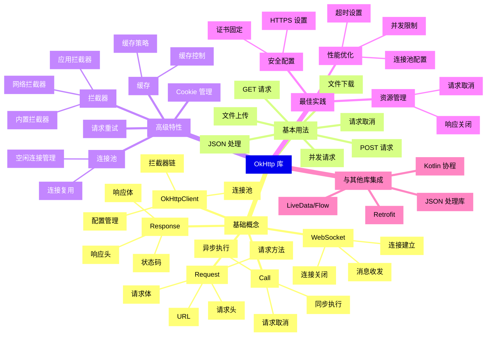
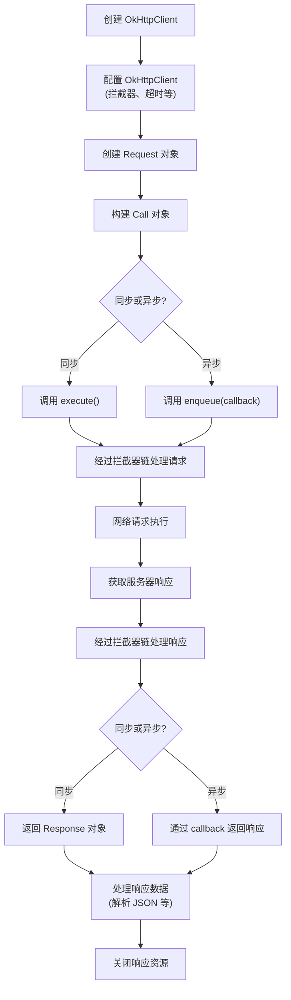
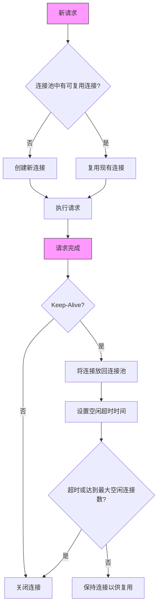
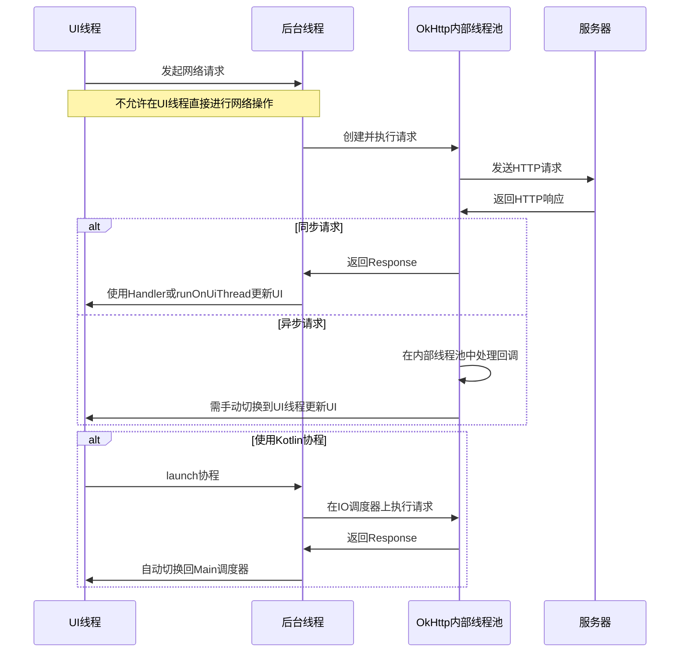

# OkHttp 库基础知识

## 简介

OkHttp 是由 Square 公司开发的一个高效 HTTP 客户端，用于 Android 和 Java 应用程序发送网络请求。它支持同步和异步请求、WebSockets、HTTP/2 和连接池等功能，能有效处理常见的网络问题，如连接失败重试、连接池复用和透明的 GZIP 压缩等。OkHttp 的设计理念是简化网络操作，同时提供强大的可定制性和扩展性。

### 与其他平台网络库的对比

| 平台 | 对应库 | 对比说明 |
|------|-------|----------|
| iOS | URLSession | iOS 系统级 API，OkHttp 在 Android 中扮演类似角色，但更加灵活 |
| iOS | Alamofire | 基于 URLSession 的高级封装，与 OkHttp 定位相似，都提供便捷的 API |
| Flutter | Dio | 功能丰富的 HTTP 客户端，拦截器概念与 OkHttp 类似 |
| Flutter | http | Flutter 官方基础 HTTP 库，OkHttp 功能更丰富 |
| 前端 | fetch | 浏览器原生 API，OkHttp 在移动端扮演类似角色 |
| 前端 | axios | 基于 Promise 的 HTTP 客户端，与 OkHttp 在各自平台中定位相似 |

## 核心概念清单

### OkHttpClient

客户端对象，管理请求的配置和执行。类似于 iOS 中的 `URLSession` 或 Flutter 中的 `HttpClient`。

```kotlin
// 创建 OkHttpClient 实例
val client = OkHttpClient()

// 使用构建器模式配置客户端
val client = OkHttpClient.Builder()
    .connectTimeout(10, TimeUnit.SECONDS)
    .build()
```

### Request

表示 HTTP 请求的对象，包含 URL、请求方法、头信息等。类似于 iOS 中的 `URLRequest` 或 Flutter 中的 `Request`。

```kotlin
// 创建一个 GET 请求
val request = Request.Builder()
    .url("https://api.example.com/users")
    .get()
    .build()
```

### Response

表示 HTTP 响应的对象，包含状态码、头信息和响应体等。类似于 iOS 中的 `URLResponse` 和响应数据的组合。

```kotlin
// 处理响应
response.use {
    if (it.isSuccessful) {
        val responseBody = it.body?.string()
        // 处理响应数据
    }
}
```

### Call

执行请求的接口，支持同步和异步执行。类似于 iOS 中的 `URLSessionTask` 或 Flutter 中的 `Future<Response>`。

```kotlin
// 创建 Call 对象
val call = client.newCall(request)

// 同步执行
val response = call.execute()

// 异步执行
call.enqueue(object : Callback {
    override fun onFailure(call: Call, e: IOException) {
        // 处理失败
    }
    
    override fun onResponse(call: Call, response: Response) {
        // 处理响应
    }
})
```

### Interceptor

拦截器，可以观察、修改和重试请求。类似于 iOS 中的 `URLProtocol` 但更加灵活和强大。

```kotlin
val loggingInterceptor = Interceptor { chain ->
    val request = chain.request()
    // 记录请求信息
    val response = chain.proceed(request)
    // 记录响应信息
    response
}
```

### WebSocket

支持 WebSocket 协议的全双工通信，类似于 iOS 中的 `URLSessionWebSocketTask` 或 Flutter 中的 `WebSocket`。

```kotlin
val request = Request.Builder()
    .url("wss://echo.websocket.org")
    .build()
    
val webSocket = client.newWebSocket(request, object : WebSocketListener() {
    override fun onMessage(webSocket: WebSocket, text: String) {
        // 处理接收到的消息
    }
})
```

### Cache

缓存机制，自动管理 HTTP 缓存。类似于 iOS 中的 `URLCache` 或 Flutter 中的自定义缓存实现。

```kotlin
val cacheDirectory = File(context.cacheDir, "http_cache")
val cacheSize = 10L * 1024L * 1024L // 10 MB
val cache = Cache(cacheDirectory, cacheSize)

val client = OkHttpClient.Builder()
    .cache(cache)
    .build()
```

### 连接池

管理 HTTP 和 HTTPS 连接以实现连接复用，减少延迟。

```kotlin
val connectionPool = ConnectionPool(5, 5, TimeUnit.MINUTES)

val client = OkHttpClient.Builder()
    .connectionPool(connectionPool)
    .build()
```

### 超时控制

配置连接、读取和写入超时时间。

```kotlin
val client = OkHttpClient.Builder()
    .connectTimeout(10, TimeUnit.SECONDS) // 连接超时
    .readTimeout(30, TimeUnit.SECONDS)    // 读取超时
    .writeTimeout(30, TimeUnit.SECONDS)   // 写入超时
    .build()
```

## Kotlin 语法要点

### Lambda 表达式

Kotlin 的 Lambda 表达式在 OkHttp 的回调中广泛使用，简化了代码编写。

```kotlin
// 使用 Lambda 表达式处理异步响应
call.enqueue { response ->
    // 这是一个扩展函数，内部使用了 Lambda 表达式
    if (response.isSuccessful) {
        // 处理成功响应
    } else {
        // 处理错误响应
    }
}
```

### 协程集成

使用 Kotlin 协程可以使异步网络请求代码更加简洁和线性。

```kotlin
// 需要添加依赖：implementation "org.jetbrains.kotlinx:kotlinx-coroutines-android:1.x.x"
suspend fun fetchData(): String = withContext(Dispatchers.IO) {
    val request = Request.Builder()
        .url("https://api.example.com/data")
        .build()
    
    val response = client.newCall(request).execute()
    
    if (response.isSuccessful) {
        response.body?.string() ?: ""
    } else {
        throw IOException("请求失败: ${response.code}")
    }
}

// 使用协程
lifecycleScope.launch {
    try {
        val data = fetchData()
        // 处理数据
    } catch (e: Exception) {
        // 处理异常
    }
}
```

### 扩展函数

Kotlin 允许为现有类添加新功能，而无需继承或修改原始类。

```kotlin
// 为 OkHttpClient 添加扩展函数，简化 GET 请求
suspend fun OkHttpClient.getJson(url: String): String {
    val request = Request.Builder()
        .url(url)
        .build()
    
    return withContext(Dispatchers.IO) {
        newCall(request).execute().use { response ->
            if (response.isSuccessful) {
                response.body?.string() ?: ""
            } else {
                throw IOException("请求失败: ${response.code}")
            }
        }
    }
}

// 使用扩展函数
val result = client.getJson("https://api.example.com/data")
```

### 空安全

Kotlin 的空安全特性可以帮助处理 OkHttp 响应中可能为空的情况。

```kotlin
// 使用安全调用操作符 ?. 和 Elvis 操作符 ?:
response.body?.string()?.let { responseData ->
    // 只有当 body 不为空且 string() 不返回 null 时才会执行这个块
    parseJson(responseData)
} ?: run {
    // 处理空响应的情况
    handleEmptyResponse()
}
```

### 作用域函数

Kotlin 的作用域函数（apply, let, run, with, also）可以简化 OkHttp 的配置代码。

```kotlin
// 使用 apply 配置 OkHttpClient
val client = OkHttpClient.Builder().apply {
    connectTimeout(10, TimeUnit.SECONDS)
    readTimeout(30, TimeUnit.SECONDS)
    writeTimeout(30, TimeUnit.SECONDS)
    addInterceptor(loggingInterceptor)
}.build()

// 使用 apply 配置 Request
val request = Request.Builder().apply {
    url("https://api.example.com/users")
    addHeader("Authorization", "Bearer $token")
    get()
}.build()
```

## Android 框架概念

### 网络权限

在 Android 中使用 OkHttp 进行网络请求需要在 AndroidManifest.xml 文件中添加网络权限。

```xml
<manifest xmlns:android="http://schemas.android.com/apk/res/android"
    package="com.example.app">
    
    <!-- 添加网络权限 -->
    <uses-permission android:name="android.permission.INTERNET" />
    <uses-permission android:name="android.permission.ACCESS_NETWORK_STATE" />
    
    <!-- ... 应用其他内容 ... -->
</manifest>
```

### 主线程与工作线程

Android 禁止在主线程（UI 线程）上执行网络操作，OkHttp 的同步请求必须在工作线程中执行。

```kotlin
// 错误示例：在主线程执行网络请求
fun loadDataWrong() {
    val response = client.newCall(request).execute() // 将抛出 NetworkOnMainThreadException
}

// 正确示例 1：使用协程在 IO 线程池执行网络请求
fun loadDataCoroutine() {
    lifecycleScope.launch {
        withContext(Dispatchers.IO) {
            val response = client.newCall(request).execute()
            // 处理响应
        }
    }
}

// 正确示例 2：使用 OkHttp 的异步 API
fun loadDataAsync() {
    client.newCall(request).enqueue(object : Callback {
        override fun onFailure(call: Call, e: IOException) {
            // 在后台线程处理失败情况
        }
        
        override fun onResponse(call: Call, response: Response) {
            // 注意：这个回调仍在后台线程，需要切换到主线程更新 UI
            runOnUiThread {
                // 更新 UI
            }
        }
    })
}
```

### Application 类

OkHttpClient 对象应该在应用级别创建并作为单例使用，避免重复创建。Application 类是初始化全局 OkHttpClient 的好地方。

```kotlin
class MyApplication : Application() {
    // 使用 lazy 延迟初始化单例
    val okHttpClient: OkHttpClient by lazy {
        OkHttpClient.Builder()
            .connectTimeout(10, TimeUnit.SECONDS)
            .readTimeout(30, TimeUnit.SECONDS)
            .writeTimeout(30, TimeUnit.SECONDS)
            .build()
    }
    
    override fun onCreate() {
        super.onCreate()
        // 可以在这里进行其他初始化
    }
    
    // 提供一个静态方法访问单例
    companion object {
        @SuppressLint("StaticFieldLeak")
        private lateinit var instance: MyApplication
        
        fun getInstance(): MyApplication = instance
    }
}

// 在 Activity 或 Fragment 中使用
val client = (application as MyApplication).okHttpClient
// 或
val client = MyApplication.getInstance().okHttpClient
```

### 生命周期影响

Activity 或 Fragment 的生命周期变化可能导致网络请求完成时视图已经销毁，需要正确处理这种情况。

```kotlin
class MyActivity : AppCompatActivity() {
    private var currentCall: Call? = null
    
    fun loadData() {
        // 取消先前的请求
        currentCall?.cancel()
        
        val request = Request.Builder()
            .url("https://api.example.com/data")
            .build()
            
        currentCall = (application as MyApplication).okHttpClient.newCall(request)
        currentCall?.enqueue(object : Callback {
            override fun onFailure(call: Call, e: IOException) {
                if (call.isCanceled()) return // 请求已取消，不处理
                // 处理失败
            }
            
            override fun onResponse(call: Call, response: Response) {
                if (call.isCanceled()) return // 请求已取消，不处理
                // 检查 Activity 是否已销毁
                if (isDestroyed || isFinishing) return
                
                runOnUiThread {
                    // 安全地更新 UI
                }
            }
        })
    }
    
    override fun onDestroy() {
        super.onDestroy()
        // 取消进行中的请求
        currentCall?.cancel()
    }
}
```

### Context 使用

在 OkHttp 中使用 Context 时，需要注意内存泄漏问题，尤其是在异步操作中。

```kotlin
// 错误示例：在回调中持有 Activity 引用
fun loadDataWrong(activity: Activity) {
    client.newCall(request).enqueue(object : Callback {
        override fun onResponse(call: Call, response: Response) {
            // 如果 Activity 已销毁但回调仍在执行，会导致内存泄漏
            activity.runOnUiThread { /* 更新 UI */ }
        }
        
        override fun onFailure(call: Call, e: IOException) {
            // 同样的问题
        }
    })
}

// 正确示例：使用 WeakReference 避免内存泄漏
fun loadDataCorrect(activity: Activity) {
    val weakActivity = WeakReference(activity)
    
    client.newCall(request).enqueue(object : Callback {
        override fun onResponse(call: Call, response: Response) {
            val activityRef = weakActivity.get() ?: return // Activity 已被回收
            if (activityRef.isDestroyed || activityRef.isFinishing) return
            
            activityRef.runOnUiThread { /* 安全地更新 UI */ }
        }
        
        override fun onFailure(call: Call, e: IOException) {
            // 同样的处理
        }
    })
}
```

## 快速入门指南

### 项目集成

#### Gradle 依赖

在项目级 `build.gradle` 文件中添加 OkHttp 依赖：

```kotlin
// 在模块级 build.gradle 文件中
dependencies {
    // OkHttp 主库
    implementation "com.squareup.okhttp3:okhttp:4.10.0"
    
    // 可选：日志拦截器，用于调试
    implementation "com.squareup.okhttp3:logging-interceptor:4.10.0"
    
    // 可选：与 Kotlin 协程集成
    implementation "org.jetbrains.kotlinx:kotlinx-coroutines-android:1.6.4"
}
```

#### 权限配置

在 `AndroidManifest.xml` 文件中添加必要的网络权限：

```xml
<manifest xmlns:android="http://schemas.android.com/apk/res/android"
    package="com.example.app">
    
    <!-- 网络访问权限 -->
    <uses-permission android:name="android.permission.INTERNET" />
    
    <!-- 网络状态访问权限（可选，但推荐添加） -->
    <uses-permission android:name="android.permission.ACCESS_NETWORK_STATE" />
    
    <!-- ... 应用其他内容 ... -->
</manifest>
```

#### 初始化最佳实践

在 Application 类中创建 OkHttpClient 单例：

```kotlin
class MyApplication : Application() {
    // 使用 lazy 延迟初始化 - Kotlin 的懒加载特性，只有在首次访问时才会创建实例
    val okHttpClient: OkHttpClient by lazy {
        val loggingInterceptor = HttpLoggingInterceptor().apply {
            // 仅在调试模式下启用详细日志
            level = if (BuildConfig.DEBUG) {
                HttpLoggingInterceptor.Level.BODY
            } else {
                HttpLoggingInterceptor.Level.NONE
            }
        }
        
        OkHttpClient.Builder()
            .connectTimeout(15, TimeUnit.SECONDS)
            .readTimeout(30, TimeUnit.SECONDS)
            .writeTimeout(30, TimeUnit.SECONDS)
            .addInterceptor(loggingInterceptor)
            .build()
    }
    
    override fun onCreate() {
        super.onCreate()
        instance = this
    }
    
    companion object {
        private lateinit var instance: MyApplication
        
        fun getInstance(): MyApplication = instance
    }
}
``` 

### 基础使用场景

#### GET 请求：获取用户信息

以获取用户信息为例，展示如何执行 GET 请求：

```kotlin
/**
 * 使用 OkHttp 获取用户信息
 * 展示了基本的 GET 请求、异步处理和错误处理
 */
fun getUserProfile(userId: String, callback: (UserProfile?, Exception?) -> Unit) {
    // 从应用实例获取全局 OkHttpClient
    val client = MyApplication.getInstance().okHttpClient
    
    // 构建请求对象 - 使用 Kotlin 的 apply 作用域函数简化配置
    val request = Request.Builder().apply {
        url("https://api.example.com/users/$userId")
        // 添加认证头
        addHeader("Authorization", "Bearer ${getAuthToken()}")
        // GET 请求是默认的，可以省略 .get() 调用
        get()
    }.build()
    
    // 创建并执行异步请求
    client.newCall(request).enqueue(object : Callback {
        // 请求失败回调
        override fun onFailure(call: Call, e: IOException) {
            // 注意：这个回调在后台线程中执行
            // 使用 Handler 或其他方法切换到主线程
            Handler(Looper.getMainLooper()).post {
                callback(null, e)
            }
        }
        
        // 请求成功回调
        override fun onResponse(call: Call, response: Response) {
            // 同样在后台线程中执行
            try {
                if (!response.isSuccessful) {
                    throw IOException("Unexpected response code: ${response.code}")
                }
                
                // 使用 Kotlin 的空安全特性处理可能为空的响应体
                val responseBody = response.body?.string()
                
                if (responseBody != null) {
                    // 解析 JSON 响应 - 使用 Gson 或其他 JSON 库
                    val userProfile = Gson().fromJson(responseBody, UserProfile::class.java)
                    
                    // 切换到主线程并调用回调
                    Handler(Looper.getMainLooper()).post {
                        callback(userProfile, null)
                    }
                } else {
                    throw IOException("Empty response body")
                }
            } catch (e: Exception) {
                // 处理解析错误或服务器错误
                Handler(Looper.getMainLooper()).post {
                    callback(null, e)
                }
            } finally {
                // 确保响应关闭
                response.close()
            }
        }
    })
}

// 使用 Kotlin 数据类表示用户信息
data class UserProfile(
    val id: String,
    val name: String,
    val email: String,
    val avatarUrl: String? = null,
    val createdAt: Long = 0
)

// 在 Activity 或 Fragment 中使用
fun loadUserData() {
    showLoadingIndicator()
    
    getUserProfile("user123") { profile, error ->
        hideLoadingIndicator()
        
        if (error != null) {
            // 显示错误消息
            showError("加载用户失败: ${error.message}")
            return@getUserProfile
        }
        
        // 使用 Kotlin 的空安全特性处理结果
        profile?.let {
            // 更新 UI 显示用户信息
            userNameTextView.text = it.name
            userEmailTextView.text = it.email
            
            // 可能使用 Glide/Coil 等库加载头像
            if (it.avatarUrl != null) {
                Glide.with(this)
                    .load(it.avatarUrl)
                    .into(userAvatarImageView)
            }
        }
    }
}
```

#### 使用协程简化 GET 请求

使用 Kotlin 协程可以让异步代码更线性、更易读：

```kotlin
/**
 * 使用协程获取用户信息
 * 展示了如何用协程简化异步请求
 */
suspend fun getUserProfileCoroutine(userId: String): UserProfile {
    // 从应用实例获取全局 OkHttpClient
    val client = MyApplication.getInstance().okHttpClient
    
    // 构建请求
    val request = Request.Builder()
        .url("https://api.example.com/users/$userId")
        .addHeader("Authorization", "Bearer ${getAuthToken()}")
        .build()
    
    // 切换到 IO 线程执行网络请求
    return withContext(Dispatchers.IO) {
        // 执行请求并使用 Kotlin 的 use 函数自动关闭响应
        client.newCall(request).execute().use { response ->
            if (!response.isSuccessful) {
                throw IOException("Unexpected response code: ${response.code}")
            }
            
            // 使用 Elvis 操作符处理可能为空的 body
            val responseBody = response.body?.string() 
                ?: throw IOException("Empty response body")
            
            // 解析 JSON
            Gson().fromJson(responseBody, UserProfile::class.java)
        }
    }
}

// 在 Activity 或 Fragment 中使用协程
fun loadUserDataWithCoroutines() {
    // 在 ViewModel 中或使用 lifecycleScope
    lifecycleScope.launch {
        try {
            showLoadingIndicator()
            
            // 调用挂起函数
            val profile = getUserProfileCoroutine("user123")
            
            // 在主线程更新 UI
            userNameTextView.text = profile.name
            userEmailTextView.text = profile.email
            
            if (profile.avatarUrl != null) {
                Glide.with(this@MainActivity)
                    .load(profile.avatarUrl)
                    .into(userAvatarImageView)
            }
        } catch (e: Exception) {
            // 处理错误
            showError("加载用户失败: ${e.message}")
        } finally {
            hideLoadingIndicator()
        }
    }
}
```

#### POST 请求：用户登录

展示如何发送 POST 请求进行用户登录：

```kotlin
/**
 * 使用 OkHttp 执行用户登录
 * 展示了 POST 请求和 JSON 请求体的处理
 */
fun loginUser(email: String, password: String, callback: (LoginResult?, Exception?) -> Unit) {
    val client = MyApplication.getInstance().okHttpClient
    
    // 创建 JSON 请求体 - 使用 MediaType 常量
    val jsonMediaType = "application/json; charset=utf-8".toMediaType()
    
    // 构建 JSON 请求数据 - 可以使用 JSONObject 或 Gson 等
    val requestBodyJson = JSONObject().apply {
        put("email", email)
        put("password", password)
        put("device_type", "android")
        put("app_version", BuildConfig.VERSION_NAME)
    }.toString()
    
    // 创建请求体
    val requestBody = requestBodyJson.toRequestBody(jsonMediaType)
    
    // 构建 POST 请求
    val request = Request.Builder()
        .url("https://api.example.com/auth/login")
        .post(requestBody) // 指定 POST 方法和请求体
        .build()
    
    // 执行异步请求
    client.newCall(request).enqueue(object : Callback {
        override fun onFailure(call: Call, e: IOException) {
            Handler(Looper.getMainLooper()).post {
                callback(null, e)
            }
        }
        
        override fun onResponse(call: Call, response: Response) {
            try {
                val responseBody = response.body?.string()
                
                // 处理服务器返回的错误状态码
                if (!response.isSuccessful) {
                    val errorMessage = if (responseBody != null) {
                        try {
                            // 尝试从错误响应中提取错误消息
                            val errorJson = JSONObject(responseBody)
                            errorJson.optString("error", "Unknown error")
                        } catch (e: JSONException) {
                            "Login failed: ${response.code}"
                        }
                    } else {
                        "Login failed: ${response.code}"
                    }
                    
                    throw IOException(errorMessage)
                }
                
                if (responseBody != null) {
                    // 解析登录结果
                    val loginResult = Gson().fromJson(responseBody, LoginResult::class.java)
                    
                    // 保存认证令牌
                    saveAuthToken(loginResult.token)
                    
                    Handler(Looper.getMainLooper()).post {
                        callback(loginResult, null)
                    }
                } else {
                    throw IOException("Empty response body")
                }
            } catch (e: Exception) {
                Handler(Looper.getMainLooper()).post {
                    callback(null, e)
                }
            } finally {
                response.close()
            }
        }
    })
}

// 登录结果数据类
data class LoginResult(
    val userId: String,
    val token: String,
    val refreshToken: String,
    val expiresIn: Int,
    val userName: String? = null
)

// 在登录页面中使用
fun performLogin() {
    val email = emailEditText.text.toString()
    val password = passwordEditText.text.toString()
    
    // 基本输入验证
    if (email.isEmpty() || password.isEmpty()) {
        showError("请输入邮箱和密码")
        return
    }
    
    showLoadingIndicator()
    
    loginUser(email, password) { result, error ->
        hideLoadingIndicator()
        
        if (error != null) {
            showError("登录失败: ${error.message}")
            return@loginUser
        }
        
        result?.let {
            // 登录成功，跳转到主页面
            startActivity(Intent(this, MainActivity::class.java))
            finish() // 关闭登录页面
        }
    }
}
```

#### 使用协程的 POST 请求

```kotlin
/**
 * 使用协程执行用户登录
 */
suspend fun loginUserCoroutine(email: String, password: String): LoginResult {
    val client = MyApplication.getInstance().okHttpClient
    
    // 创建 JSON 请求体
    val jsonMediaType = "application/json; charset=utf-8".toMediaType()
    
    // 使用 Kotlin 的 apply 函数构建 JSON
    val requestBodyJson = JSONObject().apply {
        put("email", email)
        put("password", password)
        put("device_type", "android")
        put("app_version", BuildConfig.VERSION_NAME)
    }.toString()
    
    val requestBody = requestBodyJson.toRequestBody(jsonMediaType)
    
    val request = Request.Builder()
        .url("https://api.example.com/auth/login")
        .post(requestBody)
        .build()
    
    return withContext(Dispatchers.IO) {
        client.newCall(request).execute().use { response ->
            val responseBody = response.body?.string()
                ?: throw IOException("Empty response body")
            
            if (!response.isSuccessful) {
                try {
                    // 尝试解析错误消息
                    val errorJson = JSONObject(responseBody)
                    throw IOException(errorJson.optString("error", "Login failed: ${response.code}"))
                } catch (e: JSONException) {
                    throw IOException("Login failed: ${response.code}")
                }
            }
            
            // 解析登录结果
            val loginResult = Gson().fromJson(responseBody, LoginResult::class.java)
            
            // 保存认证令牌
            saveAuthToken(loginResult.token)
            
            loginResult
        }
    }
}

// 在登录页面中使用协程
fun performLoginWithCoroutines() {
    val email = emailEditText.text.toString()
    val password = passwordEditText.text.toString()
    
    // 基本输入验证
    if (email.isEmpty() || password.isEmpty()) {
        showError("请输入邮箱和密码")
        return
    }
    
    lifecycleScope.launch {
        try {
            showLoadingIndicator()
            
            // 调用挂起函数执行登录
            val result = loginUserCoroutine(email, password)
            
            // 登录成功，跳转到主页面
            startActivity(Intent(this@LoginActivity, MainActivity::class.java))
            finish() // 关闭登录页面
        } catch (e: Exception) {
            showError("登录失败: ${e.message}")
        } finally {
            hideLoadingIndicator()
        }
    }
}
```

#### 文件上传：上传用户头像

展示如何使用 OkHttp 上传文件：

```kotlin
/**
 * 上传用户头像
 * 展示了文件上传和进度监控
 */
fun uploadUserAvatar(
    userId: String,
    imageFile: File,
    progressCallback: (Float) -> Unit,
    resultCallback: (Boolean, Exception?) -> Unit
) {
    val client = MyApplication.getInstance().okHttpClient
    
    // 创建一个 RequestBody 用于文件
    val fileRequestBody = imageFile.asRequestBody("image/jpeg".toMediaType())
    
    // 创建进度监控的包装
    val progressRequestBody = ProgressRequestBody(fileRequestBody) { progress ->
        // 在主线程回调进度
        Handler(Looper.getMainLooper()).post {
            progressCallback(progress)
        }
    }
    
    // 创建 MultipartBody，用于包含文件和其他表单数据
    val requestBody = MultipartBody.Builder()
        .setType(MultipartBody.FORM)
        .addFormDataPart("user_id", userId)
        .addFormDataPart("avatar", imageFile.name, progressRequestBody)
        .build()
    
    val request = Request.Builder()
        .url("https://api.example.com/users/$userId/avatar")
        .addHeader("Authorization", "Bearer ${getAuthToken()}")
        .post(requestBody)
        .build()
    
    client.newCall(request).enqueue(object : Callback {
        override fun onFailure(call: Call, e: IOException) {
            Handler(Looper.getMainLooper()).post {
                resultCallback(false, e)
            }
        }
        
        override fun onResponse(call: Call, response: Response) {
            response.use {
                val success = it.isSuccessful
                val error = if (!success) {
                    IOException("Upload failed: ${it.code}")
                } else {
                    null
                }
                
                Handler(Looper.getMainLooper()).post {
                    resultCallback(success, error)
                }
            }
        }
    })
}

// 自定义 RequestBody 用于监控上传进度
class ProgressRequestBody(
    private val delegate: RequestBody,
    private val progressCallback: (Float) -> Unit
) : RequestBody() {
    
    override fun contentType(): MediaType? = delegate.contentType()
    
    override fun contentLength(): Long = delegate.contentLength()
    
    override fun writeTo(sink: BufferedSink) {
        val countingSink = CountingSink(sink, contentLength()) { progress ->
            progressCallback(progress)
        }
        val bufferedSink = countingSink.buffer()
        
        delegate.writeTo(bufferedSink)
        bufferedSink.flush()
    }
    
    private class CountingSink(
        delegate: Sink,
        private val contentLength: Long,
        private val progressCallback: (Float) -> Unit
    ) : ForwardingSink(delegate) {
        private var bytesWritten = 0L
        
        override fun write(source: Buffer, byteCount: Long) {
            super.write(source, byteCount)
            
            bytesWritten += byteCount
            val progress = if (contentLength > 0) {
                bytesWritten.toFloat() / contentLength.toFloat()
            } else {
                -1f
            }
            
            progressCallback(progress)
        }
    }
}

// 在个人资料页面中使用
fun selectAndUploadAvatar() {
    // 启动图片选择器（假设已经处理了权限和返回结果）
    val imagePickerIntent = Intent(Intent.ACTION_PICK, MediaStore.Images.Media.EXTERNAL_CONTENT_URI)
    startActivityForResult(imagePickerIntent, REQUEST_IMAGE_PICK)
}

// 处理图片选择结果并上传
override fun onActivityResult(requestCode: Int, resultCode: Int, data: Intent?) {
    super.onActivityResult(requestCode, resultCode, data)
    
    if (requestCode == REQUEST_IMAGE_PICK && resultCode == Activity.RESULT_OK) {
        data?.data?.let { uri ->
            // 将 URI 转换为文件
            val imageFile = createTempFileFromUri(uri)
            
            // 显示上传进度对话框
            val progressDialog = ProgressDialog(this).apply {
                setProgressStyle(ProgressDialog.STYLE_HORIZONTAL)
                max = 100
                setCancelable(false)
                setTitle("上传头像")
                setMessage("正在上传...")
                show()
            }
            
            // 上传文件
            uploadUserAvatar(
                userId = currentUserId,
                imageFile = imageFile,
                progressCallback = { progress ->
                    // 更新进度对话框
                    val percentage = (progress * 100).toInt()
                    progressDialog.progress = percentage
                },
                resultCallback = { success, error ->
                    // 关闭进度对话框
                    progressDialog.dismiss()
                    
                    if (success) {
                        showSuccess("头像上传成功")
                        // 刷新头像显示
                        loadUserAvatar()
                    } else {
                        showError("头像上传失败: ${error?.message}")
                    }
                }
            )
        }
    }
}

// 辅助函数：从 URI 创建临时文件
private fun createTempFileFromUri(uri: Uri): File {
    val inputStream = contentResolver.openInputStream(uri)
    val outputFile = File(cacheDir, "temp_avatar_${System.currentTimeMillis()}.jpg")
    
    inputStream?.use { input ->
        FileOutputStream(outputFile).use { output ->
            input.copyTo(output)
        }
    }
    
    return outputFile
}
```

#### 文件下载：下载文件并显示进度

展示如何使用 OkHttp 下载文件并显示进度：

```kotlin
/**
 * 下载文件并显示进度
 * 展示了如何处理大文件下载和进度监控
 */
fun downloadFile(
    url: String,
    destinationFile: File,
    progressCallback: (Float) -> Unit,
    resultCallback: (Boolean, Exception?) -> Unit
) {
    val client = MyApplication.getInstance().okHttpClient
    
    val request = Request.Builder()
        .url(url)
        .build()
    
    client.newCall(request).enqueue(object : Callback {
        override fun onFailure(call: Call, e: IOException) {
            Handler(Looper.getMainLooper()).post {
                resultCallback(false, e)
            }
        }
        
        override fun onResponse(call: Call, response: Response) {
            if (!response.isSuccessful) {
                Handler(Looper.getMainLooper()).post {
                    resultCallback(false, IOException("Download failed: ${response.code}"))
                }
                return
            }
            
            // 获取文件总大小
            val contentLength = response.body?.contentLength() ?: -1L
            
            try {
                // 准备输出文件
                val outputStream = FileOutputStream(destinationFile)
                val inputStream = response.body?.byteStream()
                
                if (inputStream == null) {
                    Handler(Looper.getMainLooper()).post {
                        resultCallback(false, IOException("Empty response body"))
                    }
                    return
                }
                
                // 缓冲区
                val buffer = ByteArray(8192)
                var bytesRead: Int
                var totalBytesRead = 0L
                
                // 读取输入流并写入文件
                while (inputStream.read(buffer).also { bytesRead = it } != -1) {
                    if (call.isCanceled()) {
                        outputStream.close()
                        inputStream.close()
                        destinationFile.delete()
                        return
                    }
                    
                    outputStream.write(buffer, 0, bytesRead)
                    totalBytesRead += bytesRead
                    
                    // 计算并报告进度
                    val progress = if (contentLength > 0) {
                        totalBytesRead.toFloat() / contentLength.toFloat()
                    } else {
                        -1f
                    }
                    
                    Handler(Looper.getMainLooper()).post {
                        progressCallback(progress)
                    }
                }
                
                // 关闭流
                outputStream.flush()
                outputStream.close()
                inputStream.close()
                
                // 报告成功
                Handler(Looper.getMainLooper()).post {
                    resultCallback(true, null)
                }
            } catch (e: Exception) {
                // 清理部分下载的文件
                destinationFile.delete()
                
                Handler(Looper.getMainLooper()).post {
                    resultCallback(false, e)
                }
            } finally {
                response.close()
            }
        }
    })
}

// 在 Activity 中使用下载功能
fun downloadUserManual() {
    // 创建目标文件
    val downloadsDir = Environment.getExternalStoragePublicDirectory(Environment.DIRECTORY_DOWNLOADS)
    val destinationFile = File(downloadsDir, "user_manual.pdf")
    
    // 显示下载进度对话框
    val progressDialog = ProgressDialog(this).apply {
        setProgressStyle(ProgressDialog.STYLE_HORIZONTAL)
        max = 100
        setCancelable(false)
        setTitle("下载用户手册")
        setMessage("正在下载...")
        show()
    }
    
    // 开始下载
    downloadFile(
        url = "https://example.com/downloads/user_manual.pdf",
        destinationFile = destinationFile,
        progressCallback = { progress ->
            // 更新进度对话框
            val percentage = (progress * 100).toInt()
            progressDialog.progress = percentage
        },
        resultCallback = { success, error ->
            // 关闭进度对话框
            progressDialog.dismiss()
            
            if (success) {
                showSuccess("下载完成: ${destinationFile.absolutePath}")
                
                // 可以选择打开文件
                openPdfFile(destinationFile)
            } else {
                showError("下载失败: ${error?.message}")
            }
        }
    )
}

// 辅助函数：打开 PDF 文件
private fun openPdfFile(file: File) {
    val intent = Intent(Intent.ACTION_VIEW).apply {
        setDataAndType(FileProvider.getUriForFile(
            this@MainActivity,
            "${BuildConfig.APPLICATION_ID}.fileprovider",
            file
        ), "application/pdf")
        addFlags(Intent.FLAG_GRANT_READ_URI_PERMISSION)
    }
    
    if (intent.resolveActivity(packageManager) != null) {
        startActivity(intent)
    } else {
        showError("没有应用可以打开 PDF 文件")
    }
}

## OkHttp 工作流程图

### OkHttp 知识体系思维导图



### OkHttp 请求流程图



### 拦截器链工作流程图


### 连接池管理图



### OkHttp 与 Android 线程模型关系图



## 实际应用场景

### 用户认证与 Token 处理

下面展示一个完整的用户认证流程，包括登录、Token 管理、请求拦截和自动刷新 Token 等功能：

```kotlin
/**
 * Token 认证管理器类
 * 负责管理认证状态、存储和刷新 Token
 */
class AuthManager(private val context: Context) {
    
    // 使用 Kotlin 对象声明创建单例
    companion object {
        @Volatile
        private var instance: AuthManager? = null
        
        fun getInstance(context: Context): AuthManager {
            return instance ?: synchronized(this) {
                instance ?: AuthManager(context.applicationContext).also { instance = it }
            }
        }
    }
    
    // 使用 DataStore 存储 Token 信息，比 SharedPreferences 更现代化
    private val dataStore: DataStore<Preferences> = context.createDataStore(
        name = "auth_prefs"
    )
    
    // 定义 Token 相关的键
    private object PreferencesKeys {
        val ACCESS_TOKEN = stringPreferencesKey("access_token")
        val REFRESH_TOKEN = stringPreferencesKey("refresh_token")
        val TOKEN_EXPIRY = longPreferencesKey("token_expiry")
    }
    
    // 获取访问令牌
    suspend fun getAccessToken(): String? {
        return dataStore.data.first()[PreferencesKeys.ACCESS_TOKEN]
    }
    
    // 获取刷新令牌
    suspend fun getRefreshToken(): String? {
        return dataStore.data.first()[PreferencesKeys.REFRESH_TOKEN]
    }
    
    // 获取令牌过期时间
    suspend fun getTokenExpiry(): Long {
        return dataStore.data.first()[PreferencesKeys.TOKEN_EXPIRY] ?: 0L
    }
    
    // 保存认证信息
    suspend fun saveAuthInfo(accessToken: String, refreshToken: String, expiresIn: Int) {
        val expiryTime = System.currentTimeMillis() + (expiresIn * 1000)
        dataStore.edit { preferences ->
            preferences[PreferencesKeys.ACCESS_TOKEN] = accessToken
            preferences[PreferencesKeys.REFRESH_TOKEN] = refreshToken
            preferences[PreferencesKeys.TOKEN_EXPIRY] = expiryTime
        }
    }
    
    // 清除认证信息（登出）
    suspend fun clearAuthInfo() {
        dataStore.edit { it.clear() }
    }
    
    // 检查 Token 是否有效
    suspend fun isTokenValid(): Boolean {
        val expiry = getTokenExpiry()
        // 提前 5 分钟刷新，避免边界情况
        return expiry > System.currentTimeMillis() + (5 * 60 * 1000)
    }
    
    // 刷新 Token
    suspend fun refreshToken(): Boolean {
        val refreshToken = getRefreshToken() ?: return false
        
        return try {
            val client = OkHttpClient()
            
            val requestBody = FormBody.Builder()
                .add("grant_type", "refresh_token")
                .add("refresh_token", refreshToken)
                .add("client_id", BuildConfig.API_CLIENT_ID)
                .add("client_secret", BuildConfig.API_CLIENT_SECRET)
                .build()
            
            val request = Request.Builder()
                .url("https://api.example.com/auth/refresh")
                .post(requestBody)
                .build()
            
            val response = withContext(Dispatchers.IO) {
                client.newCall(request).execute()
            }
            
            if (response.isSuccessful) {
                response.body?.string()?.let { responseBody ->
                    val tokenResponse = Gson().fromJson(responseBody, TokenResponse::class.java)
                    saveAuthInfo(
                        tokenResponse.accessToken,
                        tokenResponse.refreshToken,
                        tokenResponse.expiresIn
                    )
                    true
                } ?: false
            } else {
                // 刷新失败，清除所有 Token
                clearAuthInfo()
                false
            }
        } catch (e: Exception) {
            Log.e("AuthManager", "Token 刷新失败", e)
            false
        }
    }
    
    // Token 响应数据类
    data class TokenResponse(
        @SerializedName("access_token") val accessToken: String,
        @SerializedName("refresh_token") val refreshToken: String,
        @SerializedName("expires_in") val expiresIn: Int
    )
}

/**
 * 认证拦截器
 * 自动将 Token 添加到请求中
 */
class AuthInterceptor(private val context: Context) : Interceptor {
    
    override fun intercept(chain: Interceptor.Chain): Response {
        val originalRequest = chain.request()
        
        // 检查请求是否需要认证（根据 URL 或其他条件）
        if (!requiresAuthentication(originalRequest)) {
            return chain.proceed(originalRequest)
        }
        
        // 获取 Token（需要在协程中执行）
        val accessToken = runBlocking {
            val authManager = AuthManager.getInstance(context)
            
            // 检查 Token 是否有效，如果无效则尝试刷新
            if (!authManager.isTokenValid()) {
                val refreshed = authManager.refreshToken()
                if (!refreshed) {
                    // Token 刷新失败，可以触发重新登录
                    // 这里简单返回 null，实际应用中可能需要更复杂的处理
                    return@runBlocking null
                }
            }
            
            authManager.getAccessToken()
        }
        
        // 如果没有有效的 Token，可能需要重新登录
        if (accessToken == null) {
            // 在实际应用中，这里可能需要通知用户重新登录
            // 例如通过事件总线发送登录事件
            EventBus.getDefault().post(RequireLoginEvent())
            
            // 返回未授权响应
            return Response.Builder()
                .request(originalRequest)
                .protocol(Protocol.HTTP_1_1)
                .code(401)
                .message("Unauthorized")
                .body("".toResponseBody(null))
                .build()
        }
        
        // 添加 Authorization 头
        val authorizedRequest = originalRequest.newBuilder()
            .header("Authorization", "Bearer $accessToken")
            .build()
        
        return chain.proceed(authorizedRequest)
    }
    
    // 判断请求是否需要认证
    private fun requiresAuthentication(request: Request): Boolean {
        val url = request.url.toString()
        // 登录、注册等端点不需要认证
        return !url.contains("/auth/login") && 
               !url.contains("/auth/register") && 
               !url.contains("/auth/refresh")
    }
    
    // 需要登录的事件类
    class RequireLoginEvent
}

/**
 * 全局网络客户端构建器
 * 创建配置好的 OkHttpClient，包含认证和其他功能
 */
object ApiClientBuilder {
    
    fun create(context: Context): OkHttpClient {
        return OkHttpClient.Builder()
            .connectTimeout(15, TimeUnit.SECONDS)
            .readTimeout(30, TimeUnit.SECONDS)
            .writeTimeout(30, TimeUnit.SECONDS)
            // 添加认证拦截器
            .addInterceptor(AuthInterceptor(context))
            // 添加日志拦截器（仅调试模式）
            .addInterceptor(HttpLoggingInterceptor().apply {
                level = if (BuildConfig.DEBUG) {
                    HttpLoggingInterceptor.Level.BODY
                } else {
                    HttpLoggingInterceptor.Level.NONE
                }
            })
            .build()
    }
}

/**
 * 登录功能实现
 */
class LoginRepository(private val context: Context) {
    
    // 注意这里使用不带认证拦截器的客户端，避免循环依赖
    private val client = OkHttpClient.Builder()
        .connectTimeout(15, TimeUnit.SECONDS)
        .readTimeout(30, TimeUnit.SECONDS)
        .writeTimeout(30, TimeUnit.SECONDS)
        .build()
    
    // 用户登录
    suspend fun login(email: String, password: String): Result<Unit> {
        return try {
            val requestBody = JSONObject().apply {
                put("email", email)
                put("password", password)
                put("device_type", "android")
                put("app_version", BuildConfig.VERSION_NAME)
            }.toString().toRequestBody("application/json".toMediaType())
            
            val request = Request.Builder()
                .url("https://api.example.com/auth/login")
                .post(requestBody)
                .build()
            
            val response = withContext(Dispatchers.IO) {
                client.newCall(request).execute()
            }
            
            if (response.isSuccessful) {
                val responseBody = response.body?.string()
                    ?: return Result.failure(IOException("Empty response body"))
                
                val tokenResponse = Gson().fromJson(
                    responseBody, 
                    AuthManager.TokenResponse::class.java
                )
                
                // 保存认证信息
                AuthManager.getInstance(context).saveAuthInfo(
                    tokenResponse.accessToken,
                    tokenResponse.refreshToken,
                    tokenResponse.expiresIn
                )
                
                Result.success(Unit)
            } else {
                val errorBody = response.body?.string()
                val errorMessage = if (errorBody != null) {
                    try {
                        // 尝试从错误响应中提取错误消息
                        val errorJson = JSONObject(errorBody)
                        errorJson.optString("message", "Login failed")
                    } catch (e: JSONException) {
                        "Login failed"
                    }
                } else {
                    "Login failed"
                }
                
                Result.failure(IOException(errorMessage))
            }
        } catch (e: Exception) {
            Result.failure(e)
        }
    }
    
    // 用户登出
    suspend fun logout(): Result<Unit> {
        return try {
            val accessToken = AuthManager.getInstance(context).getAccessToken()
                ?: return Result.success(Unit) // 已经没有 Token，认为登出成功
            
            // 通知服务器登出（取消设备令牌等）
            val request = Request.Builder()
                .url("https://api.example.com/auth/logout")
                .addHeader("Authorization", "Bearer $accessToken")
                .post("".toRequestBody(null))
                .build()
            
            withContext(Dispatchers.IO) {
                try {
                    client.newCall(request).execute()
                } catch (e: Exception) {
                    // 服务器登出失败不影响本地登出
                    Log.w("LoginRepository", "Server logout failed", e)
                }
            }
            
            // 清除本地 Token
            AuthManager.getInstance(context).clearAuthInfo()
            
            Result.success(Unit)
        } catch (e: Exception) {
            Result.failure(e)
        }
    }
}

/**
 * 登录 ViewModel
 */
class LoginViewModel(application: Application) : AndroidViewModel(application) {
    
    private val loginRepository = LoginRepository(application)
    
    // 使用 LiveData 暴露登录状态
    private val _loginState = MutableLiveData<LoginState>()
    val loginState: LiveData<LoginState> = _loginState
    
    // 执行登录
    fun login(email: String, password: String) {
        viewModelScope.launch {
            _loginState.value = LoginState.Loading
            
            try {
                val result = loginRepository.login(email, password)
                
                if (result.isSuccess) {
                    _loginState.value = LoginState.Success
                } else {
                    _loginState.value = LoginState.Error(
                        result.exceptionOrNull()?.message ?: "Unknown error"
                    )
                }
            } catch (e: Exception) {
                _loginState.value = LoginState.Error(e.message ?: "Unknown error")
            }
        }
    }
    
    // 执行登出
    fun logout() {
        viewModelScope.launch {
            try {
                loginRepository.logout()
                // 登出后可能需要导航到登录页面
            } catch (e: Exception) {
                // 处理登出错误
            }
        }
    }
    
    // 登录状态密封类
    sealed class LoginState {
        object Loading : LoginState()
        object Success : LoginState()
        data class Error(val message: String) : LoginState()
    }
}

/**
 * 登录 Activity
 */
class LoginActivity : AppCompatActivity() {
    
    private lateinit var viewModel: LoginViewModel
    private lateinit var binding: ActivityLoginBinding
    
    override fun onCreate(savedInstanceState: Bundle?) {
        super.onCreate(savedInstanceState)
        
        // 使用 ViewBinding
        binding = ActivityLoginBinding.inflate(layoutInflater)
        setContentView(binding.root)
        
        // 初始化 ViewModel
        viewModel = ViewModelProvider(this).get(LoginViewModel::class.java)
        
        // 设置登录按钮点击事件
        binding.loginButton.setOnClickListener {
            val email = binding.emailEditText.text.toString()
            val password = binding.passwordEditText.text.toString()
            
            // 简单的输入验证
            if (email.isEmpty() || password.isEmpty()) {
                showError("请输入邮箱和密码")
                return@setOnClickListener
            }
            
            // 执行登录
            viewModel.login(email, password)
        }
        
        // 观察登录状态
        viewModel.loginState.observe(this) { state ->
            when (state) {
                is LoginViewModel.LoginState.Loading -> {
                    binding.progressBar.isVisible = true
                    binding.loginButton.isEnabled = false
                }
                is LoginViewModel.LoginState.Success -> {
                    binding.progressBar.isVisible = false
                    // 登录成功，跳转到主页面
                    startActivity(Intent(this, MainActivity::class.java))
                    finish()
                }
                is LoginViewModel.LoginState.Error -> {
                    binding.progressBar.isVisible = false
                    binding.loginButton.isEnabled = true
                    showError(state.message)
                }
            }
        }
    }
    
    private fun showError(message: String) {
        Toast.makeText(this, message, Toast.LENGTH_LONG).show()
    }
}

### RESTful API 客户端

以下是一个完整的 RESTful API 客户端的封装实现，包括基类设计、响应处理和错误统一处理：

```kotlin
/**
 * API 响应包装类
 * 统一所有接口返回的响应格式
 */
data class ApiResponse<T>(
    @SerializedName("data") val data: T? = null,
    @SerializedName("message") val message: String? = null,
    @SerializedName("status") val status: Int = 0,
    @SerializedName("timestamp") val timestamp: Long = 0
) {
    val isSuccess: Boolean
        get() = status == 200 || status == 0
}

/**
 * API 结果密封类
 * 用于表示网络请求的结果状态
 */
sealed class ApiResult<out T> {
    data class Success<T>(val data: T) : ApiResult<T>()
    data class Error(val exception: Throwable) : ApiResult<Nothing>()
    object Loading : ApiResult<Nothing>()
    
    // 便捷的获取数据方法
    fun getOrNull(): T? = when (this) {
        is Success -> data
        else -> null
    }
    
    // 便捷的获取错误信息方法
    fun errorMessage(): String = when (this) {
        is Error -> exception.message ?: "Unknown error"
        else -> ""
    }
}

/**
 * ApiService 接口
 * 定义所有网络请求方法
 */
interface ApiService {
    
    // 用户相关接口
    suspend fun getUserProfile(): ApiResult<UserProfile>
    suspend fun updateUserProfile(userProfile: UserProfile): ApiResult<Boolean>
    
    // 商品相关接口
    suspend fun getProducts(page: Int, pageSize: Int): ApiResult<List<Product>>
    suspend fun getProductDetail(productId: String): ApiResult<Product>
    
    // 订单相关接口
    suspend fun createOrder(order: Order): ApiResult<String> // 返回订单ID
    suspend fun getOrders(status: Int? = null): ApiResult<List<Order>>
    
    // 其他接口...
}

/**
 * OkHttp 实现的 ApiService
 */
class OkHttpApiService(
    private val context: Context,
    private val baseUrl: String
) : ApiService {
    
    // 获取配置好的带认证的 OkHttpClient
    private val client = ApiClientBuilder.create(context)
    
    // 使用 Gson 处理 JSON
    private val gson = Gson()
    
    /**
     * 执行 GET 请求的通用方法
     */
    private suspend inline fun <reified T> executeGet(
        endpoint: String,
        queryParams: Map<String, String> = emptyMap()
    ): ApiResult<T> {
        return try {
            // 构建完整的 URL，包括查询参数
            val urlBuilder = "$baseUrl/$endpoint".toHttpUrl().newBuilder()
            
            // 添加查询参数
            queryParams.forEach { (key, value) ->
                urlBuilder.addQueryParameter(key, value)
            }
            
            val request = Request.Builder()
                .url(urlBuilder.build())
                .get()
                .build()
            
            executeRequest(request)
        } catch (e: Exception) {
            ApiResult.Error(e)
        }
    }
    
    /**
     * 执行 POST 请求的通用方法
     */
    private suspend inline fun <reified T> executePost(
        endpoint: String,
        body: Any
    ): ApiResult<T> {
        return try {
            // 将请求体转换为 JSON
            val jsonBody = gson.toJson(body)
            
            val requestBody = jsonBody.toRequestBody("application/json".toMediaType())
            
            val request = Request.Builder()
                .url("$baseUrl/$endpoint")
                .post(requestBody)
                .build()
            
            executeRequest(request)
        } catch (e: Exception) {
            ApiResult.Error(e)
        }
    }
    
    /**
     * 执行 PUT 请求的通用方法
     */
    private suspend inline fun <reified T> executePut(
        endpoint: String,
        body: Any
    ): ApiResult<T> {
        return try {
            val jsonBody = gson.toJson(body)
            
            val requestBody = jsonBody.toRequestBody("application/json".toMediaType())
            
            val request = Request.Builder()
                .url("$baseUrl/$endpoint")
                .put(requestBody)
                .build()
            
            executeRequest(request)
        } catch (e: Exception) {
            ApiResult.Error(e)
        }
    }
    
    /**
     * 执行 DELETE 请求的通用方法
     */
    private suspend inline fun <reified T> executeDelete(
        endpoint: String
    ): ApiResult<T> {
        return try {
            val request = Request.Builder()
                .url("$baseUrl/$endpoint")
                .delete()
                .build()
            
            executeRequest(request)
        } catch (e: Exception) {
            ApiResult.Error(e)
        }
    }
    
    /**
     * 执行网络请求并处理响应的通用方法
     */
    private suspend inline fun <reified T> executeRequest(
        request: Request
    ): ApiResult<T> {
        return withContext(Dispatchers.IO) {
            try {
                // 执行请求
                val response = client.newCall(request).execute()
                
                // 处理响应
                val responseBody = response.body?.string()
                
                // 检查响应是否成功
                if (!response.isSuccessful) {
                    val errorMessage = if (responseBody != null) {
                        try {
                            // 尝试从错误响应中提取错误消息
                            val errorJson = JSONObject(responseBody)
                            errorJson.optString("message", "HTTP Error: ${response.code}")
                        } catch (e: JSONException) {
                            "HTTP Error: ${response.code}"
                        }
                    } else {
                        "HTTP Error: ${response.code}"
                    }
                    
                    throw IOException(errorMessage)
                }
                
                if (responseBody == null) {
                    throw IOException("Empty response body")
                }
                
                // 解析 ApiResponse 包装类
                val apiResponse = gson.fromJson<ApiResponse<T>>(
                    responseBody,
                    TypeToken.getParameterized(ApiResponse::class.java, T::class.java).type
                )
                
                // 检查 API 状态码
                if (!apiResponse.isSuccess) {
                    throw IOException(apiResponse.message ?: "API Error: ${apiResponse.status}")
                }
                
                // 正常返回数据，如果数据为空则尝试创建默认值
                val data = apiResponse.data ?: try {
                    // 对于集合类型，返回空集合
                    when (T::class) {
                        List::class, ArrayList::class, Collection::class -> listOf<Any>() as T
                        Map::class, HashMap::class -> mapOf<Any, Any>() as T
                        else -> null
                    }
                } catch (e: Exception) {
                    null
                }
                
                if (data != null) {
                    ApiResult.Success(data)
                } else {
                    throw IOException("Response data is null")
                }
            } catch (e: Exception) {
                ApiResult.Error(e)
            }
        }
    }
    
    // API 接口实现
    
    override suspend fun getUserProfile(): ApiResult<UserProfile> {
        return executeGet("users/profile")
    }
    
    override suspend fun updateUserProfile(userProfile: UserProfile): ApiResult<Boolean> {
        return executePut("users/profile", userProfile)
    }
    
    override suspend fun getProducts(page: Int, pageSize: Int): ApiResult<List<Product>> {
        return executeGet(
            "products",
            mapOf(
                "page" to page.toString(),
                "page_size" to pageSize.toString()
            )
        )
    }
    
    override suspend fun getProductDetail(productId: String): ApiResult<Product> {
        return executeGet("products/$productId")
    }
    
    override suspend fun createOrder(order: Order): ApiResult<String> {
        return executePost("orders", order)
    }
    
    override suspend fun getOrders(status: Int?): ApiResult<List<Order>> {
        val queryParams = if (status != null) {
            mapOf("status" to status.toString())
        } else {
            emptyMap()
        }
        
        return executeGet("orders", queryParams)
    }
}

/**
 * API 服务提供者
 * 提供 ApiService 实例的工厂类
 */
object ApiServiceProvider {
    
    @Volatile
    private var instance: ApiService? = null
    
    fun getInstance(context: Context, baseUrl: String): ApiService {
        return instance ?: synchronized(this) {
            instance ?: OkHttpApiService(
                context.applicationContext,
                baseUrl
            ).also { instance = it }
        }
    }
}

/**
 * 在 ViewModel 中使用 ApiService
 */
class ProductViewModel(application: Application) : AndroidViewModel(application) {
    
    private val apiService = ApiServiceProvider.getInstance(
        application,
        BuildConfig.API_BASE_URL
    )
    
    // 产品列表的 LiveData
    private val _products = MutableLiveData<ApiResult<List<Product>>>()
    val products: LiveData<ApiResult<List<Product>>> = _products
    
    // 产品详情的 LiveData
    private val _productDetail = MutableLiveData<ApiResult<Product>>()
    val productDetail: LiveData<ApiResult<Product>> = _productDetail
    
    // 加载产品列表
    fun loadProducts(page: Int = 1, pageSize: Int = 20) {
        viewModelScope.launch {
            _products.value = ApiResult.Loading
            
            val result = apiService.getProducts(page, pageSize)
            _products.value = result
        }
    }
    
    // 加载产品详情
    fun loadProductDetail(productId: String) {
        viewModelScope.launch {
            _productDetail.value = ApiResult.Loading
            
            val result = apiService.getProductDetail(productId)
            _productDetail.value = result
        }
    }
}

/**
 * 在 Activity 中使用 ViewModel
 */
class ProductListActivity : AppCompatActivity() {
    
    private lateinit var viewModel: ProductViewModel
    private lateinit var binding: ActivityProductListBinding
    private lateinit var productAdapter: ProductAdapter
    
    override fun onCreate(savedInstanceState: Bundle?) {
        super.onCreate(savedInstanceState)
        
        binding = ActivityProductListBinding.inflate(layoutInflater)
        setContentView(binding.root)
        
        // 设置 RecyclerView
        productAdapter = ProductAdapter { product ->
            // 点击产品项跳转到详情页
            val intent = Intent(this, ProductDetailActivity::class.java).apply {
                putExtra("product_id", product.id)
            }
            startActivity(intent)
        }
        
        binding.recyclerView.apply {
            layoutManager = LinearLayoutManager(this@ProductListActivity)
            adapter = productAdapter
        }
        
        // 下拉刷新
        binding.swipeRefreshLayout.setOnRefreshListener {
            viewModel.loadProducts()
        }
        
        // 初始化 ViewModel
        viewModel = ViewModelProvider(this).get(ProductViewModel::class.java)
        
        // 观察产品列表数据
        viewModel.products.observe(this) { result ->
            binding.swipeRefreshLayout.isRefreshing = result is ApiResult.Loading
            
            when (result) {
                is ApiResult.Success -> {
                    productAdapter.submitList(result.data)
                    binding.emptyView.isVisible = result.data.isEmpty()
                }
                is ApiResult.Error -> {
                    Toast.makeText(
                        this,
                        "加载失败: ${result.errorMessage()}",
                        Toast.LENGTH_LONG
                    ).show()
                    binding.emptyView.isVisible = true
                }
                is ApiResult.Loading -> {
                    // 加载中状态已通过 SwipeRefreshLayout 处理
                }
            }
        }
        
        // 加载数据
        viewModel.loadProducts()
    }
}

/**
 * 产品适配器
 */
class ProductAdapter(
    private val onProductClick: (Product) -> Unit
) : ListAdapter<Product, ProductAdapter.ViewHolder>(ProductDiffCallback()) {
    
    override fun onCreateViewHolder(parent: ViewGroup, viewType: Int): ViewHolder {
        val binding = ItemProductBinding.inflate(
            LayoutInflater.from(parent.context),
            parent,
            false
        )
        return ViewHolder(binding)
    }
    
    override fun onBindViewHolder(holder: ViewHolder, position: Int) {
        holder.bind(getItem(position))
    }
    
    inner class ViewHolder(
        private val binding: ItemProductBinding
    ) : RecyclerView.ViewHolder(binding.root) {
        
        init {
            binding.root.setOnClickListener {
                val position = bindingAdapterPosition
                if (position != RecyclerView.NO_POSITION) {
                    onProductClick(getItem(position))
                }
            }
        }
        
        fun bind(product: Product) {
            binding.apply {
                productNameTextView.text = product.name
                productPriceTextView.text = "¥${product.price}"
                
                // 使用 Glide 加载图片
                Glide.with(itemView)
                    .load(product.imageUrl)
                    .placeholder(R.drawable.placeholder_product)
                    .error(R.drawable.error_product)
                    .into(productImageView)
            }
        }
    }
    
    private class ProductDiffCallback : DiffUtil.ItemCallback<Product>() {
        override fun areItemsTheSame(oldItem: Product, newItem: Product): Boolean {
            return oldItem.id == newItem.id
        }
        
        override fun areContentsTheSame(oldItem: Product, newItem: Product): Boolean {
            return oldItem == newItem
        }
    }
}

/**
 * 产品实体类
 */
data class Product(
    val id: String,
    val name: String,
    val description: String,
    val price: Double,
    val imageUrl: String,
    val stock: Int,
    val category: String
)

/**
 * 订单实体类
 */
data class Order(
    val id: String? = null,
    val userId: String,
    val items: List<OrderItem>,
    val totalAmount: Double,
    val status: Int, // 0: 待付款, 1: 已付款, 2: 已发货, 3: 已完成, 4: 已取消
    val createdAt: Long = System.currentTimeMillis(),
    val updatedAt: Long = System.currentTimeMillis(),
    val shippingAddress: Address,
    val paymentMethod: String
)

data class OrderItem(
    val productId: String,
    val quantity: Int,
    val price: Double
)

data class Address(
    val name: String,
    val phone: String,
    val province: String,
    val city: String,
    val district: String,
    val detail: String,
    val isDefault: Boolean = false
)

### 图片加载与缓存

以下是一个简单的图片加载器的实现，使用 OkHttp 下载图片并实现内存和磁盘缓存：

```kotlin
/**
 * 简单的图片加载器
 * 使用 OkHttp 加载图片，并实现内存缓存和磁盘缓存
 */
class SimpleImageLoader(context: Context) {
    
    // 单例模式，确保全局只有一个实例
    companion object {
        @Volatile
        private var instance: SimpleImageLoader? = null
        
        fun getInstance(context: Context): SimpleImageLoader {
            return instance ?: synchronized(this) {
                instance ?: SimpleImageLoader(context.applicationContext).also { instance = it }
            }
        }
    }
    
    // OkHttpClient 实例
    private val client: OkHttpClient
    
    // 内存缓存（使用 LruCache，限制大小）
    private val memoryCache: LruCache<String, Bitmap>
    
    // 磁盘缓存目录
    private val diskCacheDir: File
    
    // 磁盘缓存大小（10MB）
    private val diskCacheSize = 10 * 1024 * 1024L
    
    // 磁盘缓存（使用 DiskLruCache）
    private val diskCache: DiskLruCache
    
    // 执行图片加载的线程池
    private val executorService: ExecutorService = Executors.newFixedThreadPool(5)
    
    // 主线程 Handler，用于在主线程更新 UI
    private val mainHandler = Handler(Looper.getMainLooper())
    
    init {
        // 初始化 OkHttpClient
        client = OkHttpClient.Builder()
            .connectTimeout(15, TimeUnit.SECONDS)
            .readTimeout(30, TimeUnit.SECONDS)
            .build()
        
        // 计算内存缓存大小（最大可用内存的 1/8）
        val maxMemory = (Runtime.getRuntime().maxMemory() / 1024).toInt()
        val cacheSize = maxMemory / 8
        
        // 初始化内存缓存
        memoryCache = object : LruCache<String, Bitmap>(cacheSize) {
            override fun sizeOf(key: String, bitmap: Bitmap): Int {
                // 计算每个 Bitmap 的大小（KB）
                return bitmap.byteCount / 1024
            }
        }
        
        // 初始化磁盘缓存目录
        diskCacheDir = File(context.cacheDir, "image_cache")
        if (!diskCacheDir.exists()) {
            diskCacheDir.mkdirs()
        }
        
        // 初始化磁盘缓存
        diskCache = DiskLruCache.open(
            diskCacheDir,
            1, // 版本号
            1, // 一个 key 对应的文件数量
            diskCacheSize
        )
    }
    
    /**
     * 加载图片并显示到 ImageView 中
     *
     * @param url 图片 URL
     * @param imageView 显示图片的 ImageView
     * @param placeholder 占位图资源 ID
     * @param errorPlaceholder 错误占位图资源 ID
     */
    fun loadImage(
        url: String,
        imageView: ImageView,
        placeholder: Int = 0,
        errorPlaceholder: Int = 0
    ) {
        // 为 ImageView 设置标记，防止加载错位
        imageView.tag = url
        
        // 显示占位图
        if (placeholder != 0) {
            imageView.setImageResource(placeholder)
        }
        
        // 尝试从内存缓存获取
        val cachedBitmap = getBitmapFromMemoryCache(url)
        if (cachedBitmap != null) {
            imageView.setImageBitmap(cachedBitmap)
            return
        }
        
        // 在后台线程加载图片
        executorService.submit {
            try {
                // 尝试从磁盘缓存获取
                var bitmap = getBitmapFromDiskCache(url)
                
                // 如果磁盘缓存也没有，则从网络加载
                if (bitmap == null) {
                    bitmap = downloadImage(url)
                    
                    // 保存到磁盘缓存
                    if (bitmap != null) {
                        saveBitmapToDiskCache(url, bitmap)
                    }
                }
                
                // 保存到内存缓存
                if (bitmap != null) {
                    addBitmapToMemoryCache(url, bitmap)
                }
                
                // 在主线程设置图片
                mainHandler.post {
                    // 检查 ImageView 的标记，确保加载的是正确的图片
                    if (imageView.tag == url) {
                        if (bitmap != null) {
                            imageView.setImageBitmap(bitmap)
                        } else if (errorPlaceholder != 0) {
                            imageView.setImageResource(errorPlaceholder)
                        }
                    }
                }
            } catch (e: Exception) {
                // 加载失败，显示错误占位图
                mainHandler.post {
                    if (imageView.tag == url && errorPlaceholder != 0) {
                        imageView.setImageResource(errorPlaceholder)
                    }
                }
                Log.e("SimpleImageLoader", "Error loading image: ${e.message}")
            }
        }
    }
    
    /**
     * 从网络下载图片
     */
    private fun downloadImage(url: String): Bitmap? {
        try {
            val request = Request.Builder().url(url).build()
            val response = client.newCall(request).execute()
            
            if (!response.isSuccessful) {
                return null
            }
            
            val inputStream = response.body?.byteStream() ?: return null
            
            // 解码图片
            return BitmapFactory.decodeStream(inputStream)
        } catch (e: Exception) {
            Log.e("SimpleImageLoader", "Error downloading image: ${e.message}")
            return null
        }
    }
    
    /**
     * 从内存缓存获取 Bitmap
     */
    private fun getBitmapFromMemoryCache(key: String): Bitmap? {
        return memoryCache.get(key)
    }
    
    /**
     * 添加 Bitmap 到内存缓存
     */
    private fun addBitmapToMemoryCache(key: String, bitmap: Bitmap) {
        if (getBitmapFromMemoryCache(key) == null) {
            memoryCache.put(key, bitmap)
        }
    }
    
    /**
     * 从磁盘缓存获取 Bitmap
     */
    private fun getBitmapFromDiskCache(key: String): Bitmap? {
        val cacheKey = key.md5()
        val snapshot = diskCache.get(cacheKey) ?: return null
        
        try {
            val inputStream = snapshot.getInputStream(0)
            val bitmap = BitmapFactory.decodeStream(inputStream)
            snapshot.close()
            return bitmap
        } catch (e: Exception) {
            snapshot.close()
            return null
        }
    }
    
    /**
     * 保存 Bitmap 到磁盘缓存
     */
    private fun saveBitmapToDiskCache(key: String, bitmap: Bitmap) {
        val cacheKey = key.md5()
        
        var editor: DiskLruCache.Editor? = null
        try {
            editor = diskCache.edit(cacheKey)
            if (editor != null) {
                val outputStream = editor.newOutputStream(0)
                if (bitmap.compress(Bitmap.CompressFormat.JPEG, 90, outputStream)) {
                    editor.commit()
                } else {
                    editor.abort()
                }
            }
        } catch (e: Exception) {
            editor?.abort()
        }
    }
    
    /**
     * 计算 MD5 值，用于磁盘缓存的键
     */
    private fun String.md5(): String {
        try {
            val md = MessageDigest.getInstance("MD5")
            val bytes = md.digest(this.toByteArray())
            return bytes.joinToString("") { "%02x".format(it) }
        } catch (e: Exception) {
            return this.hashCode().toString()
        }
    }
    
    /**
     * 清除内存缓存
     */
    fun clearMemoryCache() {
        memoryCache.evictAll()
    }
    
    /**
     * 清除磁盘缓存
     */
    fun clearDiskCache() {
        executorService.submit {
            try {
                diskCache.delete()
                // 重新初始化磁盘缓存
                diskCache.close()
                diskCacheDir.mkdirs()
                // 这里应该重新初始化 diskCache，但简化起见省略了
            } catch (e: Exception) {
                Log.e("SimpleImageLoader", "Error clearing disk cache: ${e.message}")
            }
        }
    }
    
    /**
     * 关闭加载器，释放资源
     */
    fun shutdown() {
        executorService.shutdown()
        diskCache.close()
    }
}

/**
 * 使用图片加载器的示例
 */
class ImageActivity : AppCompatActivity() {
    
    private lateinit var binding: ActivityImageBinding
    private lateinit var imageLoader: SimpleImageLoader
    
    override fun onCreate(savedInstanceState: Bundle?) {
        super.onCreate(savedInstanceState)
        
        binding = ActivityImageBinding.inflate(layoutInflater)
        setContentView(binding.root)
        
        // 初始化图片加载器
        imageLoader = SimpleImageLoader.getInstance(this)
        
        // 加载图片
        loadImage("https://example.com/images/sample.jpg")
        
        // 清除缓存按钮
        binding.clearCacheButton.setOnClickListener {
            imageLoader.clearMemoryCache()
            imageLoader.clearDiskCache()
            Toast.makeText(this, "缓存已清除", Toast.LENGTH_SHORT).show()
        }
        
        // 加载新图片按钮
        binding.loadImageButton.setOnClickListener {
            val imageUrl = binding.imageUrlEditText.text.toString()
            if (imageUrl.isNotEmpty()) {
                loadImage(imageUrl)
            }
        }
    }
    
    private fun loadImage(url: String) {
        // 显示加载进度
        binding.progressBar.isVisible = true
        
        // 使用图片加载器加载图片
        imageLoader.loadImage(
            url = url,
            imageView = binding.imageView,
            placeholder = R.drawable.placeholder,
            errorPlaceholder = R.drawable.error
        )
        
        // 隐藏加载进度（实际应用中应该在图片加载完成后隐藏）
        binding.progressBar.isVisible = false
    }
    
    override fun onDestroy() {
        super.onDestroy()
        // 不需要在每个 Activity 销毁时都关闭加载器，这里只是示例
        // imageLoader.shutdown()
    }
} 