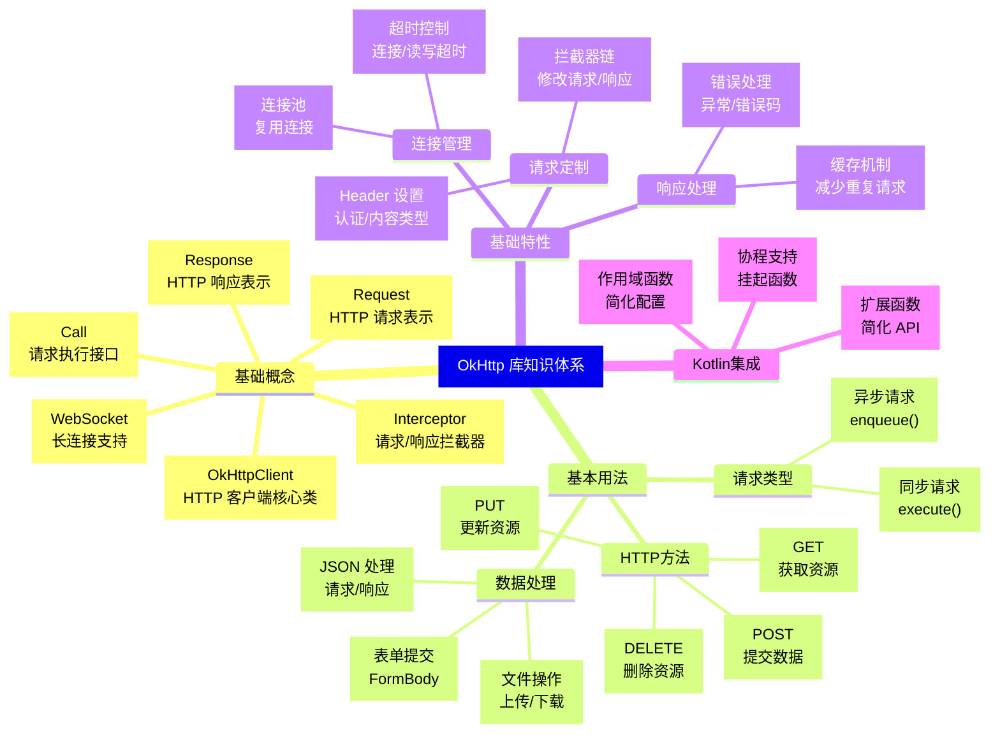
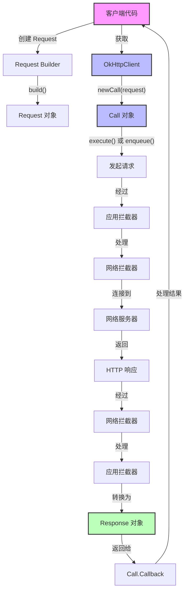
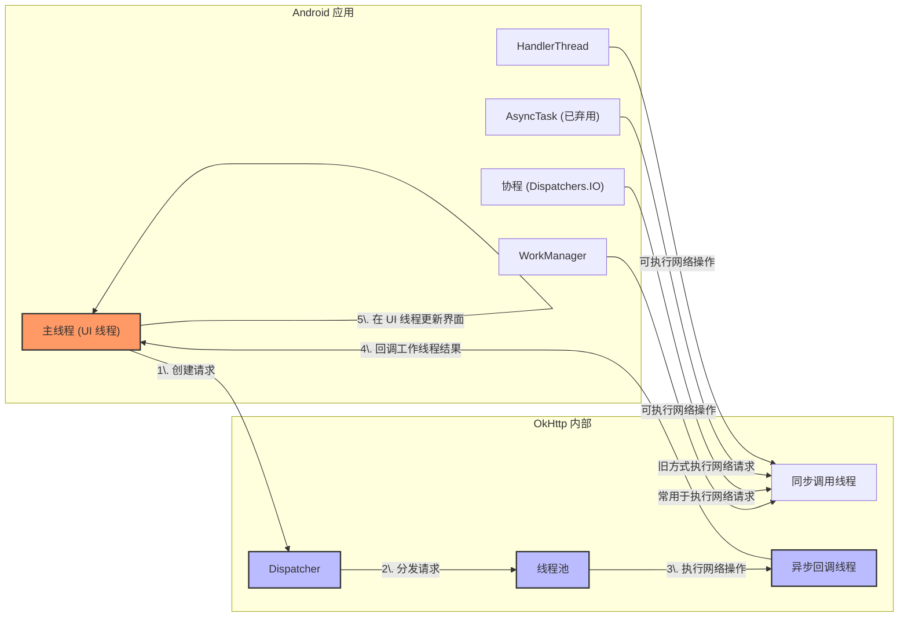

# OkHttp 库基础指南

## 简介

OkHttp 是由 Square 公司开发的一个高效 HTTP 客户端库，适用于 Android 和 Java 应用程序。它提供了简洁的 API 接口，实现了现代 HTTP 协议的各种特性，包括连接池、GZIP 压缩、响应缓存等，有效提升网络请求的性能和可靠性。

### OkHttp 的主要优势

- 高效的请求/响应处理
- 连接池复用
- 透明的 GZIP 压缩
- 响应缓存减少重复请求
- 自动处理网络问题并恢复连接
- 现代 TLS 特性 (SNI, ALPN) 支持
- 拦截器机制支持监控、重写和重试请求

### 与其他平台网络库的对比

| 平台 | 对应库 | 对比说明 |
|------|-------|---------|
| iOS | URLSession | Apple 官方网络库，OkHttp 在 Android 中的地位类似 |
| iOS | Alamofire | 基于 URLSession 的封装，API 设计理念与 OkHttp 相似 |
| Flutter | Dio | Flutter 生态中的热门 HTTP 客户端，接口设计受 OkHttp 启发 |
| Flutter | http | Flutter 官方的简单 HTTP 库，功能较 OkHttp 简单 |
| Web | axios | JavaScript 中类似 OkHttp 的 Promise 风格 HTTP 客户端 |
| Web | fetch | 浏览器原生 API，相当于 Android 中较底层的 HttpURLConnection |

## 核心概念清单

OkHttp 库的基础架构由以下几个核心组件构成：

### OkHttpClient

**功能**：HTTP 客户端的核心类，负责发送 HTTP 请求并获取响应。  
**特点**：线程安全且可重用，通常在应用中作为单例使用。  
**对比**：相当于 iOS 中的 `URLSession` 或 Flutter 中的 `HttpClient`。

### Request

**功能**：表示一个 HTTP 请求，包含 URL、方法、头部和请求体等信息。  
**特点**：使用构建器模式创建，创建后不可变更。  
**对比**：类似 iOS 中的 `URLRequest` 或 Flutter 中的 `Request`。

### Response

**功能**：表示服务器返回的 HTTP 响应，包含状态码、头部和响应体等。  
**特点**：提供多种方法访问响应数据（字符串、字节流、JSON 等）。  
**对比**：类似 iOS 中的 `HTTPURLResponse` 和响应数据的组合。

### Call

**功能**：一个准备执行的请求接口，支持同步或异步执行。  
**特点**：每个 Call 只能执行一次，但可以通过 `clone()` 创建副本。  
**对比**：类似 iOS 中的 `URLSessionTask` 或 Flutter 中的 `Future<Response>`。

### Interceptor

**功能**：请求/响应链中的拦截器，可以观察、修改甚至短路请求。  
**特点**：强大的扩展点，可用于日志、认证、缓存等。  
**对比**：类似 iOS 中的 `URLProtocol` 或 Alamofire 的 `RequestAdapter`。

### WebSocket

**功能**：提供 WebSocket 连接支持，实现实时双向通信。  
**特点**：简化了 WebSocket 握手和消息传递流程。  
**对比**：类似 iOS 中的 `URLSessionWebSocketTask` 或 Flutter 中的 `WebSocket`。

### Cache

**功能**：实现 HTTP 响应的磁盘缓存机制。  
**特点**：遵循 HTTP 缓存控制标准，支持配置缓存大小和位置。  
**对比**：类似 iOS 中 `URLCache` 或 Flutter 中的自定义缓存实现。

### 连接池

**功能**：管理和复用 HTTP 连接以提高性能。  
**特点**：自动管理连接的创建、复用和释放。  
**对比**：iOS 和 Flutter 网络库内部也有类似机制，但通常对开发者透明。

### 超时控制

**功能**：控制连接、读取和写入操作的超时时间。  
**特点**：细粒度的超时控制，提高请求可靠性。  
**对比**：类似 iOS 中 URLSession 的 `timeoutIntervalForRequest` 等属性。

## Kotlin 语法要点

在使用 OkHttp 过程中，了解以下 Kotlin 语法特性将使代码更简洁高效：

### Lambda 表达式

Kotlin 中的 Lambda 表达式使 OkHttp 回调处理更简洁：

```kotlin
// 传统匿名内部类方式
call.enqueue(object : Callback {
    override fun onFailure(call: Call, e: IOException) {
        // 处理失败
    }
    
    override fun onResponse(call: Call, response: Response) {
        // 处理响应
    }
})

// Lambda 表达式方式（需要自定义扩展函数）
call.enqueue(
    onResponse = { response -> 
        // 处理响应
    },
    onFailure = { exception -> 
        // 处理失败 
    }
)
```

### 协程基础

Kotlin 协程可以简化异步编程，使网络请求代码更线性：

```kotlin
// 导入必要的协程库
import kotlinx.coroutines.*

// 在协程作用域中执行网络请求
CoroutineScope(Dispatchers.IO).launch {
    try {
        // 使用挂起函数执行网络请求
        val response = client.newCall(request).await() // await() 是扩展函数
        // 处理响应
        withContext(Dispatchers.Main) {
            // 在主线程更新 UI
        }
    } catch (e: Exception) {
        // 处理异常
    }
}
```

### 扩展函数

Kotlin 的扩展函数可以为 OkHttp 类添加新功能：

```kotlin
// 为 Call 添加挂起函数扩展，配合协程使用
suspend fun Call.await(): Response = suspendCancellableCoroutine { continuation ->
    enqueue(object : Callback {
        override fun onResponse(call: Call, response: Response) {
            continuation.resume(response)
        }
        
        override fun onFailure(call: Call, e: IOException) {
            continuation.resumeWithException(e)
        }
    })
    
    continuation.invokeOnCancellation {
        try {
            cancel()
        } catch (ex: Exception) {
            // 忽略取消异常
        }
    }
}

// 使用扩展函数简化 JSON 响应处理
inline fun <reified T> Response.parseJson(): T {
    return Json.decodeFromString(body?.string() ?: "")
}
```

### 空安全

Kotlin 的空安全特性帮助处理网络响应中的空值：

```kotlin
// 安全地处理可能为空的响应体
val responseText = response.body?.string() ?: "No data"

// 使用 let 处理非空响应
response.body?.let { body ->
    val content = body.string()
    // 处理内容
}

// 使用 Elvis 运算符提供默认值
val userId = jsonResponse?.user?.id ?: -1
```

### 作用域函数

使用 Kotlin 作用域函数简化 OkHttp 配置：

```kotlin
// 使用 apply 配置 OkHttpClient
val client = OkHttpClient().apply {
    connectTimeout(10, TimeUnit.SECONDS)
    readTimeout(30, TimeUnit.SECONDS)
    writeTimeout(30, TimeUnit.SECONDS)
}

// 使用 run 处理响应
response.run {
    if (isSuccessful) {
        body?.string() ?: "Empty body"
    } else {
        "Error: ${code}"
    }
}

// 使用 with 构建请求
val request = with(Request.Builder()) {
    url("https://api.example.com/users")
    header("Authorization", "Bearer $token")
    get()
    build()
}
```

## Android 框架概念

OkHttp 在 Android 开发中的使用涉及以下 Android 特有概念：

### 网络权限

在 Android 中使用 OkHttp 需要网络访问权限：

```xml
<!-- 在 AndroidManifest.xml 中添加网络权限 -->
<uses-permission android:name="android.permission.INTERNET" />
<uses-permission android:name="android.permission.ACCESS_NETWORK_STATE" />
```

Android 10 (API 29) 及以上版本如需明文 HTTP 请求，还需要：

```xml
<!-- 允许明文 HTTP 流量（不推荐用于生产环境） -->
<application
    android:usesCleartextTraffic="true"
    ... >
```

### 主线程与工作线程

Android 禁止在主线程执行网络操作：

- OkHttp 的同步请求必须在工作线程中执行
- 异步请求的回调默认在 OkHttp 的后台线程池中执行
- 处理 UI 相关操作需要切换到主线程

```kotlin
// 错误示例：在主线程执行同步请求
val response = client.newCall(request).execute() // 会抛出 NetworkOnMainThreadException

// 正确示例：使用协程在后台线程执行，结果切换到主线程
lifecycleScope.launch(Dispatchers.IO) {
    val response = client.newCall(request).execute()
    withContext(Dispatchers.Main) {
        // 更新 UI
    }
}
```

### Application 类

`OkHttpClient` 应在 Application 类中初始化为单例：

```kotlin
class MyApplication : Application() {
    // 伴生对象中定义单例
    companion object {
        lateinit var okHttpClient: OkHttpClient
            private set
    }
    
    override fun onCreate() {
        super.onCreate()
        
        // 初始化 OkHttpClient
        okHttpClient = OkHttpClient.Builder()
            .connectTimeout(30, TimeUnit.SECONDS)
            .readTimeout(30, TimeUnit.SECONDS)
            .writeTimeout(30, TimeUnit.SECONDS)
            .build()
    }
}
```

### 生命周期影响

Activity/Fragment 生命周期变化可能影响网络请求：

- 当 Activity 销毁时，进行中的网络请求可能导致内存泄漏
- 当配置更改（如旋转屏幕）时，Activity 重建但网络请求继续
- 当应用进入后台时，长时间运行的网络请求可能被系统限制

```kotlin
class MyActivity : AppCompatActivity() {
    // 跟踪活跃的请求
    private val activeNetworkCalls = mutableListOf<Call>()
    
    fun makeNetworkRequest() {
        val call = okHttpClient.newCall(request)
        activeNetworkCalls.add(call)
        
        call.enqueue(object : Callback {
            override fun onResponse(call: Call, response: Response) {
                activeNetworkCalls.remove(call)
                // 处理响应
            }
            
            override fun onFailure(call: Call, e: IOException) {
                activeNetworkCalls.remove(call)
                // 处理失败
            }
        })
    }
    
    override fun onDestroy() {
        // 取消所有活跃的网络请求
        activeNetworkCalls.forEach { it.cancel() }
        activeNetworkCalls.clear()
        super.onDestroy()
    }
}
```

### Context 使用

在处理 OkHttp 响应时正确使用 Context：

- 在回调中使用 Activity 的 Context 前先检查 Activity 是否已销毁
- 在长生命周期对象中持有 Context 引用时使用 ApplicationContext
- 避免在 OkHttp 拦截器中持有 Activity Context

## 快速入门指南

### 项目集成

#### 添加依赖

在模块级 `build.gradle` 文件中添加 OkHttp 依赖：

```groovy
dependencies {
    // OkHttp 核心库
    implementation 'com.squareup.okhttp3:okhttp:4.11.0'
    
    // 可选：日志拦截器，用于调试
    implementation 'com.squareup.okhttp3:logging-interceptor:4.11.0'
    
    // 可选：如使用 Kotlin 协程，添加协程支持
    implementation 'org.jetbrains.kotlinx:kotlinx-coroutines-android:1.7.3'
}
```

#### 添加权限

在 `AndroidManifest.xml` 中添加必要的网络权限：

```xml
<manifest xmlns:android="http://schemas.android.com/apk/res/android"
    package="com.example.myapp">
    
    <!-- 网络访问权限 -->
    <uses-permission android:name="android.permission.INTERNET" />
    <uses-permission android:name="android.permission.ACCESS_NETWORK_STATE" />
    
    <application
        ...
    </application>
</manifest>
```

#### 初始化 OkHttpClient

推荐在 Application 类中初始化 OkHttpClient 单例：

```kotlin
class MyApplication : Application() {
    companion object {
        val okHttpClient by lazy {
            OkHttpClient.Builder()
                .connectTimeout(30, TimeUnit.SECONDS)
                .readTimeout(30, TimeUnit.SECONDS)
                .writeTimeout(30, TimeUnit.SECONDS)
                .addInterceptor(HttpLoggingInterceptor().apply {
                    level = if (BuildConfig.DEBUG) 
                        HttpLoggingInterceptor.Level.BODY
                    else 
                        HttpLoggingInterceptor.Level.NONE
                })
                .build()
        }
    }
}
```

### 基础使用场景

#### 1. GET 请求：获取用户信息

```kotlin
/**
 * 获取用户信息的示例
 * 展示了基本的 GET 请求、异步回调处理和 JSON 解析
 */
class UserRepository(
    private val okHttpClient: OkHttpClient,
    private val json: Json // kotlinx.serialization
) {
    // 用户数据模型
    @Serializable
    data class User(
        val id: Long,
        val name: String,
        val email: String,
        val avatarUrl: String? = null
    )
    
    /**
     * 异步获取用户信息
     * @param userId 用户ID
     * @param onSuccess 成功回调
     * @param onError 错误回调
     */
    fun getUser(
        userId: Long,
        onSuccess: (User) -> Unit,
        onError: (Exception) -> Unit
    ) {
        // 构建请求
        val request = Request.Builder()
            .url("https://api.example.com/users/$userId")
            .header("Accept", "application/json")
            .get() // GET 是默认方法，可以省略
            .build()
            
        // 异步执行请求
        okHttpClient.newCall(request).enqueue(object : Callback {
            override fun onFailure(call: Call, e: IOException) {
                // 在主线程中执行错误回调
                Handler(Looper.getMainLooper()).post {
                    onError(e)
                }
            }
            
            override fun onResponse(call: Call, response: Response) {
                try {
                    if (!response.isSuccessful) {
                        throw IOException("请求失败，状态码: ${response.code}")
                    }
                    
                    // 获取响应体（若为空则抛出异常）
                    val responseBody = response.body?.string() 
                        ?: throw IOException("响应体为空")
                    
                    // 解析 JSON 到用户对象
                    val user = json.decodeFromString<User>(responseBody)
                    
                    // 在主线程中执行成功回调
                    Handler(Looper.getMainLooper()).post {
                        onSuccess(user)
                    }
                } catch (e: Exception) {
                    Handler(Looper.getMainLooper()).post {
                        onError(e)
                    }
                } finally {
                    response.close() // 确保响应被关闭
                }
            }
        })
    }
    
    /**
     * 使用协程获取用户信息（需要添加协程扩展函数）
     */
    suspend fun getUserWithCoroutine(userId: Long): User {
        return withContext(Dispatchers.IO) {
            val request = Request.Builder()
                .url("https://api.example.com/users/$userId")
                .header("Accept", "application/json")
                .build()
                
            val response = okHttpClient.newCall(request).execute()
            
            response.use { // 自动关闭响应
                if (!response.isSuccessful) {
                    throw IOException("请求失败，状态码: ${response.code}")
                }
                
                val responseBody = response.body?.string() 
                    ?: throw IOException("响应体为空")
                    
                json.decodeFromString<User>(responseBody)
            }
        }
    }
}

// 在 ViewModel 或 Activity 中使用
class UserViewModel(application: Application) : AndroidViewModel(application) {
    private val userRepository = UserRepository(
        MyApplication.okHttpClient,
        Json { ignoreUnknownKeys = true }
    )
    
    private val _userData = MutableLiveData<User>()
    val userData: LiveData<User> = _userData
    
    private val _error = MutableLiveData<String>()
    val error: LiveData<String> = _error
    
    fun loadUserData(userId: Long) {
        userRepository.getUser(
            userId = userId,
            onSuccess = { user ->
                _userData.value = user
            },
            onError = { exception ->
                _error.value = "加载用户数据失败: ${exception.message}"
            }
        )
    }
    
    // 使用协程的版本
    fun loadUserWithCoroutine(userId: Long) {
        viewModelScope.launch {
            try {
                val user = userRepository.getUserWithCoroutine(userId)
                _userData.value = user
            } catch (e: Exception) {
                _error.value = "加载用户数据失败: ${e.message}"
            }
        }
    }
}
```

#### 2. POST 请求：用户登录

```kotlin
/**
 * 用户登录示例
 * 展示了 POST 请求、表单提交和错误处理
 */
class AuthRepository(private val okHttpClient: OkHttpClient) {
    
    // 请求和响应数据模型
    @Serializable
    data class LoginRequest(val email: String, val password: String)
    
    @Serializable
    data class LoginResponse(
        val token: String,
        val userId: Long,
        val expiresIn: Int
    )
    
    @Serializable
    data class ErrorResponse(val message: String, val code: String)
    
    /**
     * 用户登录
     * @param email 用户邮箱
     * @param password 用户密码
     * @return 登录响应结果
     */
    suspend fun login(email: String, password: String): Result<LoginResponse> {
        return withContext(Dispatchers.IO) {
            try {
                // 创建 JSON 请求体
                val json = Json { ignoreUnknownKeys = true }
                val loginRequest = LoginRequest(email, password)
                val requestBodyJson = json.encodeToString(loginRequest)
                
                val requestBody = requestBodyJson.toRequestBody("application/json".toMediaType())
                
                // 构建 POST 请求
                val request = Request.Builder()
                    .url("https://api.example.com/auth/login")
                    .post(requestBody)
                    .header("Content-Type", "application/json")
                    .header("Accept", "application/json")
                    .build()
                
                // 执行请求
                val response = okHttpClient.newCall(request).execute()
                
                response.use {
                    val responseBody = it.body?.string() ?: ""
                    
                    if (it.isSuccessful) {
                        // 解析成功响应
                        val loginResponse = json.decodeFromString<LoginResponse>(responseBody)
                        Result.success(loginResponse)
                    } else {
                        // 尝试解析错误响应
                        try {
                            val errorResponse = json.decodeFromString<ErrorResponse>(responseBody)
                            Result.failure(Exception(errorResponse.message))
                        } catch (e: Exception) {
                            Result.failure(IOException("登录失败: HTTP ${it.code}"))
                        }
                    }
                }
            } catch (e: Exception) {
                Result.failure(e)
            }
        }
    }
}

// 在 ViewModel 中使用
class LoginViewModel(application: Application) : AndroidViewModel(application) {
    private val authRepository = AuthRepository(MyApplication.okHttpClient)
    
    private val _loginState = MutableLiveData<LoginState>()
    val loginState: LiveData<LoginState> = _loginState
    
    // 登录状态密封类
    sealed class LoginState {
        object Idle : LoginState()
        object Loading : LoginState()
        data class Success(val token: String, val userId: Long) : LoginState()
        data class Error(val message: String) : LoginState()
    }
    
    fun login(email: String, password: String) {
        viewModelScope.launch {
            _loginState.value = LoginState.Loading
            
            val result = authRepository.login(email, password)
            
            result.fold(
                onSuccess = { response ->
                    // 保存 token 到安全存储
                    saveAuthToken(response.token)
                    
                    _loginState.value = LoginState.Success(
                        token = response.token,
                        userId = response.userId
                    )
                },
                onFailure = { exception ->
                    _loginState.value = LoginState.Error(
                        message = exception.message ?: "登录失败"
                    )
                }
            )
        }
    }
    
    private fun saveAuthToken(token: String) {
        // 使用 EncryptedSharedPreferences 等安全存储机制保存 token
        // 简化示例，实际应使用安全的存储方式
        getApplication<Application>().getSharedPreferences(
            "auth_prefs", 
            Context.MODE_PRIVATE
        ).edit().apply {
            putString("auth_token", token)
            apply()
        }
    }
}
```

#### 3. 文件上传：上传用户头像

```kotlin
/**
 * 文件上传示例
 * 展示了如何上传文件、监控上传进度和处理多部分表单
 */
class FileUploadRepository(private val okHttpClient: OkHttpClient) {
    
    /**
     * 上传用户头像
     * @param userId 用户 ID
     * @param imageFile 图片文件
     * @param progressCallback 进度回调
     * @return 上传结果
     */
    suspend fun uploadUserAvatar(
        userId: Long,
        imageFile: File,
        progressCallback: (progress: Float) -> Unit
    ): Result<String> = withContext(Dispatchers.IO) {
        try {
            // 创建带进度监控的请求体
            val fileRequestBody = imageFile.asRequestBody("image/*".toMediaType())
            val progressRequestBody = ProgressRequestBody(fileRequestBody) { bytesWritten, contentLength ->
                val progress = bytesWritten.toFloat() / contentLength.toFloat()
                // 在主线程回调进度
                withContext(Dispatchers.Main) {
                    progressCallback(progress)
                }
            }
            
            // 创建多部分表单
            val requestBody = MultipartBody.Builder()
                .setType(MultipartBody.FORM)
                .addFormDataPart("user_id", userId.toString())
                .addFormDataPart(
                    "avatar", 
                    imageFile.name, 
                    progressRequestBody
                )
                .build()
            
            // 构建请求
            val request = Request.Builder()
                .url("https://api.example.com/users/$userId/avatar")
                .post(requestBody)
                .build()
            
            // 执行请求
            val response = okHttpClient.newCall(request).execute()
            
            response.use {
                if (it.isSuccessful) {
                    // 假设服务器返回头像 URL
                    val avatarUrl = it.body?.string() ?: ""
                    Result.success(avatarUrl)
                } else {
                    Result.failure(IOException("上传失败: HTTP ${it.code}"))
                }
            }
        } catch (e: Exception) {
            Result.failure(e)
        }
    }
    
    /**
     * 带进度监控的请求体包装类
     */
    private class ProgressRequestBody(
        private val delegate: RequestBody,
        private val progressListener: (bytesWritten: Long, contentLength: Long) -> Unit
    ) : RequestBody() {
        
        override fun contentType(): MediaType? = delegate.contentType()
        
        override fun contentLength(): Long = delegate.contentLength()
        
        override fun writeTo(sink: BufferedSink) {
            val contentLength = contentLength()
            
            // 创建计数的 Sink
            val countingSink = object : ForwardingSink(sink) {
                private var bytesWritten = 0L
                
                override fun write(source: Buffer, byteCount: Long) {
                    super.write(source, byteCount)
                    bytesWritten += byteCount
                    progressListener(bytesWritten, contentLength)
                }
            }
            
            // 将数据写入带计数的 Sink
            val bufferedSink = countingSink.buffer()
            delegate.writeTo(bufferedSink)
            bufferedSink.flush()
        }
    }
}

// 在 ViewModel 中使用
class ProfileViewModel(application: Application) : AndroidViewModel(application) {
    private val fileUploadRepository = FileUploadRepository(MyApplication.okHttpClient)
    
    private val _uploadProgress = MutableLiveData<Float>()
    val uploadProgress: LiveData<Float> = _uploadProgress
    
    private val _uploadState = MutableLiveData<UploadState>()
    val uploadState: LiveData<UploadState> = _uploadState
    
    sealed class UploadState {
        object Idle : UploadState()
        object Uploading : UploadState()
        data class Success(val avatarUrl: String) : UploadState()
        data class Error(val message: String) : UploadState()
    }
    
    fun uploadAvatar(userId: Long, imageFile: File) {
        viewModelScope.launch {
            _uploadState.value = UploadState.Uploading
            _uploadProgress.value = 0f
            
            fileUploadRepository.uploadUserAvatar(
                userId = userId,
                imageFile = imageFile,
                progressCallback = { progress ->
                    _uploadProgress.value = progress
                }
            ).fold(
                onSuccess = { avatarUrl ->
                    _uploadState.value = UploadState.Success(avatarUrl)
                },
                onFailure = { exception ->
                    _uploadState.value = UploadState.Error(
                        exception.message ?: "上传失败"
                    )
                }
            )
        }
    }
}
```

#### 4. 文件下载：带进度监控

```kotlin
/**
 * 文件下载示例
 * 展示了如何下载文件并监控下载进度
 */
class DownloadRepository(private val okHttpClient: OkHttpClient) {
    
    /**
     * 下载文件并监控进度
     * @param url 文件下载地址
     * @param destinationFile 保存文件的位置
     * @param progressCallback 进度回调函数
     * @return 下载结果
     */
    suspend fun downloadFile(
        url: String,
        destinationFile: File,
        progressCallback: (progress: Float) -> Unit
    ): Result<File> = withContext(Dispatchers.IO) {
        try {
            // 构建请求
            val request = Request.Builder()
                .url(url)
                .get()
                .build()
            
            // 执行请求
            val response = okHttpClient.newCall(request).execute()
            
            if (!response.isSuccessful) {
                return@withContext Result.failure(
                    IOException("下载失败: HTTP ${response.code}")
                )
            }
            
            // 获取响应体
            val responseBody = response.body ?: return@withContext Result.failure(
                IOException("响应体为空")
            )
            
            // 准备文件输出流
            val contentLength = responseBody.contentLength()
            var bytesRead = 0L
            
            // 创建临时文件，下载成功后再重命名
            val tempFile = File("${destinationFile.absolutePath}.tmp")
            if (tempFile.exists()) {
                tempFile.delete()
            }
            
            tempFile.parentFile?.mkdirs() // 确保目录存在
            
            // 创建输入流和输出流
            val inputStream = responseBody.byteStream()
            val outputStream = FileOutputStream(tempFile)
            
            try {
                // 缓冲区
                val buffer = ByteArray(8192)
                var bytes: Int
                
                // 读取数据并更新进度
                while (inputStream.read(buffer).also { bytes = it } != -1) {
                    outputStream.write(buffer, 0, bytes)
                    bytesRead += bytes
                    
                    // 计算并通知进度
                    val progress = if (contentLength > 0) {
                        bytesRead.toFloat() / contentLength.toFloat()
                    } else {
                        -1f // 无法确定进度
                    }
                    
                    // 在主线程回调进度
                    withContext(Dispatchers.Main) {
                        progressCallback(progress)
                    }
                }
                
                // 下载完成，确保所有数据写入磁盘
                outputStream.flush()
                
                // 关闭流
                outputStream.close()
                inputStream.close()
                
                // 下载成功，重命名文件
                if (tempFile.length() > 0) {
                    if (destinationFile.exists()) {
                        destinationFile.delete()
                    }
                    
                    val renamed = tempFile.renameTo(destinationFile)
                    if (!renamed) {
                        return@withContext Result.failure(
                            IOException("无法重命名下载的文件")
                        )
                    }
                    
                    return@withContext Result.success(destinationFile)
                } else {
                    tempFile.delete()
                    return@withContext Result.failure(
                        IOException("下载的文件为空")
                    )
                }
            } catch (e: Exception) {
                // 确保流关闭
                try {
                    outputStream.close()
                    inputStream.close()
                } catch (closeException: Exception) {
                    // 忽略关闭异常
                }
                
                // 删除未完成的临时文件
                tempFile.delete()
                
                throw e
            }
        } catch (e: Exception) {
            Result.failure(e)
        } finally {
            response?.close()
        }
    }
}

// 在 ViewModel 中使用
class FileViewModel(application: Application) : AndroidViewModel(application) {
    private val downloadRepository = DownloadRepository(MyApplication.okHttpClient)
    
    private val _downloadProgress = MutableLiveData<Float>()
    val downloadProgress: LiveData<Float> = _downloadProgress
    
    private val _downloadState = MutableLiveData<DownloadState>()
    val downloadState: LiveData<DownloadState> = _downloadState
    
    sealed class DownloadState {
        object Idle : DownloadState()
        object Downloading : DownloadState()
        data class Success(val file: File) : DownloadState()
        data class Error(val message: String) : DownloadState()
    }
    
    fun downloadFile(url: String, fileName: String) {
        viewModelScope.launch {
            _downloadState.value = DownloadState.Downloading
            _downloadProgress.value = 0f
            
            // 创建下载文件的目标路径
            val downloadDir = getApplication<Application>().getExternalFilesDir(Environment.DIRECTORY_DOWNLOADS)
            val destinationFile = File(downloadDir, fileName)
            
            downloadRepository.downloadFile(
                url = url,
                destinationFile = destinationFile,
                progressCallback = { progress ->
                    _downloadProgress.value = progress
                }
            ).fold(
                onSuccess = { file ->
                    _downloadState.value = DownloadState.Success(file)
                },
                onFailure = { exception ->
                    _downloadState.value = DownloadState.Error(
                        exception.message ?: "下载失败"
                    )
                }
            )
        }
    }
}
```

#### 5. JSON 数据处理

```kotlin
/**
 * JSON 数据处理示例
 * 展示了如何处理 JSON 格式的 API 响应
 */
class ProductRepository(private val okHttpClient: OkHttpClient) {
    // 数据模型
    @Serializable
    data class Product(
        val id: String,
        val name: String,
        val price: Double,
        val description: String? = null,
        val imageUrl: String? = null,
        val categories: List<String> = emptyList(),
        val rating: Double? = null
    )
    
    @Serializable
    data class ProductListResponse(
        val products: List<Product>,
        val total: Int,
        val page: Int,
        val pageSize: Int
    )
    
    /**
     * 获取商品列表
     * @param page 页码（从1开始）
     * @param pageSize 每页数量
     * @param category 可选的商品类别过滤
     * @return 商品列表响应
     */
    suspend fun getProducts(
        page: Int = 1,
        pageSize: Int = 20,
        category: String? = null
    ): Result<ProductListResponse> = withContext(Dispatchers.IO) {
        try {
            // 构建 URL（使用 HttpUrl 构建器添加查询参数）
            val urlBuilder = "https://api.example.com/products".toHttpUrl().newBuilder()
                .addQueryParameter("page", page.toString())
                .addQueryParameter("page_size", pageSize.toString())
            
            // 如果提供了类别，添加到查询参数
            category?.let {
                urlBuilder.addQueryParameter("category", it)
            }
            
            // 构建请求
            val request = Request.Builder()
                .url(urlBuilder.build())
                .header("Accept", "application/json")
                .get()
                .build()
            
            // 执行请求
            val response = okHttpClient.newCall(request).execute()
            
            response.use {
                if (!it.isSuccessful) {
                    return@withContext Result.failure(
                        IOException("请求失败: HTTP ${it.code}")
                    )
                }
                
                val responseBody = it.body?.string()
                    ?: return@withContext Result.failure(IOException("响应体为空"))
                
                // 使用 kotlinx.serialization 解析 JSON
                val json = Json { ignoreUnknownKeys = true }
                val productList = json.decodeFromString<ProductListResponse>(responseBody)
                
                Result.success(productList)
            }
        } catch (e: Exception) {
            Result.failure(e)
        }
    }
    
    /**
     * 搜索商品
     * @param query 搜索关键词
     * @return 商品列表
     */
    suspend fun searchProducts(query: String): Result<List<Product>> = 
        withContext(Dispatchers.IO) {
            try {
                // 构建请求
                val request = Request.Builder()
                    .url("https://api.example.com/products/search?q=${query.encodeUrl()}")
                    .get()
                    .build()
                
                // 执行请求
                val response = okHttpClient.newCall(request).execute()
                
                response.use {
                    if (!it.isSuccessful) {
                        return@withContext Result.failure(
                            IOException("搜索失败: HTTP ${it.code}")
                        )
                    }
                    
                    val responseBody = it.body?.string() 
                        ?: return@withContext Result.failure(IOException("响应体为空"))
                    
                    // 解析 JSON
                    val json = Json { ignoreUnknownKeys = true }
                    // 假设直接返回商品列表数组
                    val products = json.decodeFromString<List<Product>>(responseBody)
                    
                    Result.success(products)
                }
            } catch (e: Exception) {
                Result.failure(e)
            }
        }
    
    // URL 编码扩展函数
    private fun String.encodeUrl(): String {
        return URLEncoder.encode(this, "UTF-8")
    }
}
```

#### 6. 并发请求：同时发起多个请求并合并结果

```kotlin
/**
 * 并发请求示例
 * 展示了如何同时发起多个请求并合并结果
 */
class DashboardRepository(
    private val okHttpClient: OkHttpClient,
    private val json: Json
) {
    // 数据模型
    @Serializable
    data class UserProfile(val id: Long, val name: String, val avatarUrl: String?)
    
    @Serializable
    data class Notification(val id: String, val message: String, val timestamp: Long)
    
    @Serializable
    data class WeatherInfo(val temperature: Double, val condition: String, val cityName: String)
    
    @Serializable
    data class DashboardData(
        val userProfile: UserProfile?,
        val notifications: List<Notification>,
        val weather: WeatherInfo?,
        val unreadCount: Int
    )
    
    /**
     * 并发获取仪表盘所需的全部数据
     * @param userId 用户ID
     * @return 合并后的仪表盘数据
     */
    suspend fun loadDashboardData(userId: Long): Result<DashboardData> = withContext(Dispatchers.IO) {
        try {
            // 创建三个请求
            val profileRequest = Request.Builder()
                .url("https://api.example.com/users/$userId/profile")
                .get()
                .build()
                
            val notificationsRequest = Request.Builder()
                .url("https://api.example.com/users/$userId/notifications")
                .get()
                .build()
                
            val weatherRequest = Request.Builder()
                .url("https://api.example.com/weather?user_id=$userId")
                .get()
                .build()
            
            // 使用协程并发执行请求
            val results = coroutineScope {
                // 启动三个异步任务
                val profileDeferred = async { executeRequest<UserProfile?>(profileRequest) }
                val notificationsDeferred = async { executeRequest<List<Notification>>(notificationsRequest) }
                val weatherDeferred = async { executeRequest<WeatherInfo?>(weatherRequest) }
                
                // 等待所有请求完成
                Triple(
                    profileDeferred.await(),
                    notificationsDeferred.await(),
                    weatherDeferred.await()
                )
            }
            
            // 解析结果
            val (profileResult, notificationsResult, weatherResult) = results
            
            // 即使某些请求失败，仍返回部分数据
            val profile = profileResult.getOrNull()
            val notifications = notificationsResult.getOrDefault(emptyList())
            val weather = weatherResult.getOrNull()
            
            // 计算未读通知数
            val unreadCount = notifications.count { 
                it.timestamp > getLastReadTimestamp(userId) 
            }
            
            // 合并所有数据
            val dashboardData = DashboardData(
                userProfile = profile,
                notifications = notifications,
                weather = weather,
                unreadCount = unreadCount
            )
            
            Result.success(dashboardData)
        } catch (e: Exception) {
            Result.failure(e)
        }
    }
    
    /**
     * 执行请求并解析 JSON 响应
     */
    private suspend inline fun <reified T> executeRequest(request: Request): Result<T> {
        return try {
            val response = okHttpClient.newCall(request).execute()
            
            response.use {
                if (!it.isSuccessful) {
                    return Result.failure(
                        IOException("请求失败: HTTP ${it.code}")
                    )
                }
                
                val responseBody = it.body?.string()
                    ?: return Result.failure(IOException("响应体为空"))
                
                // 解析 JSON
                val result = json.decodeFromString<T>(responseBody)
                Result.success(result)
            }
        } catch (e: Exception) {
            Result.failure(e)
        }
    }
    
    /**
     * 获取用户最后读取通知的时间戳
     */
    private fun getLastReadTimestamp(userId: Long): Long {
        // 示例实现，实际应从持久化存储中获取
        return System.currentTimeMillis() - (24 * 60 * 60 * 1000) // 1天前
    }
}

// 在 ViewModel 中使用
class DashboardViewModel(application: Application) : AndroidViewModel(application) {
    private val dashboardRepository = DashboardRepository(
        MyApplication.okHttpClient,
        Json { ignoreUnknownKeys = true }
    )
    
    private val _dashboardData = MutableLiveData<DashboardData?>()
    val dashboardData: LiveData<DashboardData?> = _dashboardData
    
    private val _isLoading = MutableLiveData(false)
    val isLoading: LiveData<Boolean> = _isLoading
    
    private val _error = MutableLiveData<String?>()
    val error: LiveData<String?> = _error
    
    fun loadDashboard(userId: Long) {
        viewModelScope.launch {
            _isLoading.value = true
            _error.value = null
            
            dashboardRepository.loadDashboardData(userId).fold(
                onSuccess = { data ->
                    _dashboardData.value = data
                    _isLoading.value = false
                },
                onFailure = { exception ->
                    _error.value = "加载仪表盘数据失败: ${exception.message}"
                    _isLoading.value = false
                }
            )
        }
    }
}
```

#### 7. 请求取消：取消正在进行的请求

```kotlin
/**
 * 请求取消示例
 * 展示如何取消正在进行的请求
 */
class SearchRepository(private val okHttpClient: OkHttpClient) {
    // 跟踪当前活跃的搜索请求
    private var currentSearchCall: Call? = null
    
    /**
     * 搜索产品
     * 如果有正在进行的搜索，会先取消
     */
    suspend fun searchProducts(query: String): Result<List<Product>> = withContext(Dispatchers.IO) {
        try {
            // 取消任何正在进行的搜索
            cancelOngoingSearch()
            
            // 构建新的请求
            val request = Request.Builder()
                .url("https://api.example.com/products/search?q=${query.encodeUrl()}")
                .get()
                .build()
            
            // 创建 Call 对象并保存引用
            val call = okHttpClient.newCall(request)
            currentSearchCall = call
            
            try {
                // 执行请求
                val response = call.execute()
                
                response.use {
                    if (!it.isSuccessful) {
                        return@withContext Result.failure(
                            IOException("搜索失败: HTTP ${it.code}")
                        )
                    }
                    
                    // 如果请求已取消，返回取消错误
                    if (call.isCanceled()) {
                        return@withContext Result.failure(
                            IOException("搜索已取消")
                        )
                    }
                    
                    val responseBody = it.body?.string() 
                        ?: return@withContext Result.failure(IOException("响应体为空"))
                    
                    // 解析 JSON
                    val json = Json { ignoreUnknownKeys = true }
                    val products = json.decodeFromString<List<Product>>(responseBody)
                    
                    Result.success(products)
                }
            } finally {
                // 请求完成，清除引用
                if (currentSearchCall === call) {
                    currentSearchCall = null
                }
            }
        } catch (e: Exception) {
            // 如果是因为取消导致的异常，返回特定结果
            if (e is IOException && e.message?.contains("canceled") == true) {
                Result.failure(IOException("搜索已取消"))
            } else {
                Result.failure(e)
            }
        }
    }
    
    /**
     * 取消正在进行的搜索请求
     */
    fun cancelOngoingSearch() {
        currentSearchCall?.let {
            if (!it.isCanceled()) {
                it.cancel()
            }
            currentSearchCall = null
        }
    }
    
    // URL 编码扩展函数
    private fun String.encodeUrl(): String {
        return URLEncoder.encode(this, "UTF-8")
    }
    
    // 数据模型
    @Serializable
    data class Product(
        val id: String,
        val name: String,
        val price: Double,
        val imageUrl: String?
    )
}

// 在 ViewModel 中使用
class SearchViewModel(application: Application) : AndroidViewModel(application) {
    private val searchRepository = SearchRepository(MyApplication.okHttpClient)
    
    private val _searchResults = MutableLiveData<List<Product>>()
    val searchResults: LiveData<List<Product>> = _searchResults
    
    private val _isSearching = MutableLiveData(false)
    val isSearching: LiveData<Boolean> = _isSearching
    
    private val _searchError = MutableLiveData<String?>()
    val searchError: LiveData<String?> = _searchError
    
    // 搜索作业，用于在需要时取消
    private var searchJob: Job? = null
    
    /**
     * 搜索产品
     * 取消任何正在进行的搜索，并开始新搜索
     */
    fun search(query: String) {
        // 取消之前的搜索作业
        searchJob?.cancel()
        
        // 启动新的搜索
        searchJob = viewModelScope.launch {
            // 短查询不搜索
            if (query.length < 2) {
                _searchResults.value = emptyList()
                return@launch
            }
            
            _isSearching.value = true
            _searchError.value = null
            
            // 添加延迟避免用户输入时频繁请求
            delay(300)
            
            searchRepository.searchProducts(query).fold(
                onSuccess = { products ->
                    _searchResults.value = products
                    _isSearching.value = false
                },
                onFailure = { exception ->
                    // 如果是因为取消，不显示错误
                    if (exception.message?.contains("取消") != true) {
                        _searchError.value = "搜索失败: ${exception.message}"
                    }
                    _isSearching.value = false
                }
            )
        }
    }
    
    /**
     * 取消当前搜索
     */
    fun cancelSearch() {
        searchJob?.cancel()
        searchRepository.cancelOngoingSearch()
        _isSearching.value = false
    }
    
    override fun onCleared() {
        super.onCleared()
        searchRepository.cancelOngoingSearch()
        searchJob?.cancel()
    }
}
```

## 与 iOS/Flutter 开发的对比

### 概念对比表

| OkHttp 概念 | iOS 对应概念 | Flutter 对应概念 | 说明 |
|------------|-------------|-----------------|------|
| OkHttpClient | URLSession | Dio / http.Client | 中心化的 HTTP 客户端，负责发送请求并接收响应 |
| Request.Builder | URLRequest | Request / dio.RequestOptions | 构建 HTTP 请求的方式，OkHttp 和 Dio 都使用构建器模式 |
| Response | URLResponse + Data | Response | 服务器响应的包装，OkHttp 将头部和内容统一封装 |
| Call | URLSessionTask | Future<Response> | 表示一个可执行的请求，OkHttp 使用接口，Flutter 使用 Future |
| Interceptor | URLProtocol | dio.Interceptor | 拦截和修改请求/响应的机制 |
| Dispatcher | OperationQueue | 无直接对应，使用 Isolate | 管理请求的执行和线程调度 |
| WebSocket | URLSessionWebSocketTask | WebSocket | WebSocket 连接的抽象 |
| CookieJar | HTTPCookieStorage | CookieJar | Cookie 存储和管理 |

### 代码对比示例

#### 基本 GET 请求对比

**OkHttp (Kotlin)**:

```kotlin
// OkHttp 发起 GET 请求
val client = OkHttpClient()
val request = Request.Builder()
    .url("https://api.example.com/users")
    .build()

// 同步方式
val response = client.newCall(request).execute()
val responseData = response.body?.string()

// 异步方式
client.newCall(request).enqueue(object : Callback {
    override fun onFailure(call: Call, e: IOException) {
        // 处理错误
    }
    
    override fun onResponse(call: Call, response: Response) {
        val responseData = response.body?.string()
        // 处理数据
    }
})
```

**iOS (Swift) - URLSession**:

```swift
// URLSession 发起 GET 请求
let url = URL(string: "https://api.example.com/users")!
let task = URLSession.shared.dataTask(with: url) { (data, response, error) in
    if let error = error {
        // 处理错误
        return
    }
    
    if let data = data {
        let responseString = String(data: data, encoding: .utf8)
        // 处理数据
    }
}
task.resume()
```

**iOS (Swift) - Alamofire**:

```swift
// Alamofire 发起 GET 请求
AF.request("https://api.example.com/users").responseJSON { response in
    switch response.result {
    case .success(let value):
        // 处理 JSON 数据
        print(value)
    case .failure(let error):
        // 处理错误
        print(error)
    }
}
```

**Flutter - Dio**:

```dart
// Dio 发起 GET 请求
final dio = Dio();

// 异步/等待方式
Future<void> fetchUsers() async {
  try {
    final response = await dio.get('https://api.example.com/users');
    print(response.data);
  } catch (e) {
    print(e);
  }
}

// 回调方式
dio.get('https://api.example.com/users').then((response) {
  print(response.data);
}).catchError((error) {
  print(error);
});
```

#### POST 请求与 JSON 处理对比

**OkHttp (Kotlin)**:

```kotlin
// OkHttp 发起 POST 请求
val json = """{"name":"John","email":"john@example.com"}"""
val requestBody = json.toRequestBody("application/json".toMediaType())

val request = Request.Builder()
    .url("https://api.example.com/users")
    .post(requestBody)
    .build()

client.newCall(request).enqueue(object : Callback {
    override fun onFailure(call: Call, e: IOException) {
        // 处理错误
    }
    
    override fun onResponse(call: Call, response: Response) {
        val responseJson = response.body?.string()
        // 使用 Kotlin 序列化库解析 JSON
        val user = Json.decodeFromString<User>(responseJson ?: "")
    }
})
```

**iOS (Swift) - URLSession**:

```swift
// URLSession 发起 POST 请求
let url = URL(string: "https://api.example.com/users")!
var request = URLRequest(url: url)
request.httpMethod = "POST"
request.addValue("application/json", forHTTPHeaderField: "Content-Type")

let userData = ["name": "John", "email": "john@example.com"]
let jsonData = try? JSONSerialization.data(withJSONObject: userData)
request.httpBody = jsonData

URLSession.shared.dataTask(with: request) { (data, response, error) in
    if let data = data {
        // 解析 JSON 响应
        let user = try? JSONDecoder().decode(User.self, from: data)
    }
}.resume()
```

**Flutter - Dio**:

```dart
// Dio 发起 POST 请求
final dio = Dio();

Future<void> createUser() async {
  try {
    final response = await dio.post(
      'https://api.example.com/users',
      data: {
        'name': 'John',
        'email': 'john@example.com'
      },
      options: Options(
        headers: {
          'Content-Type': 'application/json',
        },
      ),
    );
    
    // 解析 JSON 响应
    final user = User.fromJson(response.data);
  } catch (e) {
    print(e);
  }
}
```

### 异步模型对比

| 平台 | 异步模型 | 特点 | 与 OkHttp 对比 |
|------|----------|------|---------------|
| OkHttp | 回调 + 协程支持 | 默认提供回调接口，可通过扩展支持协程 | 基础模型 |
| iOS - URLSession | 回调闭包 + GCD | 通过回调闭包处理异步结果，配合 GCD 管理线程 | 类似的回调方式，但 OkHttp 需要实现接口 |
| iOS - Combine | 响应式流 | 通过 Publisher 发布事件流，支持链式操作 | 更现代的声明式编程模型，OkHttp 需要额外库支持类似功能 |
| iOS - async/await | 结构化并发 | Swift 5.5+ 原生支持的异步编程模型 | 与 Kotlin 协程类似，但语法和实现机制不同 |
| Flutter - Future | 基于 Future 的异步 | 使用 Future 表示异步操作，支持 async/await | 类似 Kotlin 协程，但 API 设计更接近 JavaScript Promise |
| Flutter - Stream | 响应式流 | 用于处理多个异步事件，类似 RxJava | OkHttp 没有内置流支持，需要额外库如 RxJava |

### 最佳实践迁移

#### 从 iOS 迁移到 OkHttp

1. **单例客户端**
   - iOS: `URLSession.shared`
   - OkHttp: 在 Application 类中创建 `OkHttpClient` 单例

2. **请求取消**
   - iOS: 保存 `URLSessionTask` 并调用 `cancel()`
   - OkHttp: 保存 `Call` 对象并调用 `cancel()`

3. **并发控制**
   - iOS: 使用 `URLSession` 配置和 `maxConcurrentOperationCount`
   - OkHttp: 使用 `Dispatcher` 的 `maxRequests` 和 `maxRequestsPerHost`

4. **拦截器模式**
   - iOS: 自定义 `URLProtocol` 或使用 Alamofire 的 `RequestAdapter`
   - OkHttp: 实现 `Interceptor` 接口并添加到客户端

5. **响应缓存**
   - iOS: 配置 `URLCache`
   - OkHttp: 配置 `Cache` 并添加缓存拦截器

#### 从 Flutter 迁移到 OkHttp

1. **异步模型转换**
   - Flutter: 使用 `async/await` 和 `Future`
   - OkHttp: 使用 Kotlin 协程和 `suspend` 函数

2. **请求配置**
   - Flutter (Dio): 使用 `BaseOptions` 和 `RequestOptions`
   - OkHttp: 使用 `OkHttpClient.Builder` 和 `Request.Builder`

3. **错误处理**
   - Flutter: 使用 `try/catch` 捕获异常
   - OkHttp: 使用 Kotlin 的 `Result` 类型或 `try/catch`

4. **请求取消**
   - Flutter (Dio): 使用 `CancelToken`
   - OkHttp: 保存并取消 `Call` 对象

5. **响应解析**
   - Flutter: 使用 `jsonDecode` 或模型类的 `fromJson` 方法
   - OkHttp: 使用 Kotlin 序列化库如 `kotlinx.serialization`

## OkHttp 知识体系图表

### OkHttp 初级知识体系思维导图



### OkHttp 请求流程图



### OkHttp 与 Android 线程模型关系图


